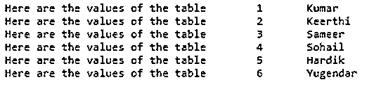
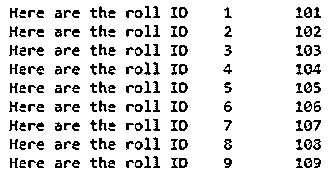
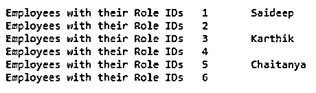

# 下一个 Lua

> 原文：<https://www.educba.com/lua-next/>

## Lua 简介接下来

Lua next 是 Lua 编程中的一个函数，用于遍历表中的所有字段。Lua 是一种基于 C 语言之上的开源编程语言。它在小型移动应用程序和大型服务器系统的多个平台上都有其价值。Lua 函数是一组共同执行一项任务的语句，但是用户仍然可以将代码分成单独的函数。在 Lua next 中，用户传递两个参数，其中一个是表，另一个是索引。这里，让我们看看 Lua 中 next 的语法，以及 next 函数在 Lua 编程中是如何工作的。

**语法:**

<small>网页开发、编程语言、软件测试&其他</small>

下面是 Lua 中下一个函数的语法，它有助于遍历一个表。

`next(table, [, index])`

参数:

*   **表:**是 next()函数中的第一个参数
*   **索引**:next()函数中的第二个参数

### Lua 编程中 next()函数是如何工作的？

Luanext()函数返回所述表的下一个索引及其与该表相关的值。

*   当使用 nil 值作为第二个参数调用 next()函数时，next 返回一个初始索引和相关值。
*   当使用表的最后一个索引或者空表中的 nil 调用 next()函数时，Lua next 将返回 nil。
*   如果第二个参数“index”不存在，那么 next()函数将其解释为 nil。
*   用户可以使用下一步(t)来检查表格是否为空。
*   指数的列举顺序并不特别，对于数字指数也是如此。
*   对于以数字顺序遍历表格，用户可以使用数字 For 或 ipairs 函数。
*   如果 next()函数给出了 undefined，在遍历过程中，用户可以将任何值赋给表中任何不存在的字段。
*   用户可以清除或修改表中的现有字段。

### Lua 示例接下来

下面是一些例子:

#### 示例 1–简单的 Lua next()函数

**代码:**

`sample_table = { "Kumar", "Keerthi", "Sameer", "Sohail", "Hardik", "Yugendar" }
for k, v in next, sample_table do
print ("Here are the values of the table ", k, v)
end`

**输出:**

因此，我们在这里创建了一个包含一些值的示例表。为了显示这些值，我们使用 for 循环。k 表示表值的索引，v 表示表中的实际值。

For 循环遍历 sample_table 中的条目。它返回下一个索引和值对。让我们看看 next()函数如何获取 sample_table 作为参数，sample_table 如何成为 for 循环条件的有效参数，以及 nil 为什么被接受为有效步骤？

命名包含在通用循环中的值的更具描述性的方式如下，

`For k, v1, v2, v3, …. in step, state, k0 do ….. end`

如此循环往复，

`k, v1, v2, v3, …. = step(state, k0) ; if k == nil then break end; k0=k;
k, v1, v2, v3, …. = step(state, k1) ; if k == nil then break end; k1=k;
k, v1, v2, v3, …. = step(state, k2) ; if k == nil then break end; k2=k;
k, v1, v2, v3, …. = step(state, k3) ; if k == nil then break end; k3=k;`

这里，步骤可以按照用户喜欢的方式自由修改状态(通过 pairs/ next 函数)。同样，让我们看一个例子，pairs()和 Lua next()，

#### 示例 2–Luan ext()函数编号表

**代码:**

`number_table = { 101, 102, 103, 104, 105, 106, 107, 108, 109 }
for index, value in pairs (number_table) do
print ("Here are the roll ID ", index, value)
end`

**输出:**

这里，我们在表中有数字，并打印索引和值。next 函数也可以与 pairs()一起使用，以打印表格的下一个值。

`for k, v in pairs(table_name) do … end,`

上面这条线基本上扩展为

`for k, v in next, table_name, nil, do … end`

#### 示例 3–Luanext()函数检查表格是否为空

**代码:**

`employee = {}
if next (employee) == nil then
-- table employee is empty
print('Employee table is empty')
end -- if empty`

**输出:**

要检查 employee 表是否为空，我们可以使用 next(table_name)来检查它是否等于零值，即空表。这里，我们已经声明 employee 表为空，因此 if 条件返回 true。

#### 示例 4–表中有空值的 Luanext()函数

**代码:**

`employee_name = { "Saideep", "", "Karthik", "", "Chaitanya", "" }
for k, v in next, employee_name do
print ("Employees with their Role IDs", k, v)
end`

**输出:**

因此，在 employee 表中有一些空值，在控制台上打印空值不会影响。

原来的语句转化为一个无限的 while 循环，它继续调用 next()函数，初始参数为 next(table_name，nil)，在每次迭代中，第二个参数被表中的下一个索引替换。当 next(table_name，index_n)返回空值时，循环停止或中断。这是遍历表的一种方法，因为 next()可以用任何对迭代进行完全控制的函数来替换。

### 结论

至此，我们结束了“下一个 Lua”这个主题。我们已经看到了 Lua next 的含义，也看到了它的语法和 next()函数所需的参数。我们还看到了一些示例，并详细解释了每个示例。这里还实现了 Next()函数和 pairs()。

### 推荐文章

这是 Lua Next 的一个指南。这里我们也讨论一下入门，以及 next()函数在 lua 编程中是如何工作的？以及不同的示例及其代码实现。您也可以看看以下文章，了解更多信息–

1.  [循环的打字稿](https://www.educba.com/typescript-for-loop/)
2.  [PHP 循环](https://www.educba.com/php-loops/)
3.  [PowerShell 中的循环](https://www.educba.com/loops-in-powershell/)
4.  [Python mkdir](https://www.educba.com/python-mkdir/)

