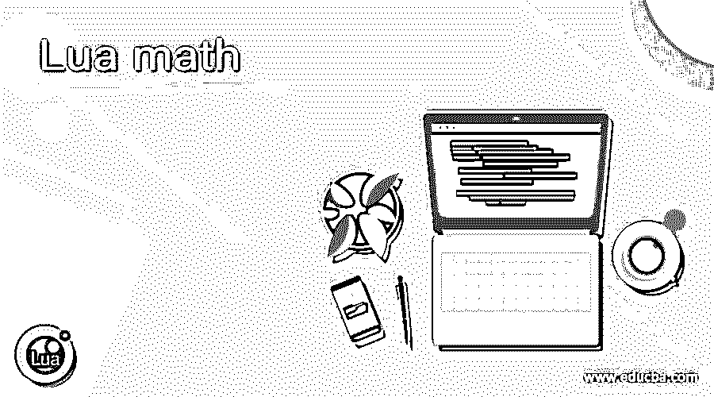
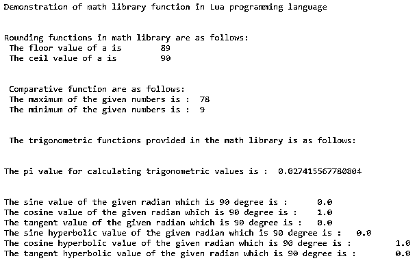
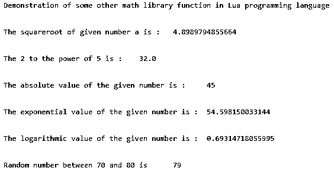

# 数学之月

> 原文：<https://www.educba.com/lua-math/>

## Lua 数学简介

在 Lua 中，math 被定义为一个标准库，它由 Lua 程序中使用的数学函数组成，通过在程序中声明这个库，可以轻松地处理数学概念。一般来说，Lua math 是由 Lua 编程语言提供的标准库，使用该库中定义的函数来处理数学概念，以解决数学相关问题，如对数函数(log)、指数函数(exp)、三角函数(sin、cos、tan 等)、舍入函数(floor、ceil)以及许多其他函数，如 max、min、pi 等，都在该 Lua math 库中定义，它是标准 C math 库的接口。

**语法:**

<small>网页开发、编程语言、软件测试&其他</small>

`math.function_name(argument_list or parameter);`

在上面的语法中，当我们想要使用任何数学函数时，我们可以使用 Lua 标准库提供的数学库，定义或使用任何类型的数学函数，然后我们必须使用数学库，以 math 开头，后面跟一个点，然后跟函数名以及需要在函数中声明或用于计算的参数。

### Lua 编程语言中数学库的工作

Lua 数学库可以直接包含它的函数名，参数传递给这个函数，以包含根据定义的函数进行计算所需的变量值。在 Lua 中，数学库中有各种函数用于不同的数学计算，下面的部分列出了其中的一些。但在此之前，我们将看到一个数学函数列表，这些函数是在这个数学库中定义的。

math.max (x，y，z，…)= >当开发人员希望在传递给此函数的参数中找到给定数字的最大值时，可以使用此数学函数。

math.min (x，y，z，…)= >当开发人员想要在作为参数传递给函数的给定数字中找到最小值时，使用这个数学函数。这些最大值和最小值函数在数学库中被称为比较函数。

math.sin(x)、math.cos(x)、math.tan(x)、math.asin(x)、math.acos(x)等是一些三角函数，用于获取作为参数传递给该函数的辐射值的正弦、余弦和正切值，而 asin 和 acos 用于获取参数中给定值的反正弦和反余弦值。

在 Lua 中，math 库还提供了 math.random([x [，y]])等随机函数来获取随机数。

库中还有许多其他函数用于舍入数字，如 math，floor(x)，math.ceil(x)，一些指数和对数函数是 math.exp(x)，math.log(x)。

**举例:**

在下面的例子中，让我们看一些使用数学库的数学函数演示。

`print( "Demonstration of math library function in Lua programming language ")
print("\n")
print("Rounding functions in math library are as follows:")
a = 89.50983
print(" The floor value of a is ", math.floor(a))
print(" The ceil value of a is ", math.ceil(a))
print("\n")
print(" Comparative function are as follows: ")
print(" The maximum of the given numbers is : ", math.max(30, 46, 29, 78, 56, 9))
print(" The minimum of the given numbers is : ",math.min(30, 46, 29, 78, 56,9))
print("\n")
print(" The trigonometric functions provided in the math library is as follows: ")
print("\n")
p = math.rad(math.pi / 2)
print("The pi value for calculating trigonometric values is : ", p)
print("\n")
print("The sine value of the given radian which is 90 degree is : ", string.format("%.1f ", math.sin(p)))
print("The cosine value of the given radian which is 90 degree is : ", string.format("%.1f ", math.cos(p)))
print("The tangent value of the given radian which is 90 degree is : ", string.format("%.1f ", math.tan(p)))
print("The sine hyperbolic value of the given radian which is 90 degree is : ", string.format("%.1f ", math.sinh(p)))
print("The cosine hyperbolic value of the given radian which is 90 degree is : ", string.format("%.1f ", math.cosh(p)))
print("The tangent hyperbolic value of the given radian which is 90 degree is : ", string.format("%.1f ", math.tanh(p)))`

**输出:**

在上面的程序中，我们可以看到一些使用程序中的数学库定义的数学函数。在第一个例子中，我们找到了函数的舍入，比如 math.floor()将舍入到前一个值，math.ceil()将该值舍入到给定数字的下一个值。然后，我们定义比较函数，如 max 和 min，它将显示给定数字列表中的最大和最小数字，作为该函数的参数。然后，我们定义了几个三角函数，并显示 90 度弧度的值，其中我们使用 rad()将 pi 值转换为弧度值，如 math.rad(math.pi / 2)，而如果我们想要显示度数值，则可以使用 deg()函数作为 math.deg(math.pi / 2)。在上面的程序中，我们已经显示了正弦值、余弦值和正切值及其双曲线值。以上截图可以看到所有这些函数的输出。

在下一节中，让我们看看另一个简单的例子，其中包含一些常见的数学函数。

**举例:**

`print( "Demonstration of some other math library function in Lua programming language ")
print("\n")
print("The squareroot of given number a is :", math.sqrt(24))
print("\n")
print("The 2 to the power of 5 is :", math.pow(2,5))
print("\n")
print("The absolute value of the given number is :", math.abs(-45))
print("\n")
print("The exponential value of the given number is :", math.exp(4))
print("\n")
print("The logarithmic value of the given number is :",math.log(2))
print("\n")
print("Random number between 70 and 80 is ",math.random(70,80))`

**输出:**

在上面的程序中，我们可以看到我们已经定义了 math 库提供的一些其他数学函数，如 math.sqrt()将显示指定数字的平方根，math.pow()将指定给定数字的幂。在上面的程序中，它是 2 ^ 5 =32，然后我们看到 math.abs()将显示绝对值，它将始终显示正数，然后 math.exp()将显示指数值，math.log()显示对数值，然后我们还定义了 math.random()函数来显示随机数。上面截图中的输出将分别显示这些函数的结果。

### 结论

在本文中，我们得出结论，Lua 提供了一个标准库，其中包含程序中一些数学计算的数学函数，它是由数学库提供的。在这种情况下，我们不需要单独导入或包含数学库，我们可以直接将它与数学函数一起使用，在数学函数名称后加一个点。因此，与其他编程语言不同，它也有一个简单的数学库用于数学运算。

### 推荐文章

这是 Lua 数学指南。在这里，我们讨论 Lua 编程语言中数学库的工作，并给出例子。您也可以看看以下文章，了解更多信息–

1.  [网络编程语言](https://www.educba.com/web-programming-languages/)
2.  [后端编程语言](https://www.educba.com/back-end-programming-languages/)
3.  [什么是 Rust 编程？](https://www.educba.com/what-is-rust-programming/)
4.  [大数据编程语言](https://www.educba.com/big-data-programming-languages/)

