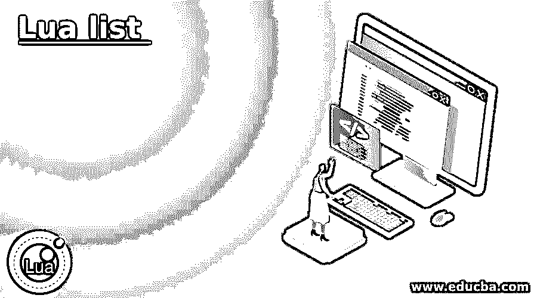
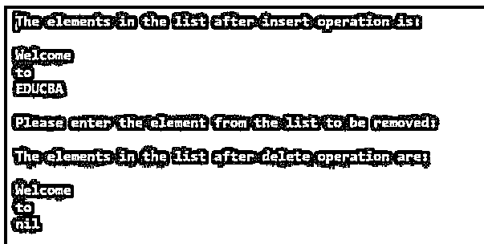
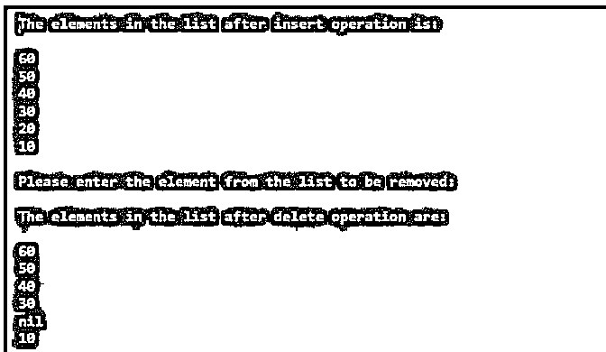

# 月亮列表

> 原文：<https://www.educba.com/lua-list/>

## Lua 列表介绍

在 Lua 中用来有效地添加元素、删除元素和遍历元素的一种奇妙的数据结构被称为链表，它有两种类型，即单链表和双链表，其中我们有一个指向单链表中第一个节点的引用，并且有一个从单链表中每个节点到下一个节点的引用，我们有对双链表中第一个节点和最后一个节点的引用，并且每个节点都有对双链表中上一个节点和下一个节点的引用。

**在 Lua 中定义列表的语法:**

<small>网页开发、编程语言、软件测试&其他</small>

`list_name = {}
list_name = {next = list_name, value = value_to_be_inserted}`

在哪里，

*   list_name 是要创建的列表的名称。
*   value_to_be_inserted 是要插入列表开头的值。

### Lua 中列表的工作

*   在 Lua 中，用于添加元素、删除元素和高效遍历元素的一种奇妙的数据结构被称为链表。
*   Lua 中的链表有两种，即单向链表和双向链表。
*   Lua 中的单链表会有一个指向单链表中第一个节点的引用，单链表中每个节点到下一个节点都有一个引用。
*   Lua 中的双向链表将同时引用双向链表中的第一个节点和最后一个节点，并且每个节点保存一个对双向链表中的前一个节点和下一个节点的引用。
*   但是不可能通过链表中的索引找到一个元素。

### Lua 列表示例

以下是 Lua 列表的示例:

#### 示例#1

这个 Lua 程序演示了链表，我们创建一个链表，将元素插入到链表中，在插入操作后显示链表中的元素，从链表中删除一个元素，在删除操作后显示链表中的元素。

**代码:**

`--creating a list called mylist
local mylist = nil
--inserting the elements into the list mylist
mylist = {next = mylist, value = "EDUCBA"}
mylist = {next = mylist, value = "to"}
mylist = {next = mylist, value = "Welcome"}
--displaying the elements of the list after insert operation
local firstit = mylist
print("The elements in the list after insert operation is:\n")
while firstit do
print(firstit.value)
firstit = firstit.next
end
print("\nPlease enter the element from the list to be removed:\n")
elementremoved = io.read()
--delete an element from the list
local secondit = mylist
while secondit do
if(secondit.value==elementremoved) then
secondit.value = nil
break
end
secondit = secondit.next
end
--displaying the elements of the list after delete operation
print("The elements in the list after delete operation are:\n")
local thirdit = mylist
while thirdit do
print(thirdit.value)
thirdit = thirdit.next
end`

**输出:**

**Note:** The element to be removed must be passed as standard input before executing the program.**Explanation:**

*   在上面的程序中，我们创建了一个名为 mylist 的空单向链表。然后我们将元素插入到列表中，然后在插入操作后将列表中的元素显示为屏幕上的输出。
*   然后，我们使用 io.read()函数从用户处获取输入，并从列表中删除相应的元素，然后将删除操作后列表中的元素显示为屏幕上的输出。

#### 实施例 2

这个 Lua 程序演示了链表，我们创建一个链表，将元素插入到链表中，在插入操作后显示链表中的元素，从链表中删除一个元素，在删除操作后显示链表中的元素。

**代码:**

`--creating a list called mylist
local mylist = nil
--inserting the elements into the list mylist
mylist = {next = mylist, value = "10"}
mylist = {next = mylist, value = "20"}
mylist = {next = mylist, value = "30"}
mylist = {next = mylist, value = "40"}
mylist = {next = mylist, value = "50"}
mylist = {next = mylist, value = "60"}
--displaying the elements of the list after insert operation
local firstit = mylist
print("The elements in the list after insert operation is:\n")
while firstit do
print(firstit.value)
firstit = firstit.next
end
print("\nPlease enter the element from the list to be removed:\n")
elementremoved = io.read()
--delete an element from the list
local secondit = mylist
while secondit do
if(secondit.value==elementremoved) then
secondit.value = nil
break
end
secondit = secondit.next
end
--displaying the elements of the list after delete operation
print("The elements in the list after delete operation are:\n")
local thirdit = mylist
while thirdit do
print(thirdit.value)
thirdit = thirdit.next
end`

**输出:**

**Note:** The element to be removed must be passed as standard input before executing the program.

**说明:**

*   在上面的程序中，我们创建了一个名为 mylist 的空单向链表。然后我们将元素插入到列表中，然后在插入操作后将列表中的元素显示为屏幕上的输出。
*   然后，我们使用 io.read()函数从用户处获取输入，并从列表中删除相应的元素，然后将删除操作后列表中的元素显示为屏幕上的输出。输出显示在上面的快照中。

### 推荐文章

这是 Lua 列表的指南。在这里，我们讨论 Lua 中列表的介绍和工作方式，并通过例子来更好地理解。您也可以看看以下文章，了解更多信息–

1.  [# C 中的 else](https://www.educba.com/hash-else-in-c/)
2.  [网络编程语言](https://www.educba.com/web-programming-languages/)
3.  [C 语言中的编程错误](https://www.educba.com/programming-errors-in-c/)
4.  [最佳编程语言](https://www.educba.com/best-programming-languages/)

