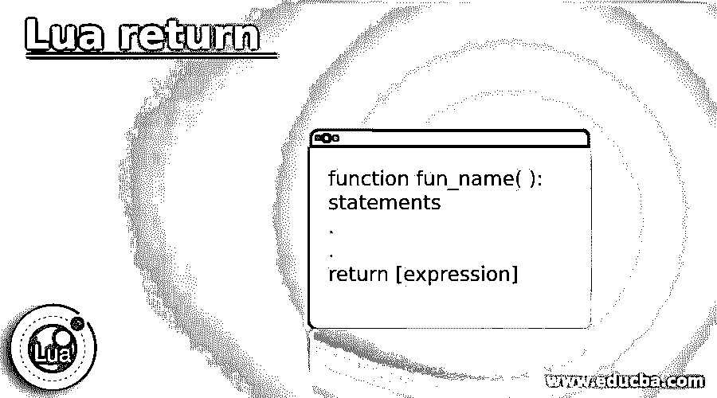
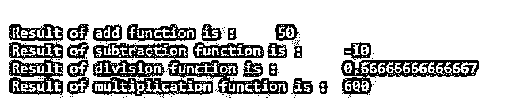
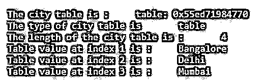
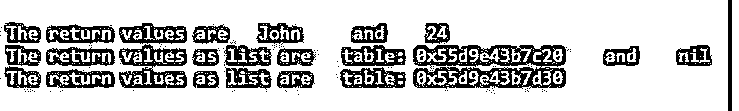

# 月亮回来了

> 原文：<https://www.educba.com/lua-return/>

## Lua 返回简介

Lua return 语句用于从一个函数返回结果或完成一个函数。return 语句是 Lua 编程中的内置语句或关键字。return 语句是一种特殊的语句，在方法或函数内部使用，用于将函数的结果发送回函数调用方。return 语句包含 return 关键字，后跟可选返回值。该函数可以返回 Lua 支持的任何数据类型值，也可以返回多个结果。在它的末尾有一个隐式的 return，这意味着如果一个函数自然结束而不返回任何值，那么就不需要 return 语句。注意，根据语法原因，return 语句应该是块或函数的最后一条语句，但在函数的 end 语句之前。

**Lua 模运算符的语法:**

<small>网页开发、编程语言、软件测试&其他</small>

`function fun_name( ):
statements
.
.
return [expression]`

**参数:**

*   **表达式:**这是可选的，指定函数的返回值。

### Lua 编程中 return 语句的使用

*   用于将函数结果返回给调用者的 return 语句。
*   返回语句用作一个函数的最后一个语句，它由返回关键字和返回值" return 50 "组成，这里函数返回 50 值作为对调用者的输出。

### Lua 返回的示例

下面是提到的例子:

#### 示例#1

lua 编程中的 return 语句示例，显示 return 语句的用法。

**代码:**

`-- Lua program to show return statement
function add( x, y )
-- returning sum of a and b
return x + y
end
function sub( x, y )
-- returning subtraction of a and b
return x - y
end
function divide( x, y )
-- returning division of a and b
return x / y
end
function multiply( x, y )
-- returning multiplication of a and b
return x * y
end
-- calling functions
res = add( 20, 30 )
print( "Result of add function is :", res)
res = sub( 20, 30 )
print( "Result of subtraction function is :", res)
res = divide( 20, 30 )
print( "Result of division function is :", res)
res = multiply( 20, 30 )
print( "Result of multiplication function is :", res)`

**输出:**

在上面的程序中，创建函数来执行基本计算并返回结果，然后调用函数并将返回结果存储到变量中，正如我们在上面的输出中看到的。

#### 实施例 2

lua 编程中的 return 语句示例，用于显示返回的表数据类型。

**代码:**

`-- Lua program to show return statement for table
function create_table( )
city = { "Bangalore", "Delhi", "Mumbai", "Hyderabad" }
-- returning city table
return city
end
-- calling function
r_city = create_table( )
print( "The city table is : ", r_city)
print( "The type of city table is ", type(r_city) )
print( "The length of the city table is : ", #r_city )
-- still table is a key-value association.
print( "Table value at index 1 is : ", r_city[1] )
print( "Table value at index 2 is : ", r_city[2] )
print( "Table value at index 3 is : ", r_city[3] )`

**输出:**

如上所述，创建了 create_table()函数，在该函数中创建了城市表，该表包含城市的名称并具有隐式关键字。因此，每当调用 create_table()函数时，该函数都会返回这个城市表。此外，create_table()函数正在调用，它返回值为表，即城市表本身，返回值功能和规范与表相同，不做任何更改。

#### 实施例 3

lua 编程中的 return 语句示例，显示多个值分别以单个值和数组的形式返回。

**代码:**

`-- Lua program to show return statement for multiple values
function ret_mul( )
name = "John"
age = 24
return name, age
end
function ret_mulAsList()
name = "John"
age = 24
-- return table as array
return {name, age}
end
-- calling function
r_name, r_age = ret_mul()
print( "The return values are ", r_name, " and ", r_age)
r_name, r_age = ret_mulAsList()
print( "The return values as list are ", r_name, " and ", r_age)
r_value = ret_mulAsList()
print( "The return values as list are ", r_value)`

**输出:**

如上所述，创建了两个函数 ret_mul()和 ret_mulAsList()，其中 ret_mul()函数分别返回多个值，ret_mulAsList()函数返回多个值作为数组，该数组也是一个表。此外，两个函数都在调用，它们的返回结果存储在一个变量中并显示出来，正如我们在上面的输出中看到的。

### 结论

Lua return 关键字是 Lua 编程中的内置关键字，用于返回函数的结果。在 Lua 函数的末尾有一个隐式的返回。根据语法原因，return 语句应该是块或函数的最后一条语句，在 end 关键字之前。

### 推荐文章

这是一个 Lua 返回的指南。这里我们讨论 Lua 编程中 return 语句的介绍、工作原理和例子。您也可以看看以下文章，了解更多信息–

1.  [# C 中的 else](https://www.educba.com/hash-else-in-c/)
2.  [网络编程语言](https://www.educba.com/web-programming-languages/)
3.  [C 语言中的编程错误](https://www.educba.com/programming-errors-in-c/)
4.  [最佳编程语言](https://www.educba.com/best-programming-languages/)

