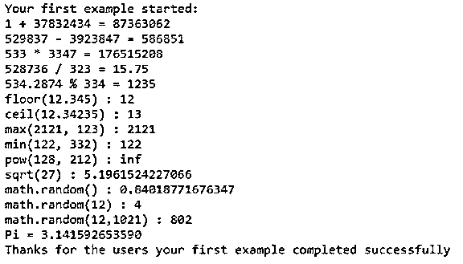
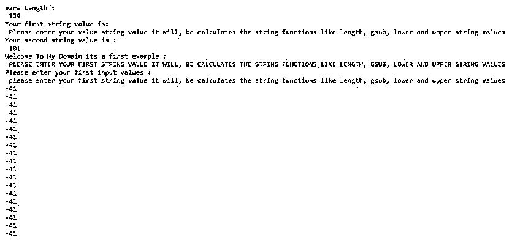
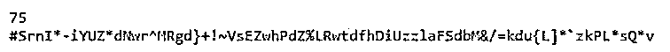

# Lua 随机

> 原文：<https://www.educba.com/lua-random/>

## Lua 随机简介

Lua random 是一个数学概念，它是一个库函数，可用于生成伪随机数，它可以以不同的方式调用，如不带参数调用的方法，它将返回具有均匀分布时间间隔的伪随机数实数类型，如果我们用单个参数调用，它可以是任何数据类型伪随机数将返回我们调用的数据类型值 伪随机生成器将使用两个参数类型，称为 randomseed 函数，它只接受数值参数集。

**语法:**

<small>网页开发、编程语言、软件测试&其他</small>

Lua 脚本有一些默认函数、关键字和变量，用于创建游戏、图像处理等应用程序。因为 random 是数学库中的函数之一，它主要用于生成具有均匀分布的序列顺序的伪随机数。

`datatype variable name = math.random(Starting number, Ending number)
conditional loop {
--some validation statement based on the satisfaction of loop conditions---
}
---other lua script codes depends upon the user and project requirement----`

以上代码是以不同顺序为数学库调用随机函数的基本语法。

### Lua 中随机函数是如何工作的？

*   在 lua 脚本中，随机函数是一个数学库，它用于使用伪随机数发生器计算伪随机数。这个函数也是计算简单伪随机发生器函数的接口之一，它是通过使用 rand 计算提供的，它是由一些标准 ANSI 代码语言如 C 等提供的。
*   它可以以不同的方式调用，例如在没有参数的情况下调用函数。它返回不同数字范围内的统一伪随机数，例如 0，1 是数字的开始和结束位置。如果将整数作为参数调用函数，它将返回整数值，该整数值具有从 1，x。
*   像这样，我们使用这个 math.random 函数调用两个整数作为参数 x 和 y，将返回范围(m，n)之间的统一伪随机整数。
*   我们使用 math.randomseed()函数也生成伪随机生成器值。使用的参数与局部变量、函数完全匹配，我们使用的参数数量与它的参数数量不同，而且它似乎在多次赋值中调整了参数数量和参数数量。如果我们在方法中使用额外的参数，它将从方法中丢弃，当我们获得额外的或额外的参数时，它将 nil 作为值。

### Lua 随机示例

下面给出了 Lua 随机的例子:

#### 示例#1

**代码:**

`print("Your first example started:")
io.write("1 + 37832434 = ", 87325736+37326, "\n")
io.write("529837 - 3923847 = ", 590238-3387, "\n")
io.write("533 * 3347 = ", 523784*337, "\n")
io.write("528736 / 323 = ", 52353/3324, "\n")
io.write("534.2874 % 334 = ", 1235%5433, "\n")
io.write("floor(12.345) : ", math.floor(12.345), "\n")
io.write("ceil(12.34235) : ", math.ceil(12.34235), "\n")
io.write("max(2121, 123) : ", math.max(2121, 123), "\n")
io.write("min(122, 332) : ", math.min(122, 332), "\n")
io.write("pow(128, 212) : ", math.pow(128, 212), "\n")
io.write("sqrt(27) : ", math.sqrt(27), "\n")
io.write("math.random() : ", math.random(), "\n")
io.write("math.random(12) : ", math.random(10), "\n")
io.write("math.random(12,1021) : ", math.random(12,1021), "\n")
math.randomseed(os.time())
print(string.format("Pi = %.12f", math.pi))
print("Thanks for the users your first example completed successfully")`

**输出:**

在上面的例子中，我们在脚本中使用了数学库的 random()函数。当我们向方法提供和传递输入时，它将计算和操作它也支持的数学函数，并使用其他数学函数，如 sqrt()、min()、max()、ceil()、floor()。对于每个函数，用户输入值通过使用数学公式和表达式来计算。

#### 实施例 2

**代码:**

`do
vars = "Please enter your first string value it will, be calculates the string functions like length, gsub, lower and upper string values"
io.write("vars Length :\n ", string.len(vars), "\n")
io.write("Your first string value is:\n ", string.gsub(vars, "first", "value"), "\n")
io.write("Your second string value is :\n ", string.find(vars, "lower"), "\n")
io.write("Welcome To My Domain its a first example :\n ", string.upper(vars), "\n")
io.write("Please enter your first input values :\n ", string.lower(vars), "\n")
local x = 1
local function demo(x, y)
x = x + 1
if x ~= nil and y ~= nil then
return math.floor(x +(math.random(math.randomseed(os.time()+x))*1234567 %y))
else
return math.floor((math.random(math.randomseed(os.time()+x))*202))
end
end
for i = 2, 20 do
print(demo(-43, 3))
end
end`

**输出:**

**

** 

在第二个例子中，我们额外使用了类似 do 语句的循环来检查用户输入条件。首先，一旦循环被执行，它将检查并执行条件。如果条件不满足，循环将终止或退出。这里我们使用一些字符串输入类型作为第一个变量和第二个变量，我们计算字符串长度，randomseed()函数将计算一些数学表达式和公式。然后它会在输出控制台上打印出来。如果我们使用 os.time()函数通过使用 x * 202，x*1234567%y 这样的公式来执行随机运算。

#### 实施例 3

**代码:**

`local vars = 'AaBbCcDdEeFfGgHhIiJjKkLlMmNnOoPpQqRrSsTtUuVvWwXxYyZz!@#$%^&*()_+-={}|[]`~*/'
local strlengths = string.len(vars)
print(strlengths)
local vars1 = ''
math.randomseed(os.time())
arrys = {}
for vars2 in vars:gmatch"." do
table.insert(arrys, vars2)
end
for i = 2, strlengths do
vars1 = vars1 .. arrys[math.random(2, #arrys)] end
print(vars1)`

**输出:**

在最后一个例子中，我们声明并初始化输入值，就像字母一样，包括大小写字母。此外，我们使用了一些操作符、符号和特殊字符，通过使用字符串默认函数，我们可以执行字符串操作，并使用 for 循环来迭代匹配的字符串输入。我们可以将字符串输入传递给数组字符，并使用 random()方法执行字符串操作，并在控制台上打印输出。

### 结论

我们已经看到了使用关键字、变量和默认函数的 lua 脚本操作。当我们使用 lua 函数时，它可以根据用户需求执行单独的任务。就像我们使用数学运算一样，通过使用 lua 库，我们可以创建和操作企业应用程序数据，如游戏、图像处理等。

### 推荐文章

这是一个 Lua 随机指南。这里我们讨论一下入门，lua 中的随机函数是如何工作的？和示例。您也可以看看以下文章，了解更多信息–

1.  [# C 中的 else](https://www.educba.com/hash-else-in-c/)
2.  [网络编程语言](https://www.educba.com/web-programming-languages/)
3.  [C 语言中的编程错误](https://www.educba.com/programming-errors-in-c/)
4.  [最佳编程语言](https://www.educba.com/best-programming-languages/)

