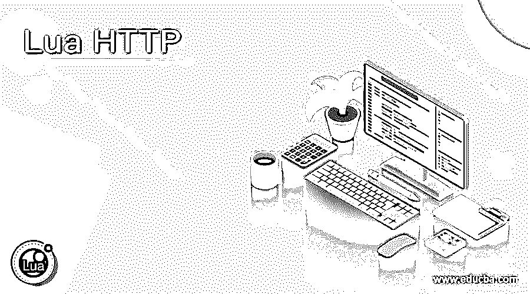
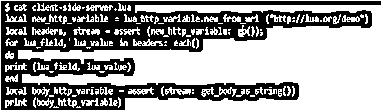
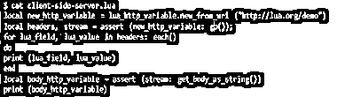
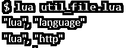

# Lua HTTP

> 原文：<https://www.educba.com/lua-http/>

## Lua HTTP 的定义

*   它是一种应用程序级协议，用于在浏览器 Lua 编程语言上加载和获取万维网应用程序链接。
*   它是一种超文本传输文本协议，用于使用 Lua 技术在互联网上传输信息。
*   它是一个通用协议，使用 Lua 源代码在 web 浏览器的服务器和客户端之间提供高级通信。
*   它是一种无状态协议，用于灵活的数据传输、检索 HTTP 数据以及抛出 Lua 代码的错误。
*   对于 web 服务器来说，向 web 服务器发出请求并响应 web 浏览器是很有用的。

**语法:**

*   它有许多模块和方法来与客户端和服务器通信。
*   一些模块信息及解释如下。
*   语法如下。
*   客户端请求语法如下。

`require "http.request";`

<small>网页开发、编程语言、软件测试&其他</small>

*   示例:local Lua _ variable _ name = require " http . request "

`new_from_uri("uri link")`

*   示例:local new _ variable _ name = variable _ name . new _ from _ uri(" http://Lua . org/demo ")

*   http。该请求是客户端请求的高级接口。
*   http。该请求用于向客户端请求检索服务器信息。
*   new_from_uri 正在立即获取给定的链接并执行该过程。
*   new_from_uri 与 http 连接。请求对象评估 URI。

服务器端语法如下。

`require "http.server"`

示例:local Lua _ server = require " http . server "

`require "http. headers"`

示例:local Lua _ headers = require " http . headers "

*   http。服务器正在创建对象并用来封装服务器套接字。
*   http。服务器正在向客户端发送信息。
*   http。标题是字段名的索引。
*   http。标头是敏感数据，通过调用键值来检索它。

标题语法如下。

`headers:append(name, value, never_index)
headers:each()
: status`

*   headers: append 用于创建和关联头名称、值和布尔授权。
*   headers: each()对于头值的迭代非常有用。
*   以字符串格式保存值的标头“:status”。

util 语法如下。

`require "http.util"`

**示例:**local Lua _ http _ variable = require " http . util "；

紧凑套接字语法如下。

`require "http.compat.socket"`

**示例:**local Lua _ http _ variable = require " http . compat . socket "；

这是为了提供请求的兼容性。

### HTTP 在 Lua 中是如何工作的？

**第一步:** Lua 编程 IDE 环境设置。

根据 Lua 软件的版本，在虚拟机中安装 Lua 文本编辑器、Lua 编译器和 Lua 解释器。

**第二步:**环境设置。

安装 Lua 模块的软件包管理器(luarocks)。

`Website name:- https://luarocks.org/`

*   此管理器正在自动安装依赖项。
*   下面的命令是在 Lua 软件中输入的。

`$ luarocks install http.`

**步骤 3:** 您应该在 Lua 软件中安装以下依赖项。

**步骤 4:** 用请求创建一个变量。

`local lua_http_variable= require('http.request');`

**第五步:**用 Lua new _ from _ uri(“uri name”)创建一个变量。

`local new_http_variable= lua_http_variable.new_from_uri("http://lua.org/demo")`

**步骤 6:**Lua HTTP 中的 headers 和 steam 使用。

`for lua_field, lua_value in headers:each()
do
print(lua_field, lua_value)
end
local body_http_variable = assert(stream:get_body_as_string())`

**第七步:**返回所需数据。

`print(body_http_variable)`

*   结合工序。

`local lua_http_variable= require "http.request"
local new_http_variable= lua_http_variable .new_from_uri ("http://lua.org/demo")
local headers, stream= assert ( new_http_variable:go());
for lua_field, lua_value in headers:each()
do
print (lua_field, lua_value)
end
local body_http_variable = assert (stream:get_body_as_string())
print (body_http_variable)`

### 例子

让我们讨论一下例子。

#### 示例#1:客户端服务器示例和输出。

`local lua_http_variable= require "http.request";
local new_http_variable= lua_http_variable .new_from_uri ("http://lua.org/demo")
local headers, stream= assert ( new_http_variable:go());
for lua_field, lua_value in headers:each()
do
print (lua_field, lua_value)
end
local body_http_variable = assert (stream:get_body_as_string())
print (body_http_variable)`

**输出 1:** 输入$ cat 文件名。Lua 命令提示符中的 Lua 命令。

**输出 2:** 输入$ lua 文件名。Lua 命令提示符中的 Lua 命令。

#### 示例 2:带有“if”循环示例和输出的客户端服务器。

`local lua_http_variable= require "http.request";
local new_http_variable= lua_http_variable .new_from_uri ("http://lua.org/demo")
local headers, stream= assert( new_http_variable:go());
local body_http_variable = assert (stream:get_body_as_string())
if headers : get ":status" ~= "200"
then
error (body_http_variable)
end
print (body_http_variable)`

**输出:**

**输出 1:** 输入$ cat 文件名。Lua 命令提示符中的 Lua 命令。

**输出 2:** 输入$ lua 文件名。Lua 命令提示符中的 Lua 命令。

#### 示例 3:服务器端示例和输出。

`local lua_server = require "http.server";
local lua_header = require "http.headers";
local lua_http_server = lua_server.listen {
host: "localhost";
port: 8005;
onstream: function(sa, sb)
local reqst_header = sb:get_headers(),
local reqst_method = sb:get(":method")
local lua_path = reqst_header:get(":path") or "",
local recv_path = headers.new()
recv_path:append(":status", "200")
recv_path:append("content-type", "text/plain")
sb:write_headers(recv_path, reqst_method == "HEAD")
if reqst_method ~= "HEAD" then
sb:write_chunk(("Received message \n":format(lua_path), true)
end
end
}
lua_http_server.listen();
lua_http_server.loop();`

**输出 1:** 这个输出显示了服务器的端口。

**输出 2:** 该输出显示服务器的消息。

#### 示例#4: Util 示例和输出如下。

第 1 部分:在 http.util 示例中使用 query-args(string)。

`local lua_http_vrblr = require "http.util";
for names, values in lua_http_vrblr.query.args("Lua = language & Lua = http")
do
print("names, values")
end`

**输出:**

第 2 部分:在 http.util 示例中使用 query-args(string)。

`local lua_http_util = require "http.util"
print(lua_http_util.split_authority("lua.org", "https"))
print(lua_http_util.split_authority("localhost:8005", "http"))`

**输出:**

#### 示例 5:套接字示例和输出如下。

`local lua_http_socket = require "http.compat.socket"
local bd, dc = assert(lua_http_socket.request("http://google.com"))
print(dc, #bd);`

**输出:**

### 结论

*   它有许多方法来控制服务器和客户端的数据或信息。
*   它使 Lua 应用程序变得简单、交互，并在服务器或互联网上受到保护。
*   这有助于客户端轻松获取服务器端信息，并提供保护。

### 推荐文章

这是一个 Lua HTTP 的指南。这里我们讨论定义，语法，HTTP 如何在 Lua 中工作？示例分别用代码实现。您也可以看看以下文章，了解更多信息–

1.  [HTTP 方法](https://www.educba.com/http-methods/)
2.  [XML HttpRequest](https://www.educba.com/xml-httprequest/)
3.  [HTTP cookie](https://www.educba.com/http-cookies/)
4.  [HTTP 缓存](https://www.educba.com/http-caching/)

