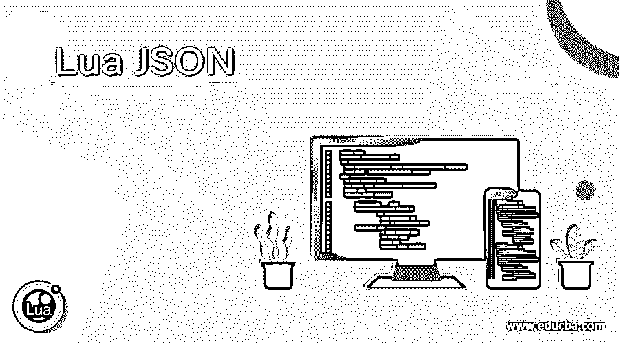
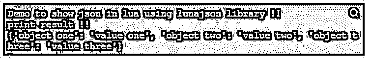

# 月球 JSON

> 原文：<https://www.educba.com/lua-json/>

## Lua JSON 简介

JSON 代表 Javascript 对象符号，它的工作方式和其他编程语言一样。JSON 是非常轻量级的，可以在里面存储任何东西，主要是 lua 或任何其他编程语言中的 JSON，用于将数据从服务器传输到网页，反之亦然。在 lua 的 JSON 中，我们可以存储任何东西，比如对象、数组等等。Json 有特定格式，如果我们想解析或分离我们的对象到 JSON，我们需要遵循这种格式，否则我们将在运行时收到解析预期。在 lua 或任何其他编程语言中，JSON 总是以' { '花括号开始，以' } '花括号结束。

**语法:**

<small>网页开发、编程语言、软件测试&其他</small>

为了在 lua 中使用 JSON，我们必须使用 Lua rocks 安装外部库，这有助于我们在 Lua 中管理库。

`local variable_name = '{"key":"value"}'`

正如你在上面几行语法中看到的，我们使用' {} '来定义 JSON，在这里我们定义了 key 和值，它可以接受 JSON 中的任何对象。

**举例:**

**代码:**

`local demojson = '{"key1 ":"hello"}'`

正如您在上面几行中看到的，我们在 JSON 中定义了键和值。

### JSON 在 Lua 中是如何工作的？

正如我们已经看到的，JSON 是用来存储数据的，它可以存储任何类型的数据。要在 lua 中使用 JSON，我们必须使用 Luarocks 安装库。我们可以遵循一些用于安装所需软件包的命令。首先我们必须安装 Luarocks，然后我们可以安装 luajson，它为我们提供了一些处理 JSON lua 的方法。

按照以下步骤开始使用 lua 中的 JSON:

**1。sudo 安装 luarocks:** 要安装 luarocks，我们可以遵循上述步骤，这将适用于 ubuntu。对于 Mac OS，请遵循下面提到的命令。

**2。brew install luarocks:** 这将安装 lua 处理 JSON 所需的库。

在你的机器上安装了 luarocks 之后，现在我们将需要 luajson 库，它也很容易像 luarocks 一样安装。我们必须执行一些特定于您的操作系统的命令。

在下面找到开始使用的命令:

**1。对于 windows:** 如果您是 windows 用户，并且想要安装 luajson，请执行以下命令:

`luarocks install lunajson`

要做到这一点，我们应该已经在机器上安装了 luarocks。

**2。要在 Linux 或 Mac 上安装它:**要在您的机器上安装 luajson，请让您已经安装了 luarocks 的用户，因为它负责为我们管理 lua 库。

按照以下命令在 mac 或 linux 上安装它:

`sudo luarocks install lunajson`

一旦你设置了你的 libarray 或者在你的机器上完成了库的安装，现在我们需要做一些配置来在 lua 的程序中使用这个库。

*   **设置路径:**我们必须将库的路径输入到我们正在使用的程序中。如果你是 ubuntu 用户，我们有默认路径可以使用，即:/usr/local/share/Lua/5 . veri osn/只有在这个配置之后，我们才能使用 lunajson 库中的方法来处理 json。luajson 库为我们提供了编码和解码机制，通过这种机制，我们可以在 Lua 中将对象编码和解码为 json。

让我们看看它的语法以及如何在 lua 中使用 while 程序:

要使用 luajson 中的任何方法，首先我们必须将包导入到我们的程序中。

之后，我们可以为 luajson 库指定一个本地或自定义名称，语法如下:

`name_of_libarary = require 'lunajson'`

在上面的代码中，我们使用“require”关键字将 luajson 库导入或使用到程序中，在这一行之后，我们将能够在我们的程序中使用编码和解码。

**1。Encode:** Encode 方法用于将普通对象转换成 lua 中 json 的形式。我们可以在库导入名称上调用这个方法。

**举例:**

**代码:**

`mylua = require 'lunajson'
local demojson = mylua.encode( your_object )`

正如你在上面的代码行中看到的，我们在这里尝试使用 encode 方法。首先，我们导入了库，然后对其对象调用方法。在 encode 方法中，我们可以传递要转换成 json 格式的对象名或变量。

**2。Decode:** Decode 方法用于将 json 再次转换为正常格式。我们可以在库导入名称上调用这个方法。

**举例:**

**代码:**

`mylua = require 'lunajson'
local demojson = mylua.decode( your_object )`

正如你在上面的代码行中看到的，我们在这里尝试使用 decode 方法。首先，我们导入了库，然后对其对象调用方法。在 decode 方法中，我们可以传递我们想要转换成 lua 中普通对象的对象名或变量。

### Lua JSON 示例

下面给出的是 Lua JSON 的例子:

如果您的机器上没有安装 luarocks 和 luajson，这个程序将不会运行。它不会使用任何在线编译器来运行，它会抛出一个错误。

**代码:**

`#!/usr/bin/lua5.1
print("Demo to show json in lua using lunajson library !!")
myluna = require 'lunajson'
local objecttoconvert = { ["object one "] = "value one", ["object two"] = "value two", ["object three"] = "value three" }
local result = myluna.encode( objecttoconvert )
print("print result !!")
print( result )`

**输出:**

### 结论

JSON 使得大数据的开始变得容易得多，它的工作方式和其他编程语言一样。它可以包含任何类型的对象、对象列表等等。基本上，它用于在服务器和客户端之间传输大量数据。

### 推荐文章

这是 Lua JSON 的指南。这里我们讨论一下入门，JSON 在 Lua 中是如何工作的？和示例以便更好地理解。您也可以看看以下文章，了解更多信息–

1.  [JavaScript UUID](https://www.educba.com/javascript-uuid/)
2.  [JavaScript 中的函数](https://www.educba.com/functions-in-javascript/)
3.  [JavaScript 对象符号](https://www.educba.com/javascript-object-notation/)
4.  [JavaScript 实例 of](https://www.educba.com/javascript-instanceof/)

