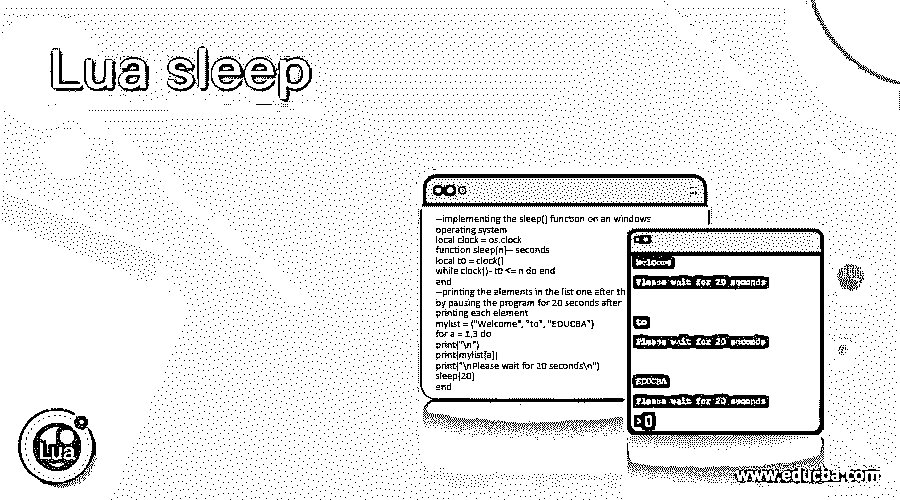
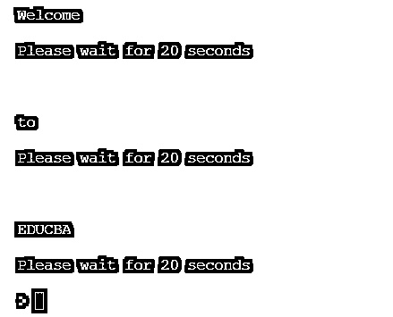
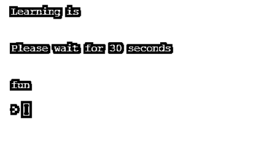

# 月球睡眠

> 原文：<https://www.educba.com/lua-sleep/>

## Lua 睡眠简介

每当需要暂停我们正在执行的程序一段时间而不使用 busy 或 wait 时，我们就使用 Lua 中的 sleep()函数， 并且该 sleep()函数不是 Lua 中的内置函数，但是有几种方法来实现该 sleep()函数，这取决于 Lua 程序运行的操作系统或平台，并且任何打算调用 sleep()函数的程序必须在调用它之前在程序中实现 sleep()函数，并且 sleep()函数可以在 Windows、Linux 和 Mac 操作系统上实现。

**在 Windows 操作系统的 Lua 中定义 sleep()函数的语法如下:**

<small>网页开发、编程语言、软件测试&其他</small>

`local clock = os.clock
function sleep(n)
local t0 = clock()
while clock() - t0 <= n do end
end
sleep(number_of_seconds)`

os 在哪里？clock 返回程序的 CPU 时间的秒数

n 是我们希望程序暂停的秒数。

### Lua 中 sleep()函数如何**工作？**

Lua 中 sleep()函数的工作原理如下:

*   每当需要暂停我们正在执行的程序一段时间而不使用 busy 或 wait 时，我们就使用 Lua 中的 sleep()函数。
*   sleep()函数不是 Lua 中的内置函数。
*   根据 Lua 程序运行的操作系统或平台，有几种方法可以实现 sleep()函数。
*   任何打算调用 sleep()函数的程序都必须在程序中实现 sleep()函数，然后才能在程序中调用它。
*   sleep()函数可以在 Windows、Linux 和 Mac 操作系统上实现。

### 例子

让我们讨论 Lua 睡眠的例子。

#### 示例#1

Lua 程序，通过在 Windows 操作系统上实现 sleep()函数并在打印程序中的第二条语句之前暂停程序 30 秒钟来演示其工作原理:

**代码:**

`--implementing the sleep() function on an windows operating system
local clock = os.clock
function sleep(n)-- seconds
local t0 = clock()
while clock() - t0 <= n do end
end
--printing the first statement and then calling sleep() function to pause the program for 30 seconds before it can print the second statement
print("Welcome to\n")
print("\nPlease wait for 30 seconds\n")
sleep(30)
print("\nEDUCBA\n")`

上述程序的输出如下面的快照所示:

在上面的程序中，我们在 Windows 操作系统上实现了 sleep()函数。然后我们打印一条语句，然后调用 sleep()函数暂停程序 30 秒钟，然后它可以在屏幕上打印第二条语句作为输出。输出显示在上面的快照中。

#### 实施例 2

Lua 程序演示了 sleep()函数，其中我们创建了一个数组，并遍历数组的元素，在程序暂停 20 秒后，将数组的每个元素作为输出显示在屏幕上:

**代码:**

`--implementing the sleep() function on an windows operating system
local clock = os.clock
function sleep(n)-- seconds
local t0 = clock()
while clock() - t0 <= n do end
end
--printing the elements in the list one after the other by pausing the program for 20 seconds after printing each element
mylist = {"Welcome", "to", "EDUCBA"}
for a = 1,3 do
print("\n")
print(mylist[a])
print("\nPlease wait for 20 seconds\n")
sleep(20)
end`

上述程序的输出如下面的快照所示:

在上面的程序中，我们在 Windows 操作系统上实现了 sleep()函数。然后，我们创建一个数组，然后遍历数组，在屏幕上显示每个元素的输出后，暂停程序 20 秒，依次显示数组的元素。输出显示在上面的快照中。

#### 实施例 3

Lua 程序演示了 sleep()函数，其中我们创建了一个数组并遍历数组的元素，在程序暂停 10 秒钟后，将数组的每个元素作为输出显示在屏幕上:

**代码:**

`--implementing the sleep() function on an windows operating system
local clock = os.clock
function sleep(n)-- seconds
local t0 = clock()
while clock() - t0 <= n do end
end
--printing the elements in the list one after the other by pausing the program for 20 seconds after printing each element
mylist = {"Learning", "is", "fun"}
for a = 1,3 do
print("\n")
print(mylist[a])
print("\nPlease wait for 10 seconds\n")
sleep(10)
end`

上述程序的输出如下面的快照所示:

在上面的程序中，我们在 Windows 操作系统上实现了 sleep()函数。然后，我们创建一个数组，然后遍历该数组，在屏幕上显示每个元素作为输出后，暂停程序 10 秒钟，依次显示数组的元素。输出显示在上面的快照中。

#### 实施例 4

Lua 程序，通过在 Windows 操作系统上实现 sleep()函数并在打印程序中的第二条语句之前暂停程序 30 秒钟来演示其工作原理:

**代码:**

`--implementing the sleep() function on an windows operating system
local clock = os.clock
function sleep(n)-- seconds
local t0 = clock()
while clock() - t0 <= n do end
end
--printing the first statement and then calling sleep() function to pause the program for 30 seconds before it cana print the second statement
print("Learning is\n")
print("\nPlease wait for 30 seconds\n")
sleep(30)
print("\nfun\n")`

上述程序的输出如下面的快照所示:

在上面的程序中，我们在 Windows 操作系统上实现了 sleep()函数。然后我们打印一条语句，然后调用 sleep()函数暂停程序 30 秒钟，然后它可以在屏幕上打印第二条语句作为输出。输出显示在上面的快照中。

### 结论

在本文中，我们已经通过 Lua 中 sleep()函数的定义、语法和工作方式了解了 Lua 中 sleep()函数的概念，并提供了相应的编程示例及其输出来演示它们。

### 推荐文章

这是 Lua 睡眠指南。这里我们讨论 Lua 中 sleep()函数的定义，如何工作？示例分别用代码实现。您也可以看看以下文章，了解更多信息–

1.  [C#目录信息](https://www.educba.com/c-sharp-directoryinfo/)
2.  [C#秒表](https://www.educba.com/c-sharp-stopwatch/)
3.  [C#堆栈溢出异常](https://www.educba.com/c-sharp-stackoverflowexception/)
4.  [C# SOAP](https://www.educba.com/c-sharp-soap/)

