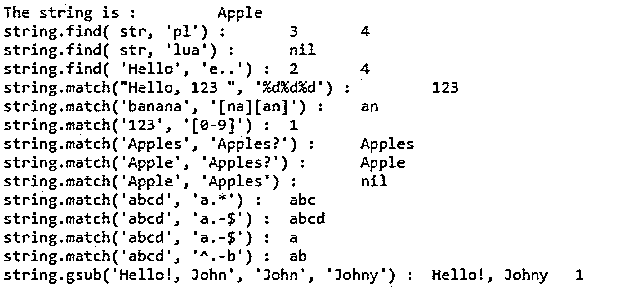

# Lua 正则表达式

> 原文：<https://www.educba.com/lua-regex/>

## Lua 正则表达式简介

Lua 正则表达式或 RegEx 是一个字符序列，它形成一个搜索模式，用于匹配字符串中的字符组合。正则表达式可以用来验证一个字符串是否包含指定的搜索模式。与其他语言不同，lua 正则表达式是不同的，它有更多的限制和不同的语法。

### Lua 正则表达式函数

Lua 编程提供了一组函数，允许我们在字符串中搜索匹配项，如下所示:

<small>网页开发、编程语言、软件测试&其他</small>

*   **find(string，pattern [，init [，plain]]):** 此函数返回字符串中匹配模式的起始和结束索引。
*   **match(string，pattern [，index]):** 一旦匹配从给定的索引开始，这个函数就匹配一个模式。
*   **gmatch(string，pattern):** 这个函数返回一个遍历字符串中所有匹配模式的函数。
*   **gsub(string，pattern，repl [，n]):** 该函数用于用子字符串替换匹配的字符串，n 指定 n 次替换。

### Lua 正则表达式元字符

Lua 编程提供了一组元字符、特殊序列和具有特殊含义的集合，如下所示:

*   **。–:**这是匹配所有字符的元字符。
*   **%a:** 这是匹配所有字母的特殊序列。
*   **%l:** 这是一个特殊的序列，匹配所有小写字母。
*   **%u:** 这是一个特殊序列，匹配所有大写字母。
*   **%d:** 这是匹配所有数字的特殊序列。
*   **%s:** 这是一个特殊序列，匹配所有空白字符。
*   **%x:** 这是匹配所有十六进制数字的特殊序列。
*   **%p:** 这是一个特殊序列，匹配所有标点字符。
*   **%g:** 这是一个特殊序列，匹配除空格以外的所有可打印字符。
*   **%c:** 这是匹配所有控制字符的特殊序列。
*   **【集合】:**这是与集合中所有字符并集的类相匹配的集合。
*   **【^set]:**这是一个特殊的序列，匹配 set 的补码。
*   **+:** 这是一个贪婪匹配，匹配一个或多个前面的字符类。
*   ***:** 这是一个贪婪匹配，匹配 0 个或更多个先前字符类的出现。
*   **？:**这是与前一个字符类的 0 个或 1 个匹配项完全匹配的匹配项。
*   **–:**这是一个惰性匹配，它匹配了 0 个或多个先前的字符类。

### Lua 正则表达式示例

示例如下:

**代码:**

`-- create string to match pattern
str = 'Apple'
print( "The string is : ", str)
-- 'pl' match in string
print( "string.find( str, 'pl') : ", string.find( str, 'pl'))
-- 'lua' will not be match in string
print( "string.find( str, 'lua') : ", string.find( str, 'lua'))
-- e.. match e and any two characters
print( "string.find( 'Hello', 'e..') : ", string.find( "Hello", 'e..'))
-- match 3 sequence of digit
print( "string.match(\"Hello, 123 \", '%d%d%d') : ", string.match("Hello, 123 ", '%d%d%d'))
--
print( "string.match('banana', '[na][an]') : ", string.match("banana", '[na][an]'))
-- you can specify a range of characters using -
print( "string.match('123', '[0-9]') : ", string.match("123", '[0-9]'))
-- Repetition examples
print( "string.match('Apples', 'Apples?') : ", string.match("Apples", 'Apples?'))
print( "string.match('Apple', 'Apples?') : ", string.match("Apple", 'Apples?'))
print( "string.match('Apple', 'Apples') : ", string.match("Apple", 'Apples'))
print( "string.match('abcd', 'a.*') : ", string.match("abc", 'a.*'))
-- $ matches the end of the string
print( "string.match('abcd', 'a.-$') : ", string.match("abcd", 'a.-$'))
-- .- part matches nothing
print( "string.match('abcd', 'a.-$') : ", string.match("abcd", 'a.-'))
-- ^ matches the start of the string
print( "string.match('abcd', '^.-b') : ", string.match("abcd", '^.-b'))
-- gsub() example
print( "string.gsub('Hello!, John', 'John', 'Johny') : ", string.gsub("Hello!, John", "John", "Johny"))`

**输出:**

在上面的 lua 程序中，我们可以看到一些借助正则表达式的模式匹配的例子，其中我们可以看到 find()、match()和 gsub()函数的使用。find()函数用于检查是否找到了模式，如果找到了模式，则返回在字符串中找到的模式的开始和结束位置，如果没有找到模式，则返回“nil”作为输出。match 函数用于匹配模式并从字符串中返回匹配的组，如上面示例中的字符串是“Hello，123”，模式是“%d%d%d”(匹配三个连续的数字)，因此这里匹配的字符串是“123”，我们也可以在输出中看到。接下来，在匹配模式(第二个参数)的地方使用 gsub()函数，匹配的字符串替换为第三个字符串，这里传递的是“张诗钟”。这个方法的输出返回字符串(匹配的被替换),输出中的替换数是 1，因为只有一个匹配项。

### 结论

Lua 正则表达式是一个字符序列，它形成一个搜索模式，用于匹配字符串中的字符组合。Lua 编程提供了一些函数，如 match()、gmatch()、find()、gsub()和元字符，可以轻松有效地进行模式匹配，正如我们在上面的例子中看到的那样。

### 推荐文章

这是一个 Lua 正则表达式的指南。这里我们将分别讨论它的简介、功能、元字符和例子。您也可以看看以下文章，了解更多信息–

1.  [# C 中的 else](https://www.educba.com/hash-else-in-c/)
2.  [网络编程语言](https://www.educba.com/web-programming-languages/)
3.  [C 语言中的编程错误](https://www.educba.com/programming-errors-in-c/)
4.  [最佳编程语言](https://www.educba.com/best-programming-languages/)

