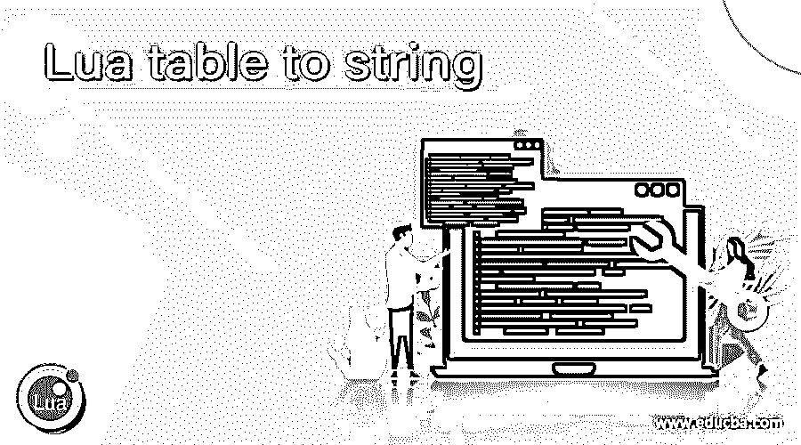
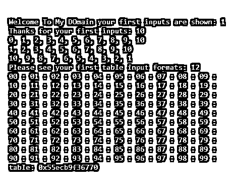
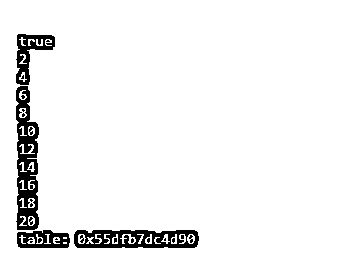
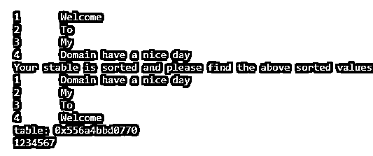

# Lua 表到字符串

> 原文：<https://www.educba.com/lua-table-to-string/>

## Lua 表到字符串介绍

Lua table.toString()是表格功能的默认方法之一，它主要用于将表格数据转换为字符串类型，以便 Lua 在语法上纠正字符串，以便将 tbl 数据的表格内容递归编码回 Lua 源代码。返回的数据将是字符串类型值，并且可以将值提供给 Lua 编译器，后者将用于将其编译回相同的表格。基本上，表格只是容器类型，值存储为键、值对。

**语法:**

<small>网页开发、编程语言、软件测试&其他</small>

在 Lua 中，table 用于构造和存储行和列格式的数据。数据用花括号表示，并将存储在一个单独的变量中。我们使用 table.tostring()方法将表值转换为字符串类型。

`function function_name()
{
table.concat(value: type)
variable name = {‘values’}
table.tostring(variable name) // tostring() is the default method for to convert table to string values
table.concat(variable name) //concat() is the default method for string package
---some lua script code logics depends on the user requirement----
}`

以上代码是在 lua 脚本中使用 tostring()方法的基本语法。我们使用了一些其他的默认方法，这些方法与字符串包相关，对于实现和转换表数据为字符串数据来说更加用户友好。

### Lua 中的表到字符串函数是如何工作的？

Lua 脚本在表中有许多特性，是以表格式输入、存储和检索数据主要特性之一。表格数据是行和列的格式，我们也可以将相同的数据转换成另一种类型，如字符串等。对于每个值，有一个单独的索引，表输入和输出使用字符串格式，它是一个可读的，它作为关键类型。一般来说，Lua 脚本中的表既不是值也不是变量，它们也是对象，通过使用构造函数是可以创建和初始化表的表达式。如果我们在空的构造函数上使用' {} '花括号，构造函数会创建空表，构造函数也会初始化数组。表键应该是数字或字符串类型，但表值必须是数字格式。此外，可以用“_undump”元方法实现的字符串、表或值以及其他方法将在脚本中自动丢弃。缩进是输出结果的缩进，它将被省略，不必要的空白被省略，这很难阅读，但空间在代码上更有效。如果我们使用 table.fromstring()方法则是相反的过程，即将字符串值转换成表格格式。

### 例子

让我们讨论 Lua 表到字符串的例子。

#### 示例#1

**代码:**

`vars = {}
for i = 1, 10 do
vars[i] = i
end
io.write("Welcome To My DOmain your first inputs are shown: ", vars[1], "\n")
io.write("Thanks for your first inputs: ", #vars, "\n")
table.insert(vars, 1, 0)
print(table.concat(vars, ", "))
table.remove(vars, 1)
print(table.concat(vars, ", "))
table.sort(vars, function(a,b) return a>b end)
print(table.concat(vars, ", "))
vars1 = {}
for i = 0, 9 do
vars1[i] = {}
for j = 0, 9 do
vars1[i][j] = tostring(i) .. tostring(j)
end
end
io.write("Please see your first table input formats: ", vars1[1][2], "\n")
for i = 0, 9 do
for j = 0, 9 do
io.write(vars1[i][j], " : ")
end
print()
end
local outputs = tostring(vars)
print(outputs)`

**样本输出:**

上面的例子中，我们使用 for 循环来迭代值，这些值将被排列并存储为表数据。存储后，我们可以使用 to string()方法将表数据转换为字符串格式，并在输出控制台上打印表 id。

#### 实施例 2

**代码:**

`vars = {}
for i = 1, 10 do
vars[i] = i
end
vars1 = {
__add = function (tbl1, tbl2)
vars1 = {}
for j = 1, #tbl1 do
if (tbl1[j] ~= nil) and (tbl2[j] ~= nil) then
vars1[j] = tbl1[j] + tbl2[j] else
vars1[j] = 0
end
end
return vars1
end,
__eq = function (tbl1, tbl2)
return tbl1.value == tbl2.value
end,
__lt = function (tbl1, tbl2)
return tbl1.value < tbl2.value
end,
__le = function (tbl1, tbl2)
return tbl1.value <= tbl2.value
end,
}
setmetatable(vars, vars1)
print(vars == vars)
vars2 = {}
vars2 = vars + vars
for z = 1, #vars2 do
print(vars2[z])
end
local outputs = tostring(vars2)
print(outputs)`

**样本输出:**

在第二个示例中，我们可以使用元表逻辑并打印整数，也就是说，我们可以使用 for 循环在控制台上打印偶数。但是数字是在函数的帮助下使用表格格式逻辑打印出来的。我们可以传递两个表参数，如 tbl1 和 tbl2，并使用 table.tostring()方法转换表数据，并在输出控制台上打印表 id。

#### 实施例 3

`vars = {"Welcome","To","My","Domain have a nice day"}
for k,v in ipairs(vars) do
print(k,v)
end
table.sort(vars)
print("Your stable is sorted and please find the above sorted values")
for k,v in ipairs(vars) do
print(k,v)
end
local outputs = tostring(vars)
print(outputs)
i = 1
while (i <= 20) do
io.write(i)
i = i + 1
if i == 8 then break end
end
print("\n")
print("Your input is iterated and validated with the user conditions")
repeat
io.write("Your input is validated")
vars2 = io.read()
until tonumber(vars2) == 15
for i = 1, 10, 1 do
io.write(i)
end
print()
inputs = {"First", "Second", "Third", "Four", "Five",
"Six", "Seven", "Eight", "Nine", "Ten", "Eleven",
"Twelve"}
for k, v in pairs(inputs) do
io.write(v, " Thanks for your script and your output is shown")
end
print("Have a Nice Day")`

**样本输出:**

在最后一个例子中，我们已经实现了表格，并且能够对表格数据进行排序。使用 sort()默认方法我们可以实现它。我们还使用 table.tostring()方法将表数据转换为字符串，并可以在输出控制台上打印表 id。

### 结论

在 Lua 脚本中，我们可以将数据从一种类型转换为另一种类型，如字符串到整数或整数到字符串，我们可以使用默认方法(如 to string()方法)将表数据转换为字符串类型。在转换的帮助下，用户感觉应用程序的内存和性能都得到了提高。

### 推荐文章

这是一个 Lua 表到字符串的指南。这里我们讨论定义，表到字符串函数在 Lua 中是如何工作的？示例分别用代码实现。您也可以看看以下文章，了解更多信息–

1.  [Java 中的可变字符串](https://www.educba.com/mutable-string-in-java/)
2.  [SQL 重命名表](https://www.educba.com/sql-rename-table/)
3.  [Scala 字符串](https://www.educba.com/scala-string/)
4.  [PostgreSQL 比较字符串](https://www.educba.com/postgresql-compare-strings/)

