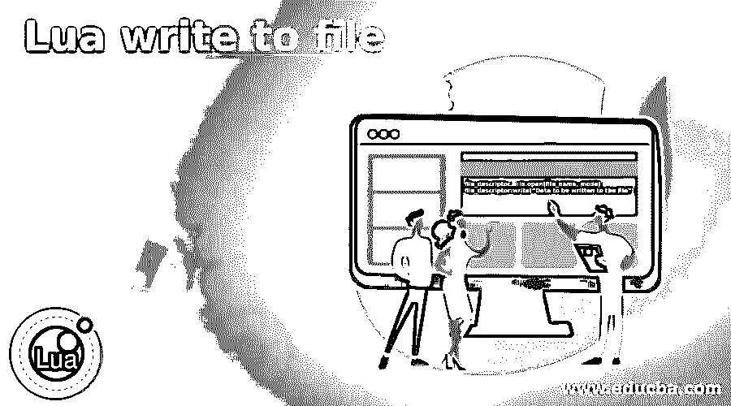
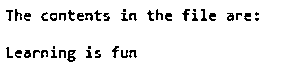
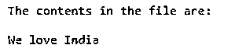

# Lua 写入文件

> 原文：<https://www.educba.com/lua-write-to-file/>

## Lua 写入文件简介

可以使用 I/O 库在 Lua 中将内容写入文件或从文件中读取内容，并且为了对文件执行任何操作，必须打开文件，并且可以以三种标准模式打开文件， 必须在文件打开操作中指定读取模式和附加模式以及我们将要打开文件的模式，以写入模式打开文件使我们能够将数据写入文件，一旦对文件的操作完成，必须使用文件关闭操作关闭文件。

**Lua 中向文件写入数据的语法:**

<small>网页开发、编程语言、软件测试&其他</small>

`file_descriptor = io.open(file_name, mode)
file_descriptor:write(“Data to be written to the file”)`

在哪里，

*   io.open()操作用于打开文件。
*   file_name 指定要打开的文件的名称。
*   模式是文件必须打开的模式。文件可以以读模式(r)、写模式(w)或附加模式(a)打开。
*   file_descriptor:write()操作用于将内容写入文件。
*   要写入文件的数据是要写入文件的数据。

### Lua 中写文件操作的实现

*   可以对文件执行若干操作，例如从文件中读取数据、将数据写入文件以及将数据追加到文件中的现有数据。
*   从文件中读取数据、将数据写入文件以及将数据追加到文件中的现有数据等操作可以在 Lua 中使用 I/O 库来执行。
*   对文件执行任何操作的第一步是打开文件。
*   可以使用 io.open()函数打开文件。
*   打开文件的模式指定了可以对打开的文件执行什么操作。
*   有三种模式可以打开文件，它们是读模式(r)，写模式(w)和附加模式(a)。
*   以写模式打开文件使我们能够将数据写入文件。
*   一旦对文件的操作完成，必须使用文件关闭操作关闭文件。

### Lua 写入文件的示例

以下是 Lua 写入文件的示例:

#### 示例#1

Lua 程序以写模式打开文件，使用 write()函数将内容写入文件，然后使用 read()操作从文件中读取内容，然后将文件内容作为输出显示在屏幕上。

**代码:**

`--creating a temporary file using io.tempfile function
tempfile = io.tempfile
--opening the file in write mode to write the contents to the file using write() operation and then closing the file
filewrite = io.open("tempfile", "w")
filewrite:write("Welcome to EDUCBA")
filewrite:close()
--opening the file in read mode to read the contents from the file using read() operation to display the contents of the file and then closing the file
fileread = io.open("tempfile", "r")
print("The contents in the file are:\n")
print(fileread:read())
fileread:close()`

**输出:**

在上面的程序中，我们使用 io.tempfile 函数创建一个临时文件。然后，我们以写模式打开文件，使用 write()操作将内容写入文件，然后关闭文件。然后，我们再次以读取模式打开文件，使用 read()操作显示文件内容，从文件中读取内容，然后关闭文件。

#### 实施例 2

Lua 程序以写模式打开文件，使用 write()函数将内容写入文件，然后使用 read()操作从文件中读取内容，然后将文件内容作为输出显示在屏幕上。

**代码:**

`--creating a temporary file using io.tempfile function
tempfile = io.tempfile
--opening the file in write mode to write the contents to the file using write() operation and then closing the file
filewrite = io.open("tempfile", "w")
filewrite:write("Learning is fun")
filewrite:close()
--opening the file in read mode to read the contents from the file using read() operation to display the contents of the file and then closing the file
fileread = io.open("tempfile", "r")
print("The contents in the file are:\n")
print(fileread:read())
fileread:close()`

**输出:**

在上面的程序中，我们使用 io.tempfile 函数创建一个临时文件。然后，我们以写模式打开文件，使用 write()操作将内容写入文件，然后关闭文件。然后，我们再次以读取模式打开文件，使用 read()操作显示文件内容，从文件中读取内容，然后关闭文件。

#### 实施例 3

Lua 程序以写模式打开文件，使用 write()函数将内容写入文件，然后使用 read()操作从文件中读取内容，然后将文件内容作为输出显示在屏幕上。

**代码:**

`--creating a temporary file using io.tempfile function
tempfile = io.tempfile
--opening the file in write mode to write the contents to the file using write() operation and then closing the file
filewrite = io.open("tempfile", "w")
filewrite:write("We love India")
filewrite:close()
--opening the file in read mode to read the contents from the file using read() operation to display the contents of the file and then closing the file
fileread = io.open("tempfile", "r")
print("The contents in the file are:\n")
print(fileread:read())
fileread:close()`

**输出:**

在上面的程序中，我们使用 io.tempfile 函数创建一个临时文件。然后，我们以写模式打开文件，使用 write()操作将内容写入文件，然后关闭文件。然后，我们再次以读取模式打开文件，使用 read()操作显示文件内容，从文件中读取内容，然后关闭文件。

### 推荐文章

这是一个 Lua 写文件的指南。这里我们分别讨论 Lua 中写文件操作的介绍、工作原理和例子。您也可以看看以下文章，了解更多信息–

1.  [# C 中的 else](https://www.educba.com/hash-else-in-c/)
2.  [网络编程语言](https://www.educba.com/web-programming-languages/)
3.  [C 语言中的编程错误](https://www.educba.com/programming-errors-in-c/)
4.  [最佳编程语言](https://www.educba.com/best-programming-languages/)

