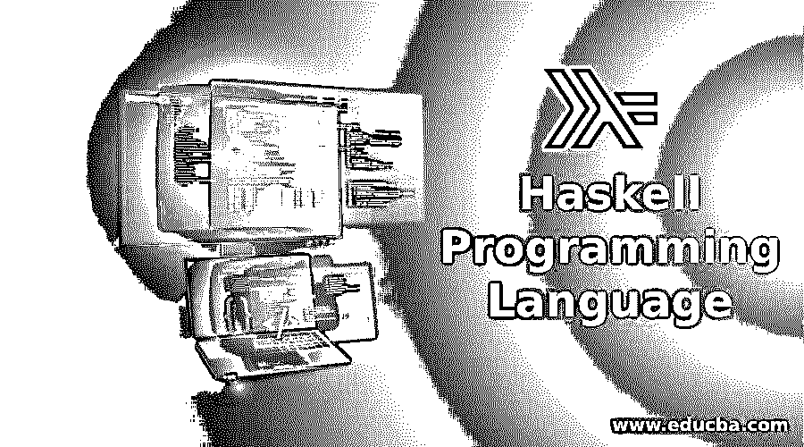

# 什么是 Haskell 编程语言

> 原文：<https://www.educba.com/what-is-haskell-programming-language/>

## Haskell 编程语言介绍

你可能读过很多语言。但是当你听说 Haskell 时，首先想到的是，“又来了一种所谓的想要成为语言的语言。”想到的第一个问题是；为什么？为什么需要这么多种语言？为什么需要这么复杂？为什么与 C 或 Java 相比, [Python](https://www.educba.com/software-development/courses/python-certification-course/ "Python Programming - Zero to Hero") 或 Ruby 如此简单？哈斯克尔到底是什么？

别担心。我今天在这里回答你所有的问题。但首先，什么是 Haskell？通常，你不会发现很多人学习或谈论这种语言。原因是 Haskell 不像 C 或者 Python 那么简单。是啊！我说的是 C，我做了四年 C 的程序员，觉得很有意思。但哈斯克尔的情况就不同了。

<small>网页开发、编程语言、软件测试&其他</small>

我学 Haskell 是因为我觉得它非常有挑战性，不像 C 或者 Python。Python 是一门非常优秀的语言，非常灵活。你几乎可以用它做任何你想做的事情。你的想象力在 Python 中只是极限。现在，让我们从 Haskell 开始，而不是我吹嘘 Python。因为这就是我们在这里的目的，对吗？

但是在你继续往下读之前，让我警告你。这门语言不适合初学者，至少不适合绝对的初学者。如果你之前没有任何编程经验，Haskell 会给你一种**火箭科学的感觉。**这是粗体字。程序员会懂的。

Haskell 编程语言是一种纯函数式语言。或者正确的说法应该是数学。任何喜欢数学的人都会对 Haskell 动态编程非常熟悉，尤其是定理。

### 但是什么是函数式编程呢？

更具体地说，最初的计算方法在函数式编程语言中将函数引入参数。除了这些语言提供的其他特性之外，available programming 还提供了一种最小且紧凑的程序编码形式，包括大量的抽象方法来构建程序。它需要一种心态，知道如何绕过数学，支持程序推理，有点类似于定理。

这种语言引领着编程语言设计的发展。所有其他编程语言，比如 PHP、Basic、C++、Java、Python、Ruby、JavaScript 和 Scala，都是表达 lambda 表达式或闭包的高级编程。

纯函数式语言引入了完全不可变的结构，这些函数没有副作用。该函数将所有不可变的结构作为输入，并创建一个类似于给定输出的新结构。

在中添加整数的示例:

#### 大蟒

`*>>>a=2*`

`*>>>b=3*`

`*>>>a+b*`

`*>>>5*`

#### C++

`*template* *<int x, int y>*`

`*struct* *add {*`

`*    static constexpr int value = x + y;*`

`*};*`

`*int main() {*`

`*    auto z = add<1,2>::value;*`

`*    std::cout << z << std::endl;*`

`*    return 0;*`

`*}*`

#### 哈斯克尔

`*add :: Int -> Int -> Int*`

`*add d e = d + e*`

`*main :: IO ()*`

`*main = do*`

`*    let f = add 1 2*`

`*    putStrLn $ show f*`

Haskell 是一种优秀的编程语言。它的数学非常复杂，而且直截了当，不像其他程序，程序不能被证明是正确的，在大多数情况下，在 Haskell 中，它们是可以的，如果它们编译了，它们将毫无问题地运行。然而，这带来了新的挑战。

例如，假设您在这里甚至不能更改一个单独的 var(var 表示变量)。递归是这里一切的关键。但是你不需要担心。一旦你掌握了其中的窍门，你就会觉得用 Haskell 编写应用程序很轻松。你唯一需要担心的部分是当我说“如果他们编译了”，呵呵呵…，这是 Haskell 中最棘手的部分:“编译”。''

### 为什么选择 Haskell 编程语言？

对于上面的问题，我问，“为什么不”Haskell 是一种很好的学习语言。在这里，您的代码简单且独立。这里没有麻烦或不必要的缩进。Haskell 编程语言也适用于 ideas。有了相当多的经验，你可以用高级和低级编程格式编写程序。

一方面，Haskell 是学习数学的好方法，相反，另一方面，它对于 Haskell 中的并行编程也很强大，这让你可以很好地控制你的[算法](https://www.educba.com/algorithms-and-cryptography/ "Algorithms and Cryptography")片段，比如你的类型如何在内存中构造。很多时候，人们剥夺高级 Haskell 编程语言是因为它看起来太低级了。尽管如此，如果你看它积极的一面，这证明了 Haskell 函数式编程具有低级和高级的可伸缩特性。

作为第一语言，Haskell 是一个很好的开始。人们在学习 Haskell 时面临的许多障碍都是因为他们太习惯于 Python 或 Ruby 等其他高级语言。尽管如此，问题是 Haskell 编程语言与他们的太不一样了。因此，如果你对编程一无所知，把它作为第一语言来学习是没有任何问题的。

从 Haskell 学习其他东西也比反过来容易得多。现在你可能会想，在开始的时候，我说过这种语言不适合初学者。是的，我这么说是因为我想确保你不会浪费 30 分钟来读这篇文章。如果你已经花了这么多时间阅读 Haskell，你就有了学习的坚定决心。这就是你需要了解的这门语言。

### 坏处

Haskell 是一种很棒的语言，但是像其他语言一样，Haskell 编程语言也有它的特点。例如，工具、错误消息以及系统构建的方式都比它们需要的更复杂。如果你在 GHCi 中工作，你会注意到在 Python、 [Golang](https://www.educba.com/software-development/courses/golang-course/ "Go Lang - The Google Language") 或 Scala 中错误消息并没有那么有用。

更不用说其中一些目前正在研究中。Haskell 平台很小，易于安装。另一方面，Haskell 提供了更稳定的 REPL 体验。这里的包管理最近有了很多变化，并且还在改进。甚至 Emacs 也将很快获得许多改进和新特性。

虽然 Haskell 作为一门初学者语言听起来太苛刻了，但是一旦您掌握了合适的基础知识，就很容易迁移到低级语言或高级语言，因为它具有高度灵活的特性，不像 Python 或 Perl 这样的语言，如果您首先学习这些，您可能永远不会想到学习低级语言，因为它的代码结构是异化的。

Haskell 是一门相当大的语言，需要详细学习。我想说 Haskell 是一门很好的第一语言。唯一值得担心的是，由于其工具的问题，它可能需要更多的努力来让您开始并不断地继续下去，特别是如果您想构建一个令人兴奋的程序。

如果我的目标是向人们教授 Haskell 编程语言，我会让安装过程更加轻松。必须有一套合适的模块和正确的版本来配置 GHCi 以正确地编译问题。

学习 Haskell 编程语言意味着你需要功能性地思考。许多新的编程语言允许函数式编程。尽管如此，大多数开发人员并没有充分利用这些特性，因为他们相信更面向对象的模式，因为他们的背景来自学习 C 或 C++。

### 最期待的问题

现在，对于最期待的问题 Haskell 的实际用途是什么？

Haskell 在业界应用广泛，但不如 C#或 Java 普遍。所以如果你想学习它来帮助你得到 Haskell 编程的工作，那可能是浪费时间。学习 Haskell 的一个更好的原因是熟悉函数式方法。这在 Haskell 中会比在其他语言如 F#或 Scala 中发生得更快。你也可以看看我的下一篇关于 Haskell 和 Scala 的博客，了解两者的区别。

这是因为如果你对函数式风格过于不满，其他语言可以选择切换到面向对象的方法——但 Haskell 不是这样。Haskell 编程语言有一个结构，它迫使你只能用函数式风格编写，因为没有其他方法可用。你能做的最后一件事就是放弃写申请。

### 结论

这篇博客的最后一点是，如果你想在 Haskell 中找一份工作，等到 NASA 或 NSA 开始雇佣初级 Haskell 程序员来做这份工作。没错。就是这么难得。但是如果你是因为喜欢挑战而学习，Haskell 就是方法。它将使你的代码在任何语言中变得更好。

它会让你正确理解你的问题，把它们分解成好的部分，尽可能减少调试的需要。如果你正在学习 Haskell 和其他一些编程语言，那么 Haskell 最适合你，因为它会让你成为一个聪明的程序员。

### 相关文章

这里有一些文章将帮助您获得关于 Haskell 编程语言的更多细节，所以请浏览链接。

1.  [方案编程语言](https://www.educba.com/scheme-programming-language/)
2.  [高级语言对低级语言](https://www.educba.com/high-level-languages-vs-low-level-languages/)
3.  [学习算法](https://www.educba.com/learning-algorithms/)
4.  [R 编程职业](https://www.educba.com/careers-in-r-programming/)

