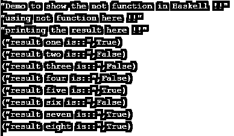

# 哈斯克尔没有

> 原文：<https://www.educba.com/haskell-not/>

## Haskell 的定义不是

在 Haskell 中 not 是一个用来检查变量值的函数，要使用 not 在 Haskell 中我们有' not '关键字。而且，它是 Haskell 的内置函数，所以我们不需要引入任何依赖或安装任何库。我们可以在程序中直接使用它。简而言之，如果我们想要检查任何变量值或根据基于变量值评估的条件执行任何逻辑，那么我们可以在 Haskell 中使用 not 函数，这在编程时非常容易使用和处理。在本教程的下一节，我们将看到 not 函数的内部工作，以及在编程时的实现和用法。

**语法:**

<small>网页开发、编程语言、软件测试&其他</small>

正如我们所讨论的，not 函数可以用来检查变量值，它在评估后返回一个布尔值。让我们看看 Haskell 中 not 函数的语法，以便初学者更好地理解和使用(见下文);

不是“你的价值有待检验”

正如你在上面一行语法中看到的，我们使用 not 关键字来检查变量值，它将在评估后返回布尔值。让我们来看看一个实践语法，以便更好地实现下面看到的内容；

**例如:**

不假

正如你在上面的语法行中看到的，Haskell 非常容易使用和处理，在本文的下一部分，我们将更详细地看到内部工作及其用法，这将有助于初学者在编程时开始使用它。

### Haskell 中的 not 函数是如何工作的？

正如我们现在已经知道的，not 函数用于检查变量值，它返回给我们布尔值。它与我们所说的“平等”正好相反。在本节中，我们将首先看到 Haskell 文档给出的 not 函数的签名细节，然后是函数细节。让我们开始吧:

非函数签名:

Bool -> Bool:这是 Haskell 官方文档给出的 not 函数的签名，它返回给我们布尔值。此外，它给了我们两个基本规则，见下文；

1)不正确==错误

2)非假==真

这是 Haskell 的官方文档给出的，用于说明 Haskell 中的 not 函数。利用这一点，我们可以根据函数的演变从函数中返回一个布尔值。此外，它是 Haskell 编程语言的内置函数，因此我们不需要为此安装或包含任何依赖项。让我们仔细看看 Haskell 中 not 函数的返回类型，以便更好地理解(见下文);

1)返回类型:该函数将返回布尔值。它将根据作为值传递的变量，返回我们进化的真或假。我们必须记住下面描述的两个条件:

1) not True == False:这是第一个条件，如果 not 函数之后传递的值或变量被评估为 True，则 not 函数将返回 False 布尔值作为结果。这个条件满足这个说法。

2) not False == True:这是第二个条件，如果在 not 函数之后传递的值或变量被评估为 False，那么 not 函数将向我们返回 True 布尔值作为结果。这个条件满足这个说法。

这样，not 函数在 Haskell 中工作，因为我们已经看到了它的条件，现在我们将看到一个例子来更好地理解它，见下文；

**例如:**

main = do

打印(非(5>10))

正如你在上面的代码行中看到的，我们试图通过使用 Haskell 中的 not 函数来比较值并得到布尔值。这里我们不需要导入任何包来在 Haskell 程序中使用这个函数。它是 Haskell 的内置函数。首先，我们定义了主模块，在其中使用 not 函数。为此，我们在 Haskell 编程中使用了 not 关键字，这里我们尝试检查数字，我们正在检查 5 是否大于 10。但是我们知道这是一个错误的条件，所以 not 函数会返回 True 作为结果。这意味着它与 Haskell 中的 equal 相反。

### 例子

在这个例子中，我们试图通过使用 Haskell 中的 not 函数来比较数字的值。同样为了这个，我们正在尝试使用内置的 not 函数，这是一个示例，让初学者更好地理解它，并在用 Haskell 编程时开始使用它。

**代码:**

`main = do
print("Demo to show the not function in Haskell !!")
print("using not function here !!")
let val1 = not (5>10)
let val2 = not (2>0)
let val3 = not (100 == 100)
let val4 = not (23 < 78)
let val5 = not ( 10 > 50)
let val6 = not (4 <=90)
let val7 = not (25 > 31)
let val8 = not (1< 0)
print("printing the result here !!")
print("result one is::" , val1)
print("result two is::" , val2)
print("result three is::" , val3)
print("result four is::" , val4)
print("result five is::" , val5)
print("result six is::" , val6)
print("result seven is::" , val7)
print("result eight is::" , val8)`

**输出:**

### 结论

通过使用 not 函数，我们可以检查变量值，并根据它来应用我们的逻辑。我们可以有几个 not 函数，里面有一些条件来检查值。这个功能也很容易操作和使用；对于开发者来说，它也是可读且易于理解的。

### 推荐文章

这是一个哈斯克尔不是指南。这里我们讨论 Haskell 的定义，语法，函数是如何工作的？以及代码实现的例子。您也可以看看以下文章，了解更多信息–

1.  [哈斯克尔在哪里](https://www.educba.com/haskell-where/)
2.  [哈斯克尔也许](https://www.educba.com/haskell-maybe/)
3.  [哈斯克尔映射](https://www.educba.com/haskell-map/)
4.  [哈斯克尔排序](https://www.educba.com/haskell-sort/)

