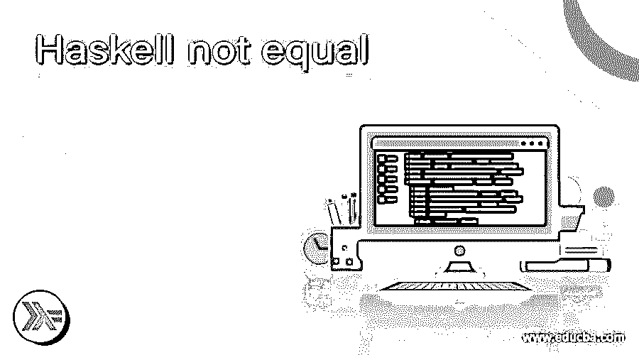
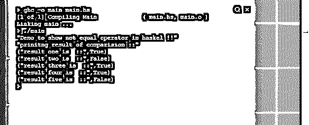

# 哈斯克尔不等于

> 原文：<https://www.educba.com/haskell-not-equal/>

## Haskell 不等于简介

Haskell 中的 not equal 是一个比较运算符，用来比较程序中的变量是否相等。这个运算符类似于数学运算符不等于，在 Haskell 中，我们有一个不同类型的比较运算符，用于验证变量值，根据结果，我们可以在程序中执行自己的逻辑。在 Haskell 中，我们使用一个符号来表示不相等的比较，这个符号表示我们将在本教程的语法部分看到。它不是一个关键字，而是 Haskell 中的一个操作符，根据两个变量的计算返回布尔值。在本教程的下一节，我们将看到它的内部工作原理，以及如何在编程时使用它，还有它的详细实现。

**语法**

<small>网页开发、编程语言、软件测试&其他</small>

为了比较 Haskell 中的任何变量，我们使用了运算符比较列表中的 not equal 运算符，这些是 Haskell 的内置特性。让我们来看看它的语法，了解更多细节，更好地理解它的用法，见下文；

**符号:**

`/=`

正如你在上面的语法行中看到的，我们用“/=”操作符来比较 Haskell 中的值，这很容易使用。让我们来练习一下语法，通过它我们将更清楚地了解如何在 Haskell 中使用 not equal 比较两个变量(见下文);

**举例:**

`value1 /= value2`

通过这种方式，你可以在 Haskell 编程中使用它，在本教程的下一部分，我们将看到不等于运算符的内部工作原理，以及更详细的用法和语法，并提供一个例子让初学者更好地理解它。

### Haskell 中不等于运算符是如何工作的？

到目前为止，我们已经知道在 Haskell 中使用 not equal 来比较变量。这是 Haskell 中比较操作符列表下的一个操作符。此外，正如我们已经讨论过的，它不是一个可以通过名字直接使用的关键字，为了在编程时使用它，我们必须为它使用一个符号，之后只有我们能够在程序中比较变量。首先，我们将讨论这个操作器的内部工作，然后我们将通过一个流程图来展示其工作，这将使我们更好地了解操作器的细节；让我们开始吧；

1)操作员工作；这个运算符是一个比较运算符，用符号表示，这个运算符是 Haskell 或任何其他编程语言中等号运算符的反义词，在大多数编程语言中不等于是用'！= '这个符号但是在 Haskell 中，它有一些不同的表示法，这更像是“≦”这个符号的数学表示法，它们两者都表示同一件事情不相等。

**表示和用法:**

**'/=':** 这是 Haskell 中不等于运算符的基本表示，也是 Haskell 语言提供的内置特性，因此我们不需要包含任何库或外部依赖项就可以在程序中使用它。我们可以直接在符号的左边和右边传递我们的变量或值，它会在值或变量求值后返回结果。

**返回类型:**如果我们谈论它的返回类型，那么它将总是根据变量的计算返回布尔值 True 或 False。如果值不相等，那么它将返回 True，如果传递的变量或值相等，那么它将返回 false。它的工作方式正好与等号运算符相反。

**Type:** 这可以用于 Haskell 中的字符串、数字和字符类型，我们可以通过在 Haskell 中使用 not equal 运算符来比较这些值。正如我们所知，它很容易使用和处理。此外，它对开发人员来说可读性很强，但它有一些不同类型的符号表示，如果我们进行比较，这与另一种语言非常不同。

### 流程图

现在让我们来看看它的流程图，当我们尝试使用不等于运算符时，内部流程是如何进行的，让我们按如下的主干来逐步进行；

1)首先我们尝试传递我们想要比较的变量。需要两个值进行比较并返回结果。

2)之后，它将比较这些值，并返回一个布尔值作为结果。

3) Equal:如果传递的值相等，则结果为 FALSE。

4)不相等:如果传递的值不相等，则结果为真。

5)最后一步是退出。

见下面所附的流程图:

### 例子

在下面的例子中，我们试图通过在 Haskell 中使用 not equal 运算符来比较不同的值，并打印结果。

**举例:**

`main = do
print("Demo to show not equal operator in haskel !!")
let value1 = 100
let value2 = 200
let value3 = 300
let value4 = 300
let value5 = 150
let value6 = 10
let value7 = 300
let value8 = 400
let value9 =  50
let value10 = 50
print("prinitng result of comparision ::")
let result1 =  value1 /= value2
let result2 =  value3 /= value4
let result3 =  value5 /= value6
let result4 =  value7 /= value8
let result5 =  value9 /= value10
print("result one is  ::" ,result1)
print("result two is  ::" ,result2)
print("result three is  ::" ,result3)
print("result four is  ::" ,result4)
print("result five is  ::" ,result5)`

**输出:**

### 结论

通过使用不等于，我们可以比较这些值，并根据变量的结果执行逻辑。这个操作符非常容易使用和处理，使用它也不需要复杂的语法，也不需要外部库，在程序中任何需要的地方都可以方便地使用。

### 推荐文章

这是一个哈斯克尔不平等的指南。在这里，我们讨论了不等于运算符在 Haskell 中是如何工作的，并给出了一些例子。您也可以看看以下文章，了解更多信息–

1.  [哈斯克尔替代方案](https://www.educba.com/haskell-alternatives/)
2.  [关于 Haskell 编程语言需要知道的重要事情](https://www.educba.com/what-is-haskell-programming-language/)
3.  [大数据编程语言](https://www.educba.com/big-data-programming-languages/)
4.  [最佳编程语言](https://www.educba.com/best-programming-languages/)

