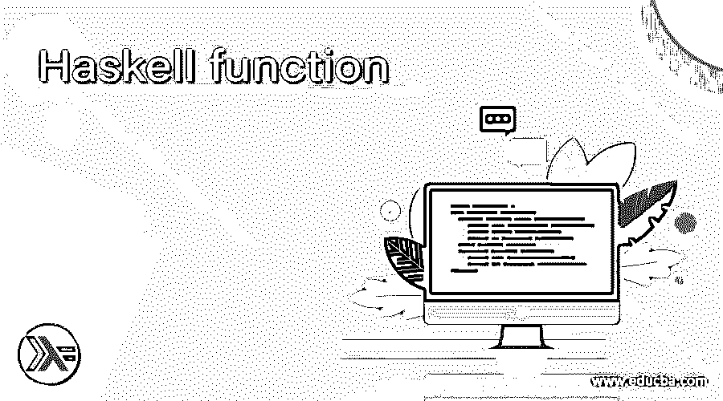
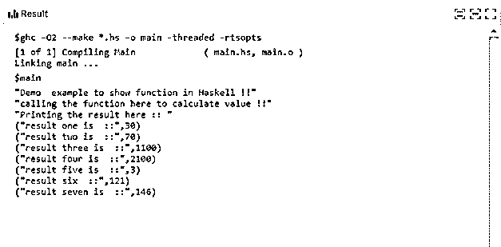

# 哈斯克尔函数

> 原文：<https://www.educba.com/haskell-function/>

## Haskell 函数介绍

在 Haskell 中，我们有不同的可用函数，我们也可以编写自己的函数，负责为我们执行一些特定的任务。用任何编程语言编写函数都是很好的做法，因为它们可以重用，而且如果我们为任何特定的逻辑编写函数，那么它也非常清晰和易于理解。此外，我们可以使用相同的功能执行不同次数的逻辑。在本教程的下一节，我们将看到 Haskell 中详细定义函数的内部工作及其标准，以便初学者更好地理解，并开始使用它来提高代码的质量和性能。

**语法**

<small>网页开发、编程语言、软件测试&其他</small>

正如我们已经讨论过的，要在 Haskell 中定义函数，我们必须遵循 Haskell 官方文档给出的一些标准，这也有助于我们获得想要的结果，让我们仔细看看 Haskell 中函数的声明，见下文；

`function_name :: list of arguments`

正如你在上面 Haskell 函数的语法行中所看到的，我们首先给出名字，然后是它接受的参数列表，并为我们产生输出。让我们仔细看看 Haskell 中函数的练习语法，这将会给初学者一个清晰的理解，见下文；

**举例:**

`demo :: Float -> Float`

正如你在上面的语法行中所看到的，我们已经给了函数名“demo ”,在这之后我们也可以定义它的主体，但是为了更好的理解，我们将在教程的下一节中看到细节，我们也将通过一些实际的例子来更好的理解它的实现。

### 如何在 Haskell 中创建函数？

我们已经知道 Haskell 是一种函数式编程语言，Haskell 为我们提供了许多内置函数，帮助我们执行所需的基本操作。此外，我们还可以定义自己的函数来执行我们想要的操作。这些函数是可重用的，我们可以多次调用它们来多次执行相同的逻辑。这将减少重复代码，减少代码行，并且代码将易于被开发人员理解和处理。在本节中，我们将首先详细讨论函数声明及其定义，这将有助于我们开始使用它。见下文；

1)Haskell 中的函数声明:首先我们将看到 Haskell 中的函数声明，它将定义它将接受什么类型的参数，以及参数的数量和它将产生的输出。在本节中，我们将首先看到函数声明语法，以便更好地理解它(见下文);

**举例:**

`function_name :: param 1 -> param 2 -> param 3`

从上面一行 Haskell 中函数声明的代码可以看出，它非常容易声明和理解。首先，我们为函数提供了一个惟一的名称，通过这个名称可以在代码中访问它。在此之后，我们定义了它将采用的参数类型和它将产生的输出，下面让我们仔细看看；

**举例:**

`demofun :: String -> String -> String`

正如你在上面的代码行中看到的，我们已经定义了一个函数，它将一个字符串作为输入参数，并产生该字符串作为输出。在下一节中，我们将看到上面给出的函数的定义。

2)函数定义:一旦我们定义了函数，那么我们必须给出函数的定义，它将如何工作，并在调用时提供我们想要的结果。因此，我们必须给我们的函数一个合适的定义，这将有助于我们得到输出。让我们仔细看看语法或它，见下文；

**举例:**

`demofun a b =  a ++ b`

正如你在上面的代码行中看到的，我们添加了两个变量，它们被传递给 Haskell 中的“demofun”。在这里，我们使用字符串，并生成字符串作为结果。我们也可以在代码中任何需要的地方调用这个函数。这将帮助我们多次重用相同的代码，并降低代码的复杂性。

在 Haskell 中使用函数时要记住以下几点:

Haskell 中有许多内置函数，但是我们也可以定义自定义函数。

2)要定义我们必须使用的任何函数，并遵循 Haskell 官方文档给出的标准。

3)要定义一个函数，首先要确保它被正确地声明，否则我们会在代码中收到很多错误。

### 例子

1)在本例中，我们在 Haskell 中创建了自己的函数，并尝试从中计算值。这个函数将接受一个整数，并返回结果。这个函数将简单地把这里的两个数相加。这是一个示例，供初学者更好地理解它，并在函数实现后开始使用它来提高代码质量。

**举例:**

`demofun :: Integer -> Integer -> Integer
demofun a b =  a + b
main = do
print("Demo  example to show function in Haskell !!")
print("calling the function here to calculate value !!")
let result1 = demofun 10 20
let result2 = demofun 30 40
let result3 = demofun 500 600
let result4 = demofun 100 2000
let result5 = demofun 1 2
let result6 = demofun 67 54
let result7 = demofun 56 90
print("Printing the result here :: ")
print("result one is  ::", result1)
print("result two is  ::", result2)
print("result three is  ::", result3)
print("result four is  ::", result4)
print("result five is  ::", result5)
print("result six  ::", result6)
print("result seven is  ::", result7)`

**输出:**

### 结论

通过使用该函数，我们可以格式化我们的代码，使其更具可读性和可重用性。此外，如果使用得当，它还可以提高应用程序的性能和可维护性。通过这个函数，我们可以很容易地将我们的代码分支，这将是干净的，也很容易理解。

### 推荐文章

这是一个 Haskell 函数的指南。这里我们讨论定义 Haskell 函数的内部工作及其标准。您也可以看看以下文章，了解更多信息–

1.  [哈斯克尔数组](https://www.educba.com/haskell-array/)
2.  [哈斯克尔编程](https://www.educba.com/haskell-programming/)
3.  [哈斯克尔也许](https://www.educba.com/haskell-maybe/)
4.  [哈斯克尔排序](https://www.educba.com/haskell-sort/)

