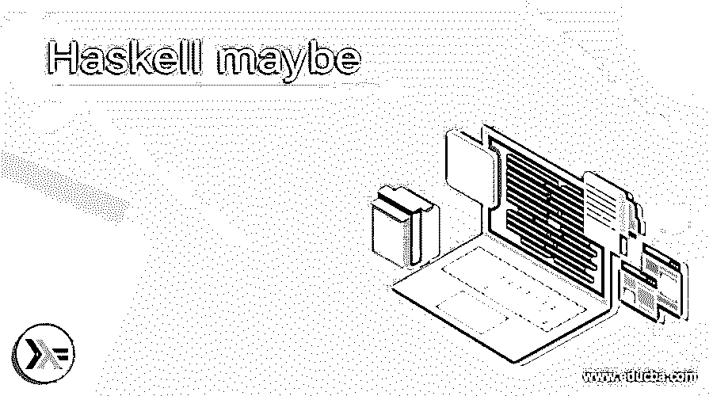
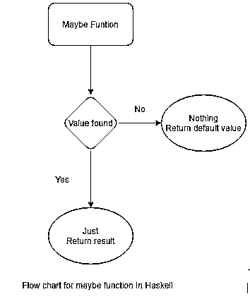
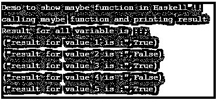

# 也许是哈斯克尔

> 原文：<https://www.educba.com/haskell-maybe/>

## Haskell 可能函数的定义

在 Haskell 中我们有一个处理可选值的 maybe 函数，这个函数主要用来检查 maybe 类型是否包含值。当我们要处理错误和异常时，这个函数非常有用，如果值不在 maybe 类型中，这个函数可以防止发生几个异常和错误。它有两个相关的关键字“Just”和“Nothing ”,这取决于它在检查 maybe 类型值时返回的值。在本教程的下一节中，我们将更详细地讨论内部实现、工作及其用法，以便更好地理解，并在用 Haskell 编写程序时开始使用它。

**语法:**

<small>网页开发、编程语言、软件测试&其他</small>

正如我们已经讨论过的，它要么包含一个值，要么什么都不包含。在编程时使用它之前，我们先来看看它的语法，见下文；

`data Maybe a = Just a | Nothing`

正如你在上面几行代码中看到的，这个函数有两个东西，第一个是 Just，另一个是 Nothing，这是 Haskell 文档给出的 maybe 函数的基本定义。让我们来练习一下如何使用它的语法，让初学者更好地理解它的语法和定义见下文；

**例如:**

`maybe default_value predicate (Just your_value)`

正如你在上面几行代码中看到的，很难理解它是如何工作的，但是在下一节中，我们将更详细地讨论它的用法。

### Haskell 中的 maybe 函数是如何工作的？

现在我们知道，maybe 函数主要检查值是否存在。它有两个名为“Just”和“Nothing”的构造函数。让我们来看看它的构造函数的细节，它们是如何使用 Haskell 中的函数 maybe 检查 maybe 类型的值的(见下文);

**构造函数:**

**1) Just:** Just 表示该值是否存在于 maybe 类型的值内部。如果它发现它为真，那么它将返回给我们这个值。

**2) Nothing:** Nothing 表示如果该值不存在于 maybe 类型的值中。如果它找不到这个值，那么它将返回默认值或者不返回任何值。

在 Haskell 中，我们可能使用一个函数来处理变量中的可选值，这有助于我们避免错误和异常，因为在编程时，我们不确定变量中会保存什么值。我们也不确定它是否包含值，或者只是空白或 null。这种情况可以通过在编程时使用 Haskell 中的 maybe 函数来避免。让我们来看看它的内部工作流程。在 Haskell 中执行 maybe 函数时执行的一个步骤，见下文；

1)我们可以使用 maybe 关键字来调用或者使用 Haskell 中的 maybe 函数。注意，它是 Haskell 中的一个内置函数，我们不要求在编程时安装或使用该函数的任何外部依赖。

2)使用该函数时，我们指定一个想要打印或返回的默认值。如果值存在，它将在这里使用公正的构造函数。它将返回值。

3)如果该值不存在，它将只返回默认值，或者不返回任何内容。

4)它基于公正和虚无来评估价值。我们也可以在这里使用谓词。

5)在这一切之后，它将带着可应用的值从程序中返回。

下图见流程图；

让我们用一个简单的程序来理解它是如何工作的，这将有助于初学者详细理解它的实现，他们也可以在编程时开始使用它，见下文；

**例如:**

`maybe False odd (Just 10)`

正如你在上面几行代码中看到的，我们尝试使用的函数可能有一个奇怪的谓词。所以它会尝试计算这个值，不管它是不是奇数。如果该值存在，那么它将基于使用奇数谓词进行的评估返回 true 或 false。如果值为 Nothing，那么它将返回默认值作为结果。这个功能非常容易操作和维护。

在 Haskell 中使用 maybe 函数时需要记住的几点见下文；

1)它是 Haskell 中的内置函数。

2)它将检查可能值类型中是否存在值。

3)为了表示它所使用的任何值，而为了表示一个虚无，它使用‘虚无’。

### 例子

1)在下面的例子中，如果值目前使用 Haskell 中的 Just from maybe 函数，我们尝试使用 maybe 函数返回结果。这是一个示例，便于初学者更好地理解。

**代码:**

`main = do
putStrLn "Demo to show maybe function in Haskell !!"
putStrLn "calling maybe function and printing result "
let value1 = 1
let value2 = 2
let value3 = 3
let value4 = 4
let value5 = 5
putStrLn "Result for all variable is ::;"
let result1 = maybe False odd (Just value1)
print("result for value 1 is :", result1)
let result2 = maybe False odd (Just value2)
print("result for value 2 is :", result2)
let result3 = maybe False odd (Just value3)
print("result for value 3 is :", result3)
let result4 = maybe False odd (Just value4)
print("result for value 4 is :", result4)
let result5 = maybe False odd (Just value5)
print("result for value 5 is :", result5)`

**输出:**

### 结论

通过使用 maybe 函数，我们可以克服运行时可能出现的许多错误和异常。这里我们对代码是否包含值进行了预先检查。在此之后，只有其他一切将被执行，这也将节省时间。对于开发人员来说，它非常容易使用，可读性和可维护性也很好。

### 推荐文章

这可能是哈斯克尔的指南。这里我们讨论 Haskell 中 maybe 函数的定义、语法、构造函数以及如何工作？以及代码实现的例子。您也可以看看以下文章，了解更多信息–

1.  [哈斯克尔替代方案](https://www.educba.com/haskell-alternatives/)
2.  [哈斯克尔 vs 二郎](https://www.educba.com/haskell-vs-erlang/)
3.  [Haskell vs Scala](https://www.educba.com/haskell-vs-scala/)
4.  [仙丹 vs 二郎](https://www.educba.com/elixir-vs-erlang/)

