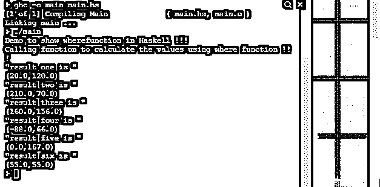
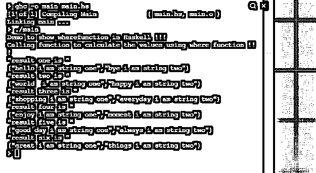

# 哈斯克尔在哪

> 原文：<https://www.educba.com/haskell-where/>

## Haskell Where 函数的定义

Haskell where 不是一个函数，而是一个关键字，用于将更复杂的逻辑或计算分成更小的部分，这使得逻辑或计算易于理解和处理。如果在我们的函数中有一些复杂的逻辑或计算，那么我们可以使用 where 关键字将这些逻辑分成更小的部分。where 子句还负责生成所需的输出。其中是 Haskell 中可用的关键字或函数，我们不需要使用任何外部库来实现。在教程的下一节，我们将更好地理解 where 子句的细节，我们还将看到它的实现和用法。

**语法:**

<small>网页开发、编程语言、软件测试&其他</small>

正如我们讨论的，它是一个与函数定义一起使用的关键字，通过使用它，我们可以将强制逻辑分成更小的部分。下面我们来看看它的语法以便初学者更好的理解来看；

`variable_name = varibale_name_2
where
// here your logic or calculations will go`

正如你在上面几行语法中看到的，我们试图使用 where 子句，此后我们可以编写我们的逻辑，它主要代表了更多强制计算的一小部分。让我们来看看初学者的练习语法，这将使他们对这一点更加清楚，见下文；

**例如:**

演示= val

在哪里

//逻辑

这只是一个基本的语法练习，在接下来的教程中，我们将看到 Haskell 编程语言中 where 子句的内部工作和实现。

### Haskell 中的 Where 函数是如何工作的？

正如我们已经知道的，where 是一个关键字或一个函数，它有助于将复杂的计算分成更小的部分。此外，通过将逻辑分成几个部分，它有助于我们获得期望的输出。通过使用这一点，我们可以很容易地计算没有任何错误的价值，也是可读的其他开发人员。当函数中有几个参数时，这个函数很有用，所以在这种情况下，我们可以使用 Haskell 中的 where 子句将单行表达式分成多个部分。Haskell 中的 Where 子句总是在函数定义中定义，它属于声明性类别，不像 Haskell 中的 Let。Haskell 编程中的 where 子句被绑定到语法结构。但是在 Haskell 中使用 where 子句或函数时，我们也可以删除重复的代码，相反，我们可以将值保存到某个变量中，以后再使用它。

Haskell 中与 where 子句一起使用的区域，让我们看看如何在 Haskell 中使用 where 子句或函数(见下文);

**1)内部函数缺陷:** Where 子句可以与函数定义一起使用，我们可以将逻辑分成更小的部分。这种预测也有助于我们优化代码。让我们举一个例子来理解这个场景，见下文；

**例如:**

`without where :
demo :: (RealFloat a) => a -> a -> String
demo w h
| w / h ^ 2 <= 18.5 = "some msg"
| w / h ^ 2 <= 25.0 = "some msg 2"
| w / h ^ 2 <= 30.0 = "some msg 3"
| otherwise = "success part "`

正如你在上面一行代码中看到的，我们必须在这里定义并计算三次这个人的重量。它正在增加行数。也使得代码重复。所以在这种情况下，我们可以用 where 替换我们的代码

条款。通过使用 where 子句，我们可以计算一次比较变量的值，之后，我们可以使用同一个变量返回结果。这将有助于我们减少和优化我们的代码，也使它更容易理解。

**2)带模式匹配:** Where 子句在 Haskell 中也可以带模式匹配使用。通过使用这一点，我们可以匹配模式并根据它返回结果。让我们举一个例子来更好地理解它的语法，见下文；

**例如:**

`function defination
where your_pattern`

正如你在上面几行代码中看到的，我们使用 where 关键字只是为了让它与 Haskell 中的模式匹配一起工作。正如你所看到的，它非常容易使用和理解。

### 例子

1)在下面的例子中，我们试图使用 Haskell 中的 where 函数添加多个参数。这是一个示例，初学者可以在编程时理解并开始使用它。

**代码:**

`add :: (Float, Float) -> (Float, Float)
add (a,b) = (x1, x2) where
x1 = 10 + a
x2 = 100 + b
main = do
putStrLn "Demo to show wherefunction in Haskell !!!"
putStrLn "Calling function to calculate the values using where function !!!"
let result1 = add(10, 20)
let result2 = add(200, -30)
let result3 = add(150, 56)
let result4 = add(-98, -34)
let result5 = add(-10, 67)
let result6 = add(45, -45)
print("result one is ")
print (result1)
print("result two is ")
print (result2)
print("result three is ")
print (result3)
print("result four is ")
print (result4)
print("result five is ")
print (result5)
print("result six is ")
print (result6)`

**输出:**

#### 示例 2–带有 where 函数的字符串示例。

**代码:**

`addstring:: (String, String) -> (String, String)
addstring (a,b) = (x1, x2) where
x1 = a ++ "i am string one"
x2 = b ++ "i am string two"
main = do
putStrLn "Demo to show wherefunction in Haskell !!!"
putStrLn "Calling function to calculate the values using where function !!!"
let result1 = addstring("hello ", "bye ")
let result2 = addstring("world ", "happy ")
let result3 = addstring("shopping ", "everyday ")
let result4 = addstring("enjoy ", "moment ")
let result5 = addstring("good day ", "always ")
let result6 = addstring("great ", "things ")
print("result one is ")
print (result1)
print("result two is ")
print (result2)
print("result three is ")
print (result3)
print("result four is ")
print (result4)
print("result five is ")
print (result5)
print("result six is ")
print (result6)`

**输出:**

### 结论

通过使用 where，我们还可以进行模式匹配，这也有助于我们非常有效地处理程序的复杂逻辑。如果我们在程序中使用 where 子句，那么代码将变得非常易读，易于理解和维护。还有一点，它是 Haskell 编程的内置特性，不需要外部库。

### 推荐文章

这是哈斯克尔的指南。在这里我们讨论描述，在 Haskell 中 where 函数是如何工作的？示例分别用代码实现。您也可以看看以下文章，了解更多信息–

1.  [哈斯克尔替代方案](https://www.educba.com/haskell-alternatives/)
2.  [Haskell vs Scala](https://www.educba.com/haskell-vs-scala/)
3.  [哈斯克尔 vs 二郎](https://www.educba.com/haskell-vs-erlang/)
4.  [TypeScript vs CoffeeScript](https://www.educba.com/typescript-vs-coffeescript/)

