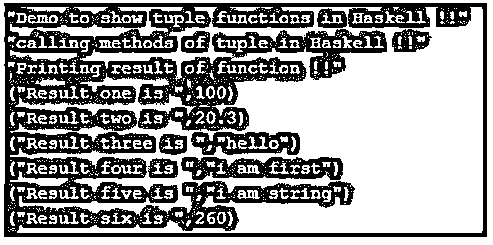

# 哈斯克尔元组

> 原文：<https://www.educba.com/haskell-tuple/>

## Haskell 元组介绍

Haskell tuple 是一种结构，我们可以通过它来存储或分组其中的值。Haskell 中的 tuple 是一个固定大小的结构，其中可以包含任何类型的数据类型。我们可能会有一些要求，我们希望在对象中存储不同类型的值，所以为了完全满足这个要求，我们可以在 Haskell 中使用 tuple，它也提供了几个函数，通过这些函数我们可以从创建的 tuple 中获取值。它们的数量是固定的，所以我们可以在知道需要存储的值的数量时使用它们。

**语法:**

<small>网页开发、编程语言、软件测试&其他</small>

正如我们所知，元组不是一个函数，而是一个数据结构，用来存储固定数量的数据。

让我们看看它在 Haskell 中创建元组的语法。

`("value1 ", "value2 ", "value3 ", "value4 " // so on)`

正如你在上面一行语法中看到的，我们只是用括号来关联 Haskell 中的元组，在里面我们可以存储我们想要的任何类型的数据。

**举例:**

**(100，“你好”)**

正如你所看到的，在 Haskell 中创建元组很容易，也很容易维护。

### Haskell 中 tuple 函数是如何工作的？

现在我们已经知道元组是用来存储值或将值组合在一起的，Haskell 中也有 list，但是元组和 list 的区别在于，元组可以存储不同类型的数据，而 list 不能，它们应该是相同的类型。但他们都曾将这些值组合在一起。元组本质上是固定的，所以当我们知道长度或大小时，我们可以在编程时使用它。

在这里，我们将看到更多关于 Haskell 中元组数据结构所提供的功能，首先我们将详细了解如何在 Haskell 中创建元组。

#### 1.元组

正如我们所知，元组是 Haskell 提供内置功能，我们不需要包含任何外部库或安装任何依赖项。我们可以通过在 Haskell 中使用'()'左右括号来轻松创建它。元组中可以包含不同类型的数据，如数字、字符串布尔等。

**元组签名:**

`("String", Boolean, numbers)`

正如你在上面的代码行中看到的，我们正在创建一个元组，其中包含字符串 Boolean 和 number 作为值。但是创建过程非常简单，我们只需要用小括号在 Haskell 中创建它。

现在我们将看到 Haskell 中可以用于元组的一些函数，这样我们就可以对元组值执行操作。

一些功能描述如下:

#### 1.强迫游泳实验

这个元组函数用于从元组值或组中获取第一个元素。我们可以在 tuple 之前使用这个函数，它将返回 Haskell 中的第一个元素作为结果。

**语法:**

`fst "your tuple"`

正如你在上面几行语法中看到的，我们试图使用 fst 函数从元组中获取第一个元素。因此，我们刚刚在元组之前使用了单词“fst ”,我们可以传递元组名称，也可以在此时创建元组。

#### 2.snd

这个元组函数用于从元组值或组中获取第二个元素。我们可以在 tuple 之前使用这个函数，它将返回第二个元素作为 Haskell 中的结果。

**语法:**

`snd "your tuple"`

正如你在上面几行语法中看到的，我们试图使用 send 函数从元组中获取第二个元素。因此，我们刚刚在元组之前使用了单词“snd ”,我们可以传递元组名称，也可以在此时创建元组。

#### 3.咖喱菜肴

这个函数元组用于将约束函数转换为非约束函数。根据 Haskell 为 tuple 提供的文档。

**语法:**

`curry fst 100 200`

#### 4.解开绳索

根据 haskell 的文档，tuple 中的这个函数用于将 curried 函数转换为 Haskell 中函数的和或对。

**语法:**

`uncurry (+) (your tuple values)`

如您所见，我们在这里使用了带有操作符的 uncurry 函数，它将添加一对元组，并给出结果的总和。我们可以在这里使用任何操作符来对元组执行操作。

### 例子

下面是提到的例子:

在这个例子中，我们使用 Haskell 中 tuple 的 fst 函数。

**代码:**

`main = do
print("Demo to show tuple functions in Haskell !!")
let tuple1 =  (100, 200)
let tuple2  =  (20.3, 450.5)
let tuple3  =  ("hello", "world")
let tuple4  =  ("i am first", "i am second")
let tuple5  =  ("i am string", "i am second string")
let tuple6 =  (260, 270)
print("calling methods of tuple in Haskell !!")
let result1  = fst tuple1
let result2  = fst tuple2
let result3  = fst tuple3
let result4  = fst tuple4
let result5  = fst tuple5
let result6  = fst tuple6
print("Printing result of function !!")
print("Result one is ", result1)
print("Result two is ", result2)
print("Result three is ", result3)
print("Result four is ", result4)
print("Result five is ", result5)
print("Result six is ", result6)`

**输出:**

**

** 

### 结论

元组函数允许我们修改我们的元组元素，它们也帮助我们从元组中获取数据。但是 Haskell 中的元组给了我们一些可以用来操作元组值的函数，Haskell 中没有多少函数可用于元组。这是非常容易使用，处理，可读的其他开发人员也。

### 推荐文章

这是一个 Haskell 元组的指南。在这里，我们将讨论简介，并结合示例进行更好的理解。您也可以看看以下文章，了解更多信息–

1.  [哈斯克尔在哪里](https://www.educba.com/haskell-where/)
2.  [哈斯克尔编程](https://www.educba.com/course/haskell-course-for-programming/)
3.  [哈斯克尔也许](https://www.educba.com/haskell-maybe/)
4.  [哈斯克尔滤波函数](https://www.educba.com/haskell-filter-function/)

