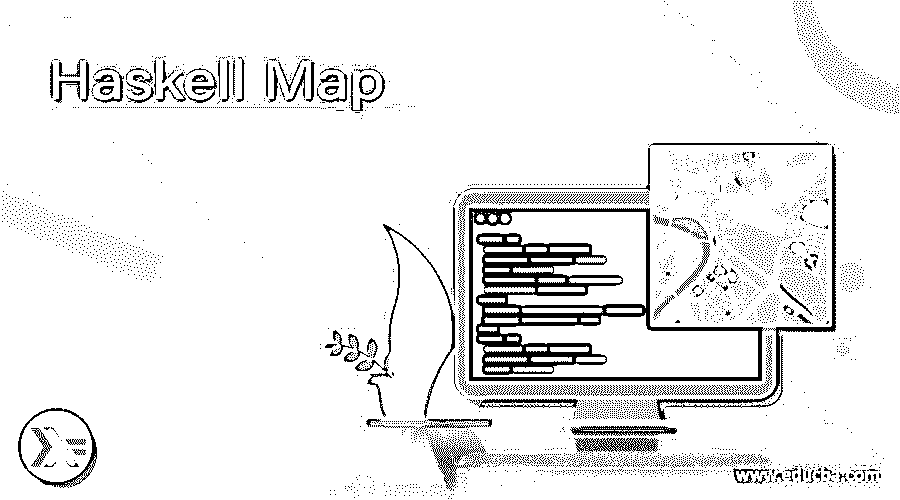
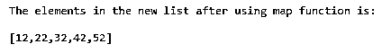
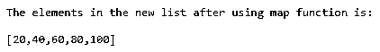
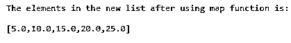
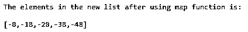

# 哈斯克尔地图

> 原文：<https://www.educba.com/haskell-map/>

## Haskell 映射简介

每当我们想要对给定列表的每个元素应用一个函数，并产生一个由更新的元素组成的新列表时，我们就使用 Haskell 中的一个名为 map() function 的函数，这个 map()函数将一个列表和要应用于列表中每个元素的函数作为输入，并返回一个新列表作为输出，这个 map()函数在数据中可用。Map 模块和 map 的内部实现是一个平衡二叉树，与哈希表等其他实现相比，这是 Haskell 编程语言中非常有效的表示。

**Haskell 中定义 map 的语法如下:**

<small>网页开发、编程语言、软件测试&其他</small>

`map :: (a -> b) -> [a] -> [b]`

其中(a -> b)是应用于列表中每个元素的函数

[a]->[b] represents function being applied on each element in the list.

### Haskell 中的 Map 是如何工作的？

Haskell 中 map 的工作方式如下:

*   每当我们想要对给定列表的每个元素应用一个函数，并生成一个包含更新元素的新列表时，我们就使用 Haskell 中的一个名为 map() function 的函数。
*   map()函数接受两个参数，即列表和应用于列表中每个元素的函数，并返回一个新列表作为输出。
*   map()函数在数据中可用。Haskell 编程语言中的 Map 模块。
*   map 的内部实现是一个平衡二叉树，与哈希表等其他实现相比，这是 Haskell 编程语言中非常有效的表示。

### 例子

让我们讨论 Haskell 映射的例子。

#### 示例#1

Haskell 程序演示了映射函数，使用该函数，我们给给定列表中的每个元素加 2，并在屏幕上显示作为输出结果的新列表:

`--defining a main function in which we are using the map function on a list to add 2 to each element in the list and display the resulting new list as the output on the screen
main  = do
let new = map (+2) [10, 20, 30, 40, 50] putStrLn "The elements in the new list after using map function is:\n"
print $ new`

上述程序的输出如下面的快照所示:

在上面的程序中，我们定义了一个 main 函数，在这个函数中，我们对一个给定的列表使用 map 函数，将列表中的每个元素加 2，并将结果列表作为输出显示在屏幕上。

#### 实施例 2

Haskell 程序演示了映射函数，使用该函数，我们将给定列表中的每个元素乘以 2，并将结果新列表作为输出显示在屏幕上:

`--defining a main function in which we are using the map function on a list to multiply each element in the given list by 2 and display the resulting new list as the output on the screen
main  = do
let new = map (*2) [10, 20, 30, 40, 50] putStrLn "The elements in the new list after using map function is:\n"
print $ new`

上述程序的输出如下面的快照所示:

在上面的程序中，我们定义了一个 main 函数，在这个函数中，我们对一个给定的列表使用 map 函数，将列表中的每个元素乘以 2，并将结果列表作为输出显示在屏幕上。

#### 实施例 3

Haskell 程序来演示映射函数，使用该函数我们将给定列表中的每个元素除以 2，并将结果新列表作为输出显示在屏幕上:

`--defining a main function in which we are using the map function on a list to divide each element in the given list by 2 and display the resulting new list as the output on the screen
main  = do
let new = map (/2) [10, 20, 30, 40, 50] putStrLn "The elements in the new list after using map function is:\n"
print $ new`

上述程序的输出如下面的快照所示:

在上面的程序中，我们定义了一个 main 函数，在这个函数中，我们对一个给定的列表使用 map 函数，将列表中的每个元素除以 2，并将结果列表作为输出显示在屏幕上。

#### 实施例 4

Haskell 程序来演示映射函数，使用该函数我们将给定列表中的每个元素减去 2，并将结果新列表作为输出显示在屏幕上:

`--defining a main function in which we are using the map function on a list to subtract each element in the given list by 2 and display the resulting new list as the output on the screen
main  = do
let new = map (2-) [10, 20, 30, 40, 50] putStrLn "The elements in the new list after using map function is:\n"
print $ new`

上述程序的输出如下面的快照所示:

在上面的程序中，我们定义了一个 main 函数，在这个函数中，我们对一个给定的列表使用 map 函数，将列表中的每个元素减去 2，并将结果列表作为输出显示在屏幕上。

### 结论

在本文中，我们通过 Haskell 编程语言中 map 的定义、语法和工作方式，以及相应的编程示例和演示它们的输出，学习了 Haskell 编程语言中 map 的概念。

### 推荐文章

这是一个哈斯克尔地图指南。这里我们讨论一下 Haskell Map 的简介、语法、如何工作？和代码实现的例子。您也可以看看以下文章，了解更多信息–

1.  [雨燕地图](https://www.educba.com/swift-map/)
2.  [XML 映射](https://www.educba.com/xml-mapping/)
3.  [火花平面图](https://www.educba.com/spark-flatmap/)
4.  [SQL 映射](https://www.educba.com/sql-mapping/)

