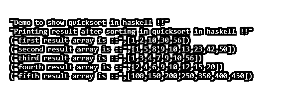

# 哈斯克尔快速排序

> 原文：<https://www.educba.com/haskell-quicksort/>

## Haskell 快速排序简介

一般来说，Quicksort 是一种排序算法，通过考虑性能，用于在最短的时间内对给定值进行排序。如果我们谈论 Haskell 中的 quicksort，那么它不是不同的，只是编写算法的语法不同，但它背后的概念是相同的。我们知道快速排序是基于 divide and concur 规则的，我们将数组或列表分成两部分，并尝试从给定的数组创建两个子数组。最后，在完成了快速排序中的步骤后，我们得到了排序后的结果数组。在本教程的下一部分，我们将看到 Haskell 中快速排序的内部工作方式，以及一个在 Haskell 中实现快速排序的示例，以便初学者更好地理解它。

**语法**

<small>网页开发、编程语言、软件测试&其他</small>

正如我们所知，它不是一个有语法的函数，我们可以根据算法编写自己的逻辑，这些代码可能彼此不同，但概念是相同的。所以在这一节，我们可以看到算法的步骤，但不是语法的细节，见下文；

1)选择透视元素

2)定义名为 I 和 j 两个变量

3)增加 I，直到大于支点。

4)减少 j，直到小于枢轴。

5)重复。

正如你在上面几行算法步骤中看到的，我们在编写代码时必须记住以上几点，然后只有我们才能使用 Haskell 中的 quicksort 对数组元素进行排序。在本教程的下一节，我们将看到它的内部工作与一个例子，我们将迭代，以了解它是如何在内部工作的，也是一个代码片段，作为初学者更好地理解它的样本。

### Haskell 中的 quicksort 是如何工作的？

到目前为止，我们已经知道 quicksort 是一种排序算法，它的工作方式与其他编程语言相同，因为它背后的概念对所有人都是一样的。唯一的区别是我们如何用不同的语言来写它。所以在这一节，我们将看到它的内部工作方式，它在 Haskell 中的实际表现，让我们开始吧，

**Haskell 中快速排序的内部工作:**

因此，就性能而言，快速排序是一种非常有效的排序算法，在这种算法中，我们将原始数组分成两部分，称为子数组。quicksort 背后的思想是它对数组进行分类，并尝试递归调用它来对数组元素进行排序。该算法对于处理大数据非常有效，Haskell 中快速排序的复杂度如下:

平均复杂度:O(n2)

最坏情况复杂度:O(n2)

下面是我们需要遵循的算法步骤，以便按照下面提到的步骤编写我们的代码；

1)首先，我们尝试在 Haskell 的 quicksort 中选择 pivot 元素。这些枢纽元素将把数组分成子数组，我们将继续重复创建太阳数组，直到数组中只剩下一个元素。为了从给定的数组中选择 pivot 元素，我们从数组中选择最高的元素，并将其作为 Haskell 中快速排序的 pivot 元素。

2)在下一步中，我们尝试从给定的数组中选择不应该包括 pivot 元素的左右值。

3)右值将指向高值。

4)左值将指向低值。

5)如果值 right 大于 pivot 元素，则向左移动。

6)如果左边的值小于 pivot，那么我们必须向右移动。

7)如果上述步骤没有遵循，那么我们将把它交换到给定的左侧和右侧。

8)如果左值大于或等于右值，则将其设置为数组的新透视元素。

正如你在上面几行步骤中看到的，它们清楚地定义了在 Haskell 中实现 quicksort 时需要采取和遵循的步骤。也就是说概念是一样的，只是代码编写标准不同。让我们用一个示例数组来更好地理解 Haskell 中的 t(见下文);

给定 haskell 中的数组如下:

5, 3, 8, 10, 6, 7, 9

现在，我们将考虑给定列表中的元素 pivot left 和 right，假设我们将 5 作为 pivot，3 作为左值，7 作为右值。

现在，我们必须按照编写的顺序执行上面描述的所有步骤。现在，我们将检查 left 是否小于 pivot，然后我们将向右移动，在这种情况下，我们有 3 个<5 which is tru so we will move left one step ahead. Same we will check for right if the right is greater than pivot than we will move to left one step. Here we have 9 > 5，这是真的，因此减 1。这些步骤将一直执行，直到我们得到一个排序后的数组。

### 例子

1.这是一个 Haskell 中快速排序的示例，我们试图使用上面提到的步骤来创建用 Haskell 编写的快速排序逻辑。这段代码将为我们编写排序后的数组，我们已经创建了几个数组来测试我们的逻辑，这是一个示例，供初学者更好地理解它，并开始在程序内部使用快速排序算法，以获得更好的性能来处理大数据。

**举例:**

`quicksortdemo :: (Ord m) => [m] -> [m] quicksortdemo [] = [] quicksortdemo (q:qs) = quicksortdemo [m | m <- qs, m < q] ++ [q] ++
quicksortdemo [n | n <- qs, n >= q] main = do
print("Demo to show quicksort in haskell !!")
let array1 = [10, 30, 56, 2, 1] let array2 = [23, 13, 10, 8, 9, 1, 5, 42, 50] let array3 = [3, 7, 1, 4, 9, 56, 10] let array4 = [9, 6, 12, 15, 10 , 2 , 4, 20] let array5 = [200, 100, 400, 250, 450, 150, 350] print("Printing result after sorting in quicksort in haskell !!")
let result1 = quicksortdemo array1
let result2 = quicksortdemo array2
let result3 = quicksortdemo array3
let result4 = quicksortdemo array4
let result5 = quicksortdemo array5
print("first result array is ::", result1)
print("second result array is ::", result2)
print("third result array is ::", result3)
print("fourth result array is ::", result4)
print("fifth result array is ::", result5)`

**输出:**

### 结论

通过使用快速排序算法，我们可以在 Haskell 中实现良好的数据排序性能。它也很容易使用，可读性和易于维护。它不是一个函数或库，而是一个数据结构的概念，通过编写高效的代码来提供良好的编程实践并提高代码的性能。

### 推荐文章

这是一个 Haskell 快速排序的指南。这里我们讨论了快速排序在 Haskell 中是如何工作的，并给出了例子和输出。您也可以看看以下文章，了解更多信息–

1.  [哈斯克尔也许](https://www.educba.com/haskell-maybe/)
2.  [哈斯克尔替代方案](https://www.educba.com/haskell-alternatives/)
3.  [哈斯克尔滤波函数](https://www.educba.com/haskell-filter-function/)
4.  [哈斯克尔映射](https://www.educba.com/haskell-map/)

