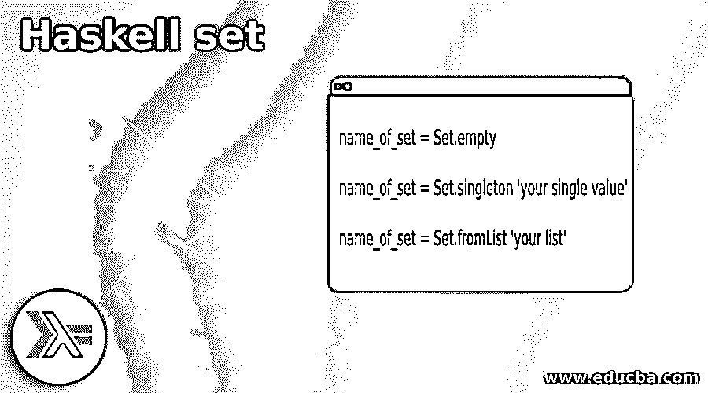

# 哈斯克尔集合

> 原文：<https://www.educba.com/haskell-set/>

## Haskell 集合简介

在 Haskell 中，顾名思义，set 是用来存储元素的，set 本质上是不可变的，并且属于数据结构类别，这为我们提供了一种在其中存储元素的方法，元素应该是有序的并且是唯一的。Haskell 中的 set 为我们提供了高效快捷的删除、插入等操作方式。正如我们所说，它们在本质上是不可变的，这意味着如果我们试图修改现有的集合，它将总是返回给我们包含新修改元素的新集合。

### Haskell 集的语法

集合是用来存储元素的，我们也必须使用一些包来在程序中使用它。

<small>网页开发、编程语言、软件测试&其他</small>

让我们看看它的语法如何在 Haskell 中创建它。

导入符合条件的数据。设为集合:

`name_of_set = Set.empty`

`name_of_set = Set.singleton 'your single value'`

`name_of_set = Set.fromList 'your list'`

正如你在上面的语法行中看到的，我们有三种不同的方法，通过使用它，我们可以在 Haskell 中创建一个集合，一个发出 empty，另一个使用 singleton，第三个是从现有的列表中创建

让我们来练习一下语法:

`demoset = Set.empty`

正如你在上面的语法代码中所看到的，我们试图通过使用 set 的“empty”方法来创建一个空集。

### Haskell 中 set 是如何工作的？

集合用来存储元素，集合存储唯一的元素，也是按照它们插入集合的顺序。在 Haskell 中，我们有一种最简单的方法来创建集合，即使用现有的列表，也可以使用 Haskell 集合中可用的空方法和单例方法来创建。

让我们仔细看看程序中需要导入的导入包:

**用于器械包的包装:**

#### 1.导入符合条件的数据。设为集合

这里提到了应该在程序中导入包，否则在 Haskell 中创建集合时会出错，因为所有创建集合的方法都只存在于包中。为了访问它们，它应该在这个地方。

#### 2.使用现有列表对象创建集合

我们可以通过使用现有的列表变量来创建集合。为此，我们可以使用可用套件中的“fromList”。但是要使用它，我们必须将 set 包导入到程序中。

让我们先看看“fromList”的语法，然后再开始使用它。

`name_of_set = Set.fromList 'your list'`

正如您在上面的代码行中看到的，使用句柄非常容易

让我们看一段样本代码:

**代码:**

`demoset = Set.fromList [10, 20, 30]`

这将创建一个包含列表中元素的集合，并返回 Haskell 中现有列表对象的新集合。

#### 3.创建空集

我们也可以通过使用 set 包中可用的“empty”方法来创建一个空集，因为这个 set 包将出现在程序的顶部。

让我们来看看编程时开始使用“empty”的语法:

`name_of_set = Set.empty`

从上面的代码行可以看出，使用句柄非常容易。

让我们看一段样本代码:

**代码:**

`demoset = Set.empty`

这将创建一个空的集合。

#### 4.使用单个值创建集合

在 Haskell 中，我们还可以创建一个包含单个值的 singleton 集合，为此我们在 Haskell 的集合库中提供了“singleton”方法。

让我们看看在编程时开始使用“singleton”的语法:

`name_of_set = Set.singleton 'your single value'`

从上面的代码行可以看出，使用句柄非常容易。

让我们来看一段代码样本:

`demoset = Set.singleton 'A'`

在下面的方法中，我们可以在 Haskell 中创建 set，但是 set 包包含它是很重要的，它也是 Haskell 的一个内置函数，所以我们不需要安装任何依赖项来在我们的程序中使用它。

### Haskell 集合的示例

下面是提到的例子:

在这个例子中，我们试图使用 set 包的 set library 和 fromList 函数在 Haskell 中创建 set。

**代码:**

`import qualified Data.Set as Set
set1 = Set.fromList ['a'..'z'] set2 = Set.fromList [10, 20, 30, 40, 50, 60] set3 = Set.fromList ["Hello", "world", "bye", "enjoy", "moment"] set4 = Set.fromList [1, 2, 3, 4, 5, 6, 7] set5 = Set.fromList [400, 200, 100, 500, 900, 800] set6 = Set.fromList ["value 1", "value 2", "value 3", "value 3", "value 4"] set7 = Set.fromList [1.1, 2.2, 3.3, 4.4, 5.5, 6.6] main = do
print("Demo to show set in Haskell !!")
print("Printing the result !!")
print("first set is :::", set1)
print("second set is :::", set2)
print("third is :::", set3)
print("fourth set is :::", set4)
print("fifth set is :::", set5)
print("sixth set is :::", set6)
print("seventh set is :::", set7)`

**输出:**

### 结论

通过使用集合，我们可以把我们的元素存储在集合中，也可以控制元素的插入顺序。关于 set 的一个重要的事情是，我们只包含唯一的元素，所以这样我们可以在为应用程序执行业务逻辑时避免重复的数据。

### 推荐文章

这是一个哈斯克尔集指南。这里我们讨论一下引言，set 在 Haskell 中是如何工作的？和示例以便更好地理解。您也可以看看以下文章，了解更多信息–

1.  [哈斯克尔在哪里](https://www.educba.com/haskell-where/)
2.  [哈斯克尔编程](https://www.educba.com/course/haskell-course-for-programming/)
3.  [JavaScript UUID](https://www.educba.com/javascript-uuid/)
4.  [JavaScript 鼠标悬停](https://www.educba.com/javascript-mouseover/)

