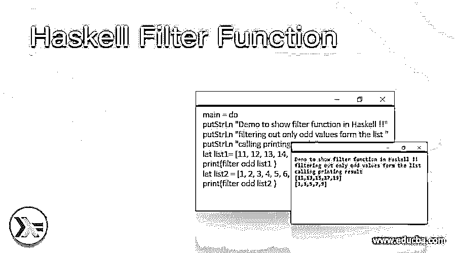
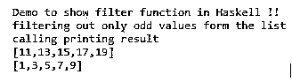
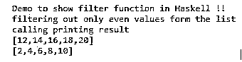
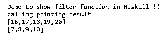

# 哈斯克尔过滤函数

> 原文：<https://www.educba.com/haskell-filter-function/>

## Haskell 过滤函数的定义

Haskell 是一种函数式编程语言，filter 是 Haskell 中过滤任意数据结构的函数。此函数采用可以是任何内容的数据结构，并尝试产生新的数据结构，该数据结构仅包含谓词返回 true 的过滤值，false 值不应包含在新的数据结构中，因为我们已经在这些现有元素中应用了一个条件来进行过滤。这个函数将总是返回给我们包含结果的新数据结构。简而言之，它是一个高阶函数，用于根据传递的一些谓词过滤数据结构元素。在下一节中，我们将详细讨论 filter 函数的内部工作和实现，以便在编程时使用它。

**语法:**

<small>网页开发、编程语言、软件测试&其他</small>

正如我们已经讨论过的，它使用一个谓词来过滤数据结构的元素，并返回给我们新的数据结构。让我们来看看它的语法，以便初学者更好地理解，见下文；

`filter :: (a -> Bool) -> [a] -> [a]`

正如你在上面几行代码中看到的，这是 Haskell 官方文档给出的过滤函数的语法。这里我们使用带有列表或数据结构的谓词来根据谓词过滤出元素。为了更清楚起见，让我们为初学者练习一下语法，见下文；

例如:

`filter (your_predicate) your_list`

从上面的例子中可以清楚地看到这个语法，所以在下一节中，我们将详细讨论内部工作以及如何在程序中使用 filter 函数。

### Haskell 中的 filter 函数是如何工作的？

众所周知，过滤器用于从给定的数据结构中过滤或提取数据或元素以供使用。这个过滤条件可以是基于我们应用的谓词的任何东西。一旦我们应用谓词，它将返回满足谓词条件的元素。让我们看看它的流程图，看看它是如何在 Haskell 中过滤数据的(见下文);

步骤如下:

1)首先我们使用 filter 函数过滤掉数据结构。

2)这里我们用谓词来表示列表或数据结构。

3)如果条件满足，那么谓词将返回 True，如果谓词条件不匹配，将返回 False。

4)过滤函数将总是返回我们新的列表；我们处理的数组或数据结构。

5)谓词的返回类型是布尔型。

6)过滤函数的返回类型是新创建的数据结构。

7)如果我们想要使用过滤函数，那么我们必须一起使用两个东西，一个是谓词，另一个是要处理的数据。

现在举一个例子来理解它是如何以编程方式工作的，见下文；

例如:

`mylist = [21, 22, 23, 24, 25, 26, 27, 28, 29, 30]`

甚至过滤我的列表

在上面几行代码中，我们使用了 Haskell 的过滤函数，这里更重要的一点是它是 Haskell 的内置函数。我们不需要为此导入任何外部库。所以在第一步，我们在里面创建一个列表，我们有一些奇数或偶数的值。在这之后，我们调用过滤函数，并听到我们使用谓词‘even’从已处理的列表中只过滤出偶数值。在这个谓词之后，我们立即传递我们创建的列表变量。这将开始一个接一个地处理列表中的元素，元素的谓词将返回真，否则将返回假。谓词返回 true 的所有元素将作为输出返回，并存储在新创建的列表中。这就是它在 Haskell 中以编程方式工作的方式，也很容易使用。

### 例子

在本例中，我们尝试使用带有‘odd’谓词的过滤函数。所以它将只返回给定列表中的奇数值。这是初学者在编程时开始使用 filter 的示例。

#### 示例#1

**代码:**

`main = do
putStrLn "Demo to show filter function in Haskell !!"
putStrLn "filtering out only odd values form the list "
putStrLn "calling printing result "
let list1= [11, 12, 13, 14, 15, 16, 17, 18, 19, 20] print(filter odd list1 )
let list2 = [1, 2, 3, 4, 5, 6, 7, 8, 9, 10] print(filter odd list2 )`

**输出:**

在这个例子中，我们尝试使用带有 even 谓词的 filter 函数。所以它将只返回给定列表中的偶数值。这是初学者在编程时开始使用 filter 的示例。

#### 实施例 2

**代码:**

`main = do
putStrLn "Demo to show filter function in Haskell !!"
putStrLn "filtering out only even values form the list "
putStrLn "calling printing result "
let list1= [11, 12, 13, 14, 15, 16, 17, 18, 19, 20] print(filter even list1 )
let list2 = [1, 2, 3, 4, 5, 6, 7, 8, 9, 10] print(filter even list2 )`

**输出:**

#### 实施例 3

在这里，我们应用了自定义谓词来过滤掉我们在 as 谓词中使用了大于号的元素。

**代码:**

`main = do
putStrLn "Demo to show filter function in Haskell !!"
putStrLn "calling printing result "
let list1= [11, 12, 13, 14, 15, 16, 17, 18, 19, 20] print(filter (>15) list1 )
let list2 = [1, 2, 3, 4, 5, 6, 7, 8, 9, 10] print(filter (>6) list2 )`

**输出:**

### 结论

通过使用 Haskell 或任何编程语言中的过滤功能，我们可以根据条件过滤出大量的数据结构，并根据需要处理它们以备将来使用。正如我们已经看到的，它非常容易使用和处理，没有沉重的代码结构。

### 推荐文章

这是一个 Haskell 过滤函数的指南。这里我们讨论 Haskell 中 filter 函数的定义、语法以及如何工作？.您也可以看看以下文章，了解更多信息–

1.  [Python 过滤函数](https://www.educba.com/python-filter-function/)
2.  [Matlab 中的滤波函数](https://www.educba.com/filter-function-in-matlab/)
3.  [Scala 过滤器](https://www.educba.com/scala-filter/)
4.  [角度数过滤器](https://www.educba.com/angularjs-number-filter/)

