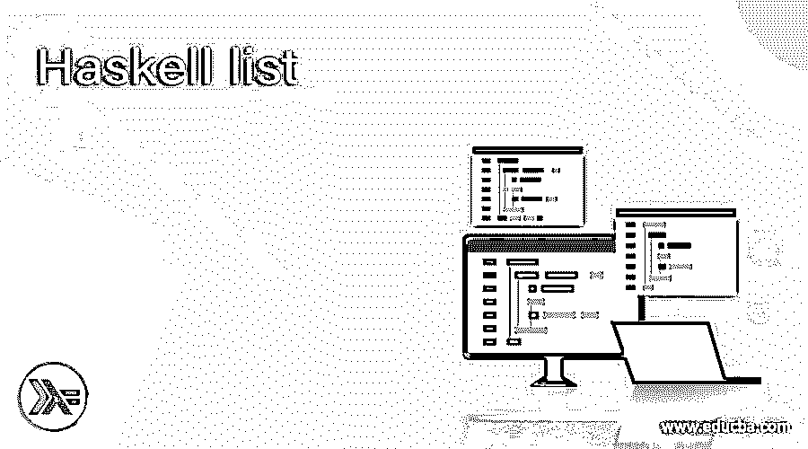
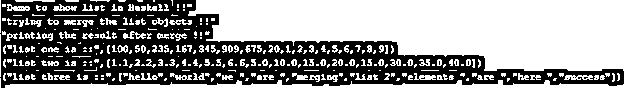

# 哈斯克尔列表

> 原文：<https://www.educba.com/haskell-list/>

## Haskell 列表介绍

在 Haskell 中，list 用于存储元素，这些元素本质上是同质的，也就是说只有一种类型。在列表中，我们可以存储相同类型的元素列表。我们可以在列表中存储任何数据类型。此外，它为我们提供了一些功能，通过使用它，我们可以修改列表的元素，我们还可以通过使用 Haskell 列表中可用的功能来合并两个列表。在本教程的 comings 部分，我们将看到在 Haskell 编程时 list 的内部工作及其实现和用法。

**语法**

<small>网页开发、编程语言、软件测试&其他</small>

如前所述，它用于存储其中的元素，让我们仔细看看列表的语法，以便更好地理解它，如下所示；

`let varibale_name = [value1, value2, value3 ..]`

正如你在上面的语法行中看到的，我们正在创建一个列表，它非常容易被开发者使用和处理，语法清晰可读。为了更好地理解语法，让我们为初学者做一个语法练习，见下文；

**举例:**

`let demo = ["val1", "val2", "val3", "so on"]`

从上面的练习语法中，我们可以清楚地看到，在接下来的教程中，我们将看到内部的工作原理，以及我们如何使用一个函数来修改列表中的元素，以便初学者在编程时开始使用它。

### Haskell 中的列表是如何工作的？

现在我们已经知道 list 是用来存储其中的元素的，它是一个负责存储同质类型数据的数据结构，我们可以在 list 中存储任何类型的数据，可以是字符串、数字、字符等等。我们也有一些链表的函数，通过使用它我们可以对链表变量进行操作。首先，我们将仔细看看列表的语法和签名，见下文；

**签名:**

`let variable = [your values]`

我们可以像其他变量一样在 Haskell 中简单地创建一个列表，我们只是使用[]'方括号'来初始化 Haskell 中的列表元素。还要记住，它只存储一种类型的元素。现在，我们将不得不看看函数，我们可以使用列表变量来执行操作，描述如下；

**1。length:** 通过使用这个函数我们可以得到 Haskell 中列表变量的长度，它会简单地以整数值的形式返回给我们这个长度。它显示了数组或列表中有多少元素。请参阅下面的语法来使用列表中的函数。

**举例:**

`length list_name`

我们可以在 Haskell 中的 length 函数后传递 list 变量。

**2。head:** 这个函数将返回列表的第一个元素，它出现在开始部分。下面是在 Haskell 中使用列表函数的语法；

**举例:**

`head list_name`

我们可以在 Haskell 的 head 函数后传递 list 变量。

**3。tail:** 这个函数将返回除列表头之外的其余元素。请参阅下面的语法来使用列表中的函数。

**举例:**

`tail list_name`

我们可以在 Haskell 的 tail 函数后传递 list 变量。

**4。last:** 这个函数将返回列表中的最后一个元素。请参阅下面的语法来使用列表中的函数。

**举例:**

`last list_name`

我们可以在 Haskell 的最后一个函数后传递 list 变量。

**5。reverse:** 该函数将返回与原始列表顺序相反的列表。请参阅下面的语法来使用列表中的函数。

**举例:**

`reverse list_name`

我们可以在 Haskell 中的 reverse 函数后传递 list 变量。

**6。init:** 这个函数将返回整个列表，除了列表中的最后一个元素。下面是在 Haskell 中使用列表函数的语法；

**举例:**

`inti list_name`

我们可以在 Haskell 中的 init 函数后传递 list 变量。

### 例子

下面举几个例子

#### 示例#1

在这个例子中，我们只是确定一个列表并试图打印它。我们已经创建了几个列表变量，其中包含各种类型的数据。这是一个示例，便于初学者更好地理解它。

**代码:**

`main = do
print("Demo to show list in Haskell !!")
let list1 = [100, 50, 235, 167, 345, 909, 675, 20] let list2 = [1, 2, 3, 4, 5, 6, 7, 8, 9] let list3 = [1.1, 2.2, 3.3, 4.4, 5.5, 6.6] let list4 = [5, 10, 15, 20, 15, 30, 35, 40] let list5 = [123.4, 567.9, 56.0, 3.9, 76.9] print("printing list element !!")
print("list one is ::" ,  list1)
print("list two is ::" ,  list2)
print("list three is ::" ,  list3)
print("list four is ::" ,  list4)
print("list five is ::" ,  list5)`

**输出:**

#### 实施例 2

显示两个列表合并的例子。

**代码:**

`main = do
print("Demo to show list in Haskell !!")
let list1 = [100, 50, 235, 167, 345, 909, 675, 20] let list2 = [1, 2, 3, 4, 5, 6, 7, 8, 9] let list3 = [1.1, 2.2, 3.3, 4.4, 5.5, 6.6] let list4 = [5, 10, 15, 20, 15, 30, 35, 40] let list5 = ["hello", "world", "we ", "are ", "merging"] let list6 = ["list 2", "elements ", "are ", "here ", "success"] print("trying to merge the list objects !!")
let result1 = list1 ++ list2
let result2 = list3 ++ list4
let result3 = list5 ++ list6
print("printing the result after merge !!")
print("list one is ::", result1)
print("list two is ::", result2)
print("list three is ::", result3)`

**输出:**

### 结论

通过使用这个列表，我们可以在其中存储任意数量的元素，这在我们有大量应用程序数据时是必需的。此外，我们有这么多可用的函数，可以与列表变量一起使用，以获取值并执行所需的操作。该列表非常易于使用，可读性强，并且易于维护。

### 推荐文章

这是哈斯克尔列表的指南。在这里，我们讨论了列表在 Haskell 中是如何工作的，以及代码和输出的例子。您也可以阅读以下文章，了解更多信息——

1.  [哈斯克尔也许](https://www.educba.com/haskell-maybe/)
2.  [哈斯克尔映射](https://www.educba.com/haskell-map/)
3.  [哈斯克尔排序](https://www.educba.com/haskell-sort/)
4.  [哈斯克尔在哪里](https://www.educba.com/haskell-where/)

