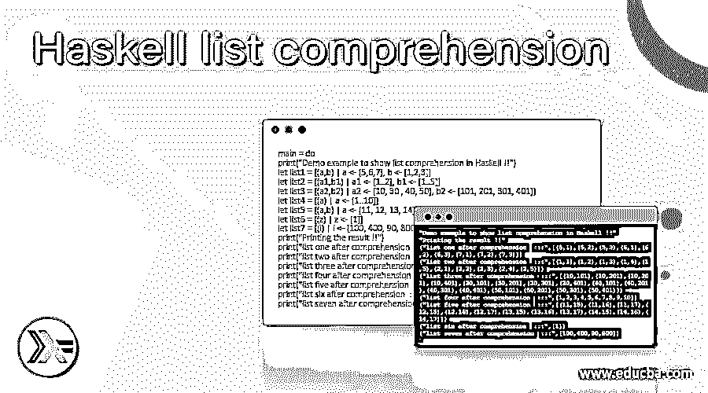
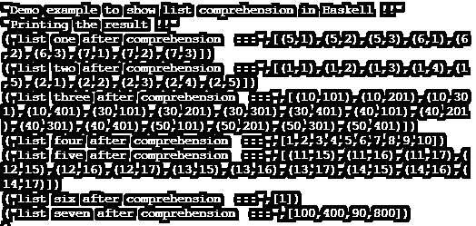

# 哈斯克尔列表理解

> 原文：<https://www.educba.com/haskell-list-comprehension/>

## Haskell 列表理解简介

在 Haskell 中，我们有理解符号，主要用于从现有列表创建新列表。这种理解符号的工作方式和它在数学上的工作方式是一样的，我们有一组新的值，这些值是由现有的值产生的，在现有的值中，我们可以修改这些值来产生新的列表。在 Haskell 中，我们也可以使用数学中开始使用的相同操作符，它由 Haskell 中的管道符号表示。要使用 Haskell 中的理解，我们应该遵循 Haskell 官方文档给出的语法，这对于开发人员来说是易于阅读和理解的。在本教程的 comings 部分，我们将看到理解符号在 Haskell 中的内部工作，以及我们如何在用 Haskell 编程时使用它。此外，我们将看到它的用法和实现。

**语法**

<small>网页开发、编程语言、软件测试&其他</small>

正如我们所知，理解是 Haskell 中的注释，用于从现有列表产生新列表。现在让我们仔细看看 Haskell 中理解符号的语法，以便初学者更好地理解它(见下文);

`[any_function variable_name | to bind <- your list]`

正如你在上面的语法行中看到的，我们刚刚使用了“|”管道操作符来准备 Haskell 中的理解列表。它的语法有点难以理解，但是在下一节中，我们将看到一个例子来更好地理解它。让我们仔细看看练习语法，以便更清楚地看到下面的内容；

**举例:**

`[toUpper x | x <- ["hello world"]`

从上面的练习语法来看，现在理解它已经非常清楚了。在本教程的下一节，我们将看到内部工作原理，以及在用 Haskell 编程时需要做些什么，以便初学者理解并开始有效地使用它。

### Haskell 中的列表理解是如何工作的？

正如我们已经知道的，列表理解是用来从现有列表中产生新列表的。在列表理解中，我们有两件重要的事情，在 Haskell 中使用列表理解时应该考虑。此外，它是 Haskell 的内置概念，因此我们可以直接使用它。因此，我们不需要使用任何外部依赖或任何导入语句来使用 Haskell 中的这个列表组件。在这一节中，我们将看到它的内部工作，首先我们将看到如何使用它，以及让它工作的东西包括哪些，见下文；

让我们用一个示例语法或一段代码来详细理解它的工作原理，见下文；

**举例:**

`[a^2 | a <- [1..10]]`

1) a

2)列表理解中的多重生成器:这个多重生成器可以使用'，'来生成，在 Haskell 中，列表理解中可以有任意数量的生成器。同样，让我们看看它的语法，以便更好地理解；

**举例:**

`[(a,b) | a <- [5,6,7], b <- [1,2,3]]`

正如你在上面的语法行中看到的，我们在这里使用生成器来理解 Haskell 中的列表，它非常容易使用和处理。因此，现在它将生成一个新的列表，其中包含来自两个生成器的元素，并将新列表作为结果返回给我们。

3)列表理解中的生成器的顺序并不总是相同的，如果我们想要从列表理解中生成不同顺序的列表，那么我们可以按照我们想要的方式来编写它。我们也可以交换他们的订单。

现在让我们来看一段用 Haskell 编写的示例代码，它将使用适合初学者理解的正确语法更好地解释列表理解的内部工作方式(见下文);

**举例:**

`main = do
print([(a,b) | a <- [5,6,7], b <- [1,2,3]])`

正如你在上面几行代码中看到的，我们在 Haskell 中使用了列表理解。这里，我们通过 Haskell 的主模块启动了程序，紧接着，我们编写了 list comprehension，其中有两个生成器来产生结果。第一个生成器将生成“a”的值，第二个生成器将生成“b”的值，在列表理解中，输出将是两个生成器值的混合。如你所见，这非常简单，现在我们也可以用任何 Haskell 函数来实现它。

### 例子

1)在这个例子中，我们尝试在 Haskell 中使用 list comprehension，并尝试基于我们已经创建的生成器生成新的列表。这是一个适合初学者的示例。

**举例:**

`main = do
print("Demo example to show list comprehension in Haskell !!")
let list1 = [(a,b) | a <- [5,6,7], b <- [1,2,3]] let list2 = [(a1,b1) | a1 <- [1..2], b1 <- [1..5]] let list3 = [(a2,b2) | a2 <- [10, 30 , 40, 50], b2 <- [101, 201, 301, 401]] let list4 = [(a) | a <- [1..10]] let list5 = [(a,b) | a <- [11, 12, 13, 14], b <- [15, 16, 17]] let list6 = [(z) | z <- [1]] let list7 = [(i) | i <- [100, 400, 90, 800]] print("Printing the result !!")
print("list one after comprehension  :::", list1)
print("list two after comprehension  :::", list2)
print("list three after comprehension  :::", list3)
print("list four after comprehension  :::", list4)
print("list five after comprehension  :::", list5)
print("list six after comprehension  :::", list6)
print("list seven after comprehension  :::", list7)`

**输出:**

### 结论

Haskell 中的列表理解是一种从生成器中产生新元素列表的方法，我们已经在其中传递了这些新元素。同样，对于生成器值，我们可以稍后应用 Haskell 函数来修改它。这种列表理解对于开发者和初学者来说都非常容易使用和处理。

### 推荐文章

这是一个 Haskell 列表理解的指南。在这里，我们讨论了列表理解在 Haskell 中是如何工作的，并给出了例子和输出。您也可以看看以下文章，了解更多信息–

1.  [哈斯克尔数组](https://www.educba.com/haskell-array/)
2.  [哈斯克尔编程](https://www.educba.com/haskell-programming/)
3.  [哈斯克尔排序](https://www.educba.com/haskell-sort/)
4.  [哈斯克尔也许](https://www.educba.com/haskell-maybe/)

