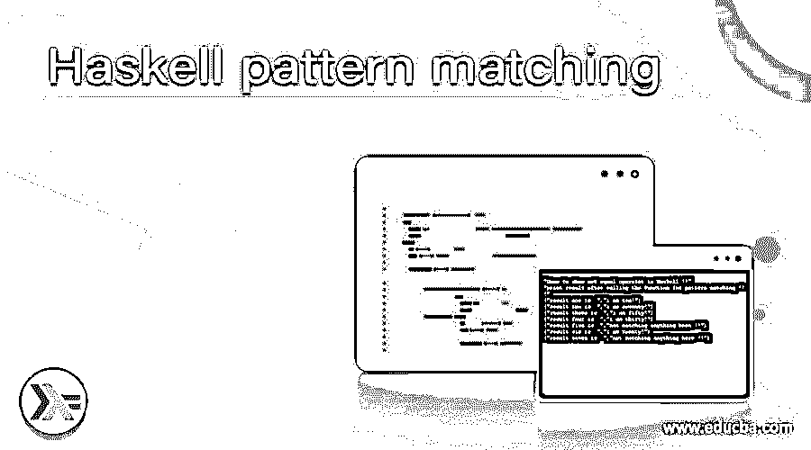
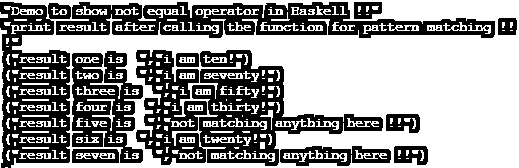

# 哈斯克尔模式匹配

> 原文：<https://www.educba.com/haskell-pattern-matching/>

## Haskell 模式匹配简介

模式匹配顾名思义，我们尝试将一个值与价值机器的任何给定模式进行匹配，然后我们可以说这是成功的。在 Haskell 模式匹配做同样的事情，他们或试图匹配任何给定值或用户传递给函数的值，之后我们可以返回任何我们想要的值，或者我们可以简单地将值赋给变量并返回它。模式匹配非常有用，它可以应用于 Haskell 中的任何东西，如数字、字符、字符串、元组和列表等。在教程的下一部分，我们将看到模式匹配的详细工作，以及模式匹配在 Haskell 中的实现，以便初学者更好地理解和开始在程序中使用。

**语法**

<small>网页开发、编程语言、软件测试&其他</small>

如前所述，模式匹配用于匹配给定值并相应地返回结果。让我们举一个例子，我们可以在 Haskell 中实现模式匹配，首先我们将看到语法，以便初学者更好地理解，见下文；

模式名=要执行的相应值。

..我们可以有任何数量的案例或模式

正如你在上面的语法行中看到的，我们正在创建一个模式，首先我们需要给出模式的名称，在这个值之后是匹配的，然后是我们想要返回的值。先拿一个练习语法给初学者更好的理解；

**举例:**

`demo val = "success"`

正如你在上面的代码行中看到的，现在很清楚要实现了，但是在接下来的部分中，我们将看到更深入的内部工作，让初学者理解并开始使用它。

### 如何在 Haskell 中执行模式匹配？

正如我们现在已经知道的，模式匹配用于将一个值与一个特定的模式进行匹配。在 Haskell 中，我们可以匹配任何类型，如数字、字符串、字符、列表元组等。此外，它的语法非常清晰，也很容易实现。在这一节中，我们将首先看看它是如何在内部工作的，并通过一些例子来详细了解它的工作原理。让我们开始看下面；

1)模式匹配:我们可以使用 Haskell 中的模式匹配来匹配任何类型的值，我们也可以传递多个模式，这些模式将为变量返回不同的值。这种模式匹配的工作方式有点像不同语言中的 case，例如，在 case 中，我们可以有模式，在模式匹配之后，我们可以返回我们想要的值。他们将按照从上到下的顺序计算模式，假设我们有 10 个模式，它将从上到下执行。让我们拿一段代码样本来更好地理解它，见下文；

**举例:**

`dempfun :: (Integral a) => a -> String
dempfun 10 = "i am ten!"
dempfun 20 = "i am twenty!"
dempfun 30 = "i am thirty!"
dempfun 40 = "i am fourty!"
dempfun 50 = "i am fifty!"
dempfun 60 = "i am sixty!"
dempfun 70 = "i am seventy!"
dempfun x = "not matching anything here !!"`

正如您在上面的示例行中看到的，我们正在尝试计算一个应该在 10–70 之间的整数，如果该值小于或大于提到的数字，那么我们会将这些值放入模式匹配的“全部捕捉”块。这里，代码将从顶部开始执行，并从上到下依次执行。如果传递的值不匹配，它将返回 catch all 语句字符串。例如，我们将“30”作为值进行传递，该值需要根据协同创建的模式进行检查，结果它将返回“我三十岁！”作为字符串。让我们假设，如果我试图传递 1000 作为值来匹配所创建的模式，那么它将返回我们“这里没有匹配任何东西！!"作为输出。因此，请始终保持 catch all 块，以避免错误或任何不必要的事件发生。

2) catch all 块:如果我们不提供 catch all 块，那么它将抛出错误，因为在进行模式匹配时，它将找不到任何东西，并向我们抛出错误。如果您提供 catch 块，那么也可以避免错误，使用 Haskell 中的默认模式匹配块会更安全。

在 Haskell 中使用模式匹配时要记住以下几点:

1.当没有匹配时，我们应该使用 catch 块作为默认模式

2.这是一个内置特性，我们不需要为此添加或安装外部依赖项。

3.我们可以为一个函数写尽可能多的模式，没有任何限制。

4.永远记住模式将从上到下执行。

### 例子

1)在这个例子中，我们试图匹配作为整数传递的值，它应该在 10 到 70 之间，如果值不匹配，它将为我们打印 catch-all 块，这是一个示例，供初学者从 Haskell 中的模式匹配开始。

注意:我们也不需要任何库来实现我们的程序。

**举例:**

`dempfun :: (Integral a) => a -> String
dempfun 10 = "i am ten!"
dempfun 20 = "i am twenty!"
dempfun 30 = "i am thirty!"
dempfun 40 = "i am fourty!"
dempfun 50 = "i am fifty!"
dempfun 60 = "i am sixty!"
dempfun 70 = "i am seventy!"
dempfun x = "not matching anything here !!"
main = do
print("Demo to show not equal operator in Haskell !!")
let result1 = dempfun 10
let result2 = dempfun 70
let result3 = dempfun 50
let result4 = dempfun 30
let result5 = dempfun 90
let result6 = dempfun 20
let result7 = dempfun 100
print("print result after calling the function for pattern matching !!!")
print("result one is  ", result1)
print("result two is  ", result2)
print("result three is  ", result3)
print("result four is  ", result4)
print("result five is  ", result5)
print("result six is  ", result6)
print("result seven is  ", result7)`

**输出:**

### 结论

通过使用模式匹配，我们可以很容易地在列表、元组、数字或字符串等中找到匹配值。模式匹配的语法也很容易在 Haskell 中使用和实现。它的工作方式和其他编程语言一样，使用一些值来匹配模式并得到想要的结果。

### 推荐文章

这是一个 Haskell 模式匹配的指南。在这里，我们将讨论如何在 Haskell 中执行模式匹配，并给出示例和输出。您也可以看看以下文章，了解更多信息–

1.  [哈斯克尔滤波函数](https://www.educba.com/haskell-filter-function/)
2.  [哈斯克尔替代方案](https://www.educba.com/haskell-alternatives/)
3.  [哈斯克尔映射](https://www.educba.com/haskell-map/)
4.  [哈斯克尔在哪里](https://www.educba.com/haskell-where/)

