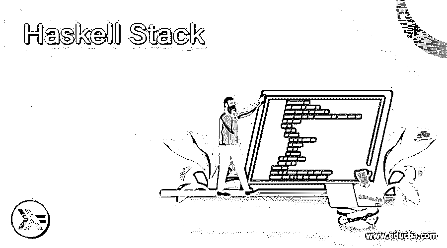

# 哈斯克尔堆栈

> 原文：<https://www.educba.com/haskell-stack/>

## Haskell 堆栈的定义

在 Haskell 中，我们有堆栈数据结构，它也用来存储其中的元素。此外，要使用堆栈，我们必须在应用程序中包含 Haskell 中没有的库。在本节中，我们将使用数据。堆栈库，它也为我们提供了这么多的函数，这些函数用来执行不同的操作。在栈数据结构中，我们只添加和删除栈顶的元素，它以后进先出的方式工作。在本教程的下一节，我们将详细了解堆栈的内部工作，这将帮助我们清楚地了解如何在 Haskell 编程时使用它，以及它的详细实现。

**语法:**

<small>网页开发、编程语言、软件测试&其他</small>

正如我们所讨论的，堆栈是一种像任何其他编程语言一样的数据结构，它有两个主要的操作，如 push 和 pop，帮助我们执行堆栈的操作。让我们仔细看看堆栈语法，以便初学者更好地理解(见下文);

`stackNew:: Stack a`

正如你在上面的语法行中看到的，我们使用关键字“stack”创建了一个简单的堆栈，但是要实现它，我们必须使用数据。将库堆栈到我们的代码中。为了更好地理解，我们来看一个语法的例子，见下文；

例如:

`stackPush :: Stack a -> a -> Stack a`

正如你在上面的语法行中看到的，我们正在尝试使用数据中的一个方法。Haskell 中的堆栈库。没有这个库，它将无法在代码中工作。在本教程的下一节中，我们将详细了解堆栈的内部工作方式，以及它如何在数据内部使用不同类型的函数。堆栈库。

### Haskell stack 是如何工作的？

正如我们已经知道的，堆栈是 Haskell 中可用的数据结构，用于存储其中的元素。这个栈的工作方式和其他编程语言一样，但是它主要有两个操作，这两个操作对于详细理解栈的工作非常重要。在这一节中，我们将看到 Haskell 中堆栈的详细流程，以及详细说明所有步骤的流程图，以便初学者更好地理解。首先，看看下面的流程图。

1)堆栈以后进先出的方式工作，这意味着后进先出。这种方法暗示或表明，最先进入的元素将是最后出来的，一般情况下反之亦然。

2)在堆栈中，我们总是只从一端移除或添加元素。这意味着这里完全满足 LIFO。

3)在堆栈中，我们通常使用 push 和 pop 方法从堆栈中添加或删除元素。

4)如果我们使用了 push 方法，那么 ends 会向堆栈中添加一个新元素。

5)如果我们使用 pop 方法，那么它将从给定的堆栈中移除第一个元素或可用的第一个元素。

6)执行完所有操作后，它将退出。

现在我们将看到数据中可用的一些方法。栈包，我们可以用它在栈上执行一些操作，让我们仔细看看，以便更好地理解。

**1) stackPush:** 这是数据内部可用的函数。我们必须把这个包放到代码中。

基本上，这个函数用于向我们已经创建的堆栈或空堆栈中添加一个新元素。让我们仔细看看 Haskell 文档给出的这个函数的语法。

**例如:**

`stackPush :: Stack a -> a -> Stack a`

如你所见，这是 Haskell 给出的堆栈推送声明的官方文档。

**2)stac know:**这是数据内部可用的函数。我们必须把这个包放到代码中。基本上，这个函数用于创建一个空堆栈。让我们仔细看看 Haskell 文档给出的这个函数的语法(见下文);

**例如:**

`stack new :: Stack a`

如你所见，这是 Haskell 给出的堆栈推送声明的官方文档。

**3)堆栈弹出:**这是数据内部可用的函数。我们必须把这个包放到代码中。基本上，这个函数用于从我们已经创建的堆栈中删除一个条目，它总是从顶部删除。让我们仔细看看 Haskell 文档给出的这个函数的语法(见下文);

**例如:**

`stackPop :: Stack a -> Maybe (Stack a, a)`

如你所见，这是 Haskell 给出的堆栈推送声明的官方文档。

**4) stackIsEmpty:** 这是数据内部可用的函数。我们必须把这个包放到代码中。

基本上，这个函数用于检查堆栈是否为空。让我们仔细看看 Haskell 文档给出的这个函数的语法(见下文);

**例如:**

`stackIsEmpty :: Stack a -> Bool`

如你所见，这是 Haskell 给出的 stackPush 声明的官方文档。

**5) stackSize:** 这是数据内部可用的函数。我们必须把这个包放到代码中。基本上，这个函数用来检查堆栈的大小，里面有多少元素。让我们仔细看看 Haskell 文档给出的这个函数的语法(见下文);

**例如:**

`stackSize :: Stack a -> Natural`

如你所见，这是 Haskell 给出的 stackPush 声明的官方文档。

现在我们可以看到一个它实际上是如何工作的例子，见下文；

`stack = [2, 3, 4, 5 ]`

假设我们创建了这个堆栈，其中插入了一些数字。假设我们已经插入了 2，那么它将是最后一个删除的，因为它以后进先出的方式工作。之后，我们插入了 3，如果我们想删除它们，它会先删除 3，然后是第一个插入的元素。

### 结论

通过使用 stack，我们可以在里面存储我们的元素，在 Haskell 中也很容易使用和处理。但是在 Haskell 中并没有直接显示出来，我们必须包含数据。堆栈库，否则它将无法工作。这些都非常容易使用和处理，开发者也可以阅读。

### 推荐文章

这是一个 Haskell Stack 的指南。这里我们讨论 Haskell 栈的定义、语法、工作原理。以及代码实现的例子。您也可以看看以下文章，了解更多信息–

1.  [哈斯克尔取函数](https://www.educba.com/haskell-take-function/)
2.  [哈斯克尔数组](https://www.educba.com/haskell-array/)
3.  [哈斯克尔 zip](https://www.educba.com/haskell-zip/)
4.  [哈斯克尔函数](https://www.educba.com/haskell-function/)

