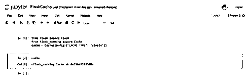

# 烧瓶缓存

> 原文：<https://www.educba.com/flask-cache/>

## Flask 缓存的定义

Flask 缓存被定义为 flask 实用程序中的一种技术，它允许用户存储操作的结果，这可能需要花费大量时间来重新运行该操作，或者换句话说，反复执行该操作是昂贵的。这个操作通常是一个函数调用。当再次执行操作时，通过“存储”后缓存的结果，答案被从存储中取出，而不是操作的实际执行。该实用程序是 flask 的扩展，增加了后端 Flask 应用程序的缓存支持。要记住的一件重要事情是，当事情运行缓慢时，使用一些缓存！

**语法:**

<small>网页开发、编程语言、软件测试&其他</small>

下面我们将首先浏览一些重要的语法，这些语法将使我们能够执行与理解 Flask 中缓存的工作同样重要的任务。

**通过任意终端安装 Flask cache 扩展:**

`easy_install Flask-Caching
OR
pip install Flask-Caching`

**用 python 代码导入 Flask 的缓存模块:**

`from flask_caching import Cache
cache = Cache(config={'CACHE_TYPE': <select choice from list of types>})`

**使用@cached decorator 缓存视图函数的能力:**

`@cache.cached(timeout=27)
def index():
return render_template(<html page>)`

**使用@cached decorator 缓存其他函数的能力:**

`@cache.cached(timeout=50, key_prefix='custom_func')
def custom_list_function():
variable = function_name()
return [random.randrange(0, 1) for x in range(2709)] cached_list = custom_list_function()
Caching Data Explicitly:
cache.set (*args, **kwargs)
Clearing cached Data:
cache.clear()`

### Flask 中的缓存是如何工作的？

既然我们知道了 flask 中高速缓存进程的典型结构，那么理解 Flask 高速缓存的工作原理以及在 Flask 中使用高速缓存的不同功能时会发生什么也同样重要。

缓存通过代码中声明的实例进行管理。此外，用户可以在代码中使用 init_app 方法轻松设置缓存实例。现在，为了使缓存工作，指定缓存类型很重要，因为它将启用需要在 flask 缓存中使用的缓存对象的类型。默认情况下，我们使用 null，这意味着除非指定，否则不会有缓存。目前有各种其他类型的缓存，最广泛使用的是简单缓存方法，除此之外，还可以根据使用 flask 开发的应用程序的需求来使用。一旦缓存类型作为字符串导入，它将被实例化。最后，这个导入对象的返回将是一个符合缓存 API 的缓存对象。此时，创建了缓存实例和缓存类型。根据当前应用程序开发的需要，可以使用缓存的实例。

现在，我们将开始讨论我们之前所学的缓存实例化的另一个扩展。一旦对象被实例化，我们就可以使用 decorators 的概念来缓存函数。缓存是以某种方式为视图函数完成的，对于其他函数，我们需要加入一个参数，即 key_prefix。这里要理解的重点是 key_prefix 在缓存的工作中做什么。Key_prefix 用于为已缓存的值生成一个键。但是为什么还要用这个论点呢？这个论点起了什么作用？简单地说，它将视图功能与其他功能区分开来。为了更详细地理解它，我们看下面的例子。假设有两个函数调用包含缓存的同一个函数。现在，由于没有关联的键，缓存的值有可能被覆盖。这正是 key_prefix 所做的。它维护一个键-值映射对，键可能是函数的名称，或者类似于调用另一个包含缓存的函数的函数，值是函数的结果。下一次在任何地方调用相同的 cache_key 时，flask 知道要呈现什么值。

现在，理解缓存工作的下一部分是了解如何在需要时清除缓存。这在内存利用率超过正常水平的情况下非常有用。使用对缓存的清除功能，我们可以清除存储在该实例中的数据。当代码执行完毕时，这是非常必要的。需要记住的一点是，某些后端实现可能不支持完全清除缓存，在某些情况下，不使用关键字前缀可能会清除整个数据库！

了解了实例化是如何完成的，那么一个重要的参数在决定如何管理缓存时扮演了什么角色呢？我们现在对缓存的工作有了一个完整的了解。

### 优点和缺点

在这一节中，我们将看看 flask 中缓存的不同优点和缺点。

**优点:**

*   缓存有助于加快 web 开发中的加载过程，从而减少 web 应用程序的响应时间。
*   在 web 应用程序中使用缓存的结果是，用于加载页面的资源减少了，因此这些资源可用于执行其他命令。
*   在应用程序中与第三方资源的重复交互被最小化，因此减少了依赖性，从而产生了更健壮的 web 应用程序。
*   网络流量大大减少，结果是网络拥塞

**缺点:**

*   如果没有适当的代理更新，应用程序中可能会存在陈旧的数据。
*   高速缓存的实现增加了复杂性，因为清除高速缓存是绝对必要的。

### 例子

让我们讨论 Flask 缓存的例子。

#### 示例#1

通过任何终端安装 Flask 缓存扩展

**语法:**

`pip install Flask-Caching`

**输出:**

**T2】**

 **#### 实施例 2

用 python 代码导入烧瓶的缓存模块:

**语法:**

`from flask import Flask
from flask_caching import Cache
cache = Cache(config={'CACHE_TYPE': 'simple'})`

**输出:**

### 结论

在本文中，我们已经了解了 Flask 缓存的所有细节，关于我们为什么需要 Flask 缓存的一个特殊之处是，微框架 Flask 没有内置的缓存功能，因此需要这个实用程序！利用列出的优点和缺点，决定使用肯定会有用。

### 推荐文章

这是一个烧瓶缓存的指南。这里我们讨论一下定义，Flask 中的缓存是如何工作的？，优缺点，以及实例。您也可以看看以下文章，了解更多信息–

1.  [Python 流](https://www.educba.com/python-stream/)
2.  [Python kwargs](https://www.educba.com/python-kwargs/)
3.  [Python 键盘中断](https://www.educba.com/python-keyboardinterrupt/)
4.  [Python json.dumps](https://www.educba.com/python-json-dumps/)

**