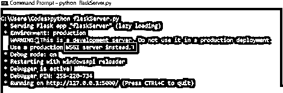

# Flask 服务器

> 原文：<https://www.educba.com/flask-server/>

## Flask 服务器的定义

Flask server 定义为能够在公共万维网、专用局域网和专用广域网上运行 HTTP 请求的服务器软件，由一台或多台捆绑在一起的计算机组成，专门用于在万维网上运行软件应用程序。Flask 有一个内置的服务器，但是为了开发人员的方便，也提供了使用其他服务器的选项。服务器能够处理来自一个或多个已配置网站上的 HTTP 的请求。简而言之，服务器的工作是接收传入的 HTTP 请求，并将处理后的 HTTP 请求发送回客户端，我们将在接下来的章节中了解工作的细节！

### 为什么我们需要 Flask 服务器？

当一个 Flask 应用程序被创建时，它需要在某种程度上得到帮助，以使它能够在应用程序的部署端成功运行。在 flask 应用程序的成功运行中，我们需要确保部署端正常运行，并且在客户端和部署端之间存在无缝连接。部署的是运行和处理 HTTP 请求的软件，称为服务器。在这一节中，我们将理解为什么我们专门使用 Flask server，而不是随便一个。

<small>网页开发、编程语言、软件测试&其他</small>

Flask 作为软件基于 WSGI 工具包和 Jinja2 模板引擎。WSGI 是**W**EB**S**erver**G**ateway**I**interface 的首字母缩写，是一个支持运行 Python web 应用程序的服务器端接口。为了理解 flask 服务器的需求，我们也要理解 WSGI 的角色，这样就完整了。在传统服务器中，没有运行 Python 应用程序的规定，坦率地说，我不了解 Python 及其应用程序。因此，在 20 世纪 90 年代后期，创建了一个 apache 模块来执行任意 Python 代码。这个模块不是一个标准规范，只是在服务器上运行 Python 代码的一种变通方法。因为它不是一个标准版本，有许多潜在的安全漏洞，所以 python 社区想到了一种执行 Python 代码的一致方法。这样就创建了 WSGI 接口，并由此产生了 Flask server 的概念。

现在，随着对标准化服务器的需求，它带来了其他好处，如:

*   提供更多的灵活性:选择使用什么 web 组件来部署应用程序与应用程序本身完全不同。这也使应用程序开发人员和服务器开发人员能够独立工作，同时又能让他们走到一起。
*   更好的扩展功能:它能够同时支持成千上万的动态内容请求。这些服务器通过有效地管理 web 流量来处理请求和通信选择。

既然我们知道了需要，现在重要的是我们要知道它是如何工作的。下一节再来看！

### Flask server 是如何工作的？

Flask 有一个内置的服务器，但是该服务器不适合生产，因为它不能使应用程序具有很好的可伸缩性，因此需要将 Flask 应用程序放在真正的 web 服务器之后，以便通过 WSGI 协议与 Flask 进行有效的通信。一个广泛使用的服务器是 Gunicorn！

现在，它在不同的方面被使用，在这一部分，我们将详细了解在事实中的工作。

*   **处理静态文件:** Web 应用需要一个静态文件，例如 Javascript 或 CSS 来渲染网页的显示。Web 服务器具有配置静态文件的角色，其中数据的对象请求作为来自客户端网页的全局请求被发送到服务器。服务器通过导入 Flask 模块来帮助处理请求。
*   **Flask sessions** :服务器在一个会话中存储数据。在这里，它将数据临时保存在映射到特定会话 ID 的临时文件夹中。
*   **上传 Flask** 中的文件:在文件移动到所需位置之前，服务器暂时保存文件。
*   **发送表单数据:**HTML 格式的表单收集所需条目的信息，然后转发并存储在服务器上。

通过各种实例，我们了解到主要是服务器在处理之前帮助存储所需的数据！

### 优点和缺点

并不是每个概念都是完美的，因此都有利弊。让我们在这里回顾一下:

**优点:**

*   Flask server 使开发人员能够构建可扩展的解决方案。
*   由于服务器和应用程序之间的依赖性较低，它提供了灵活性。
*   使 Flask 在性能方面更加优化。
*   它使开发人员能够编写更多的模块化代码。

**缺点:**

*   Flask 的内置服务器是单线程的，因此，请求是一个接一个串行执行的。因此，提供了其他 Flask 服务器。
*   Flask 的内置服务器有一个安全问题，这个问题由 Gunicorn、waste 等替代版本负责。

### 例子

现在我们已经完全了解了 flask 服务器的作用、工作原理以及本节中的优点和缺点，我们将看一些关于如何实现 Flask 服务器的示例，这样我们就可以对该服务器的外观以及内置服务器和其他 WSGI 服务器(即 Gunicorn)有一些实际的了解。

#### 示例#1

运行本地 Flask 服务器

**语法**

在 python 代码中:

`from flask import Flask
appFlask = Flask(__name__)
@appFlask.route('/index')
def index():
return "Hello World!"
if __name__ == "__main__":
appFlask.run(debug=True)`

**输出:**

#### 实施例 2

在 Windows 上运行女服务员服务器:

**语法:**

`from flask import Flask
from waitress import serve
appFlask = Flask(__name__)
@appFlask.route('/index')
def index():
return "Hello World!"
serve(appFlask, host='0.0.0.0', port=8080, threads=1)`

**输出:**

### 结论

通过这篇文章，我们了解了服务器对于任何 Flask 应用程序的重要性，以及服务器的一些优点和缺点。由于 windows 中的支持不像 UNIX 中那样广泛，因此始终建议在 UNIX 中使用此选项。

### 推荐文章

这是一个关于 Flask 服务器的指南。这里我们讨论一下定义，Flask server 是如何工作的？，优缺点，以及实例。您也可以看看以下文章，了解更多信息–

1.  [烧瓶环境变量](https://www.educba.com/flask-environment-variables/)
2.  [烧瓶会话](https://www.educba.com/flask-session/)
3.  Django vs Flask
4.  [Python 数组长度](https://www.educba.com/python-array-length/)

