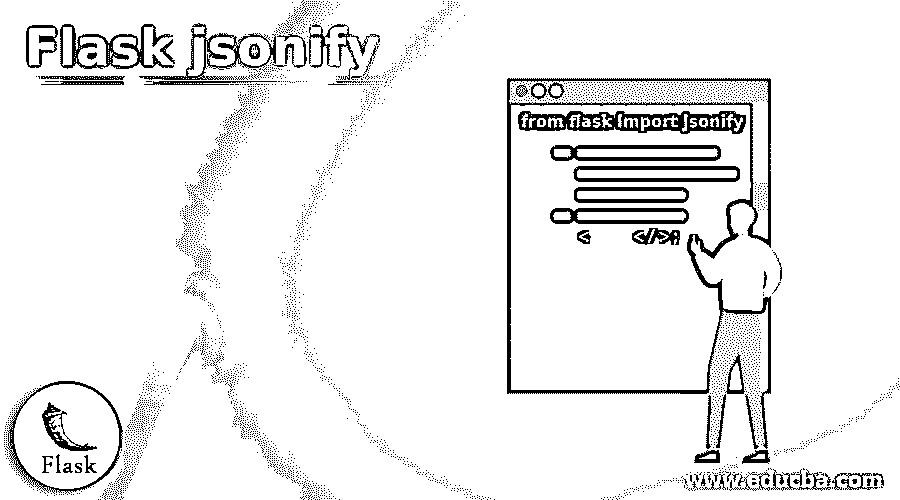
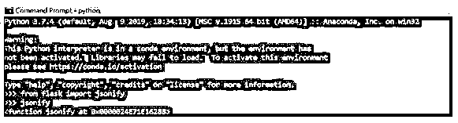
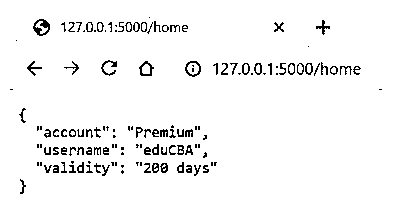
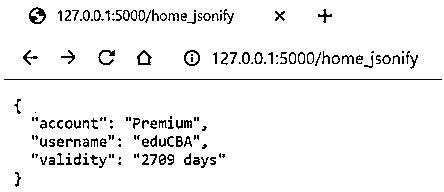
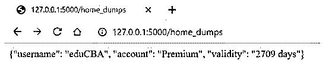

# 烧瓶密封

> 原文：<https://www.educba.com/flask-jsonify/>

## Flask jsonify 简介

Flask jsonify 被定义为 Python 能力范围内的一种功能，通过包装 dumps()函数添加增强功能，将 json (JavaScript 对象表示法)输出转换为带有 application/json mimetype 的响应对象。除了将 json 转换为输出响应之外，该函数还有助于将多个参数转换为数组或将多个参数转换为字典。该函数由适当的内容类型头组成，可供 json 响应使用。json.dumps()函数和 flask.jsonify()函数有很大的不同。现在，让我们看看 jsonify 的其他组件，这使它成为 flask 中最广泛使用的 json 转换函数。

### Flask jsonify 的语法

在这里，我们将看看 flask jsonify 范围内的不同语法，这些语法对我们来说是必不可少的，因为这将使我们能够了解相应的语法并将其映射到工作中。

<small>网页开发、编程语言、软件测试&其他</small>

所以，这里我们使用 jsonify 中的语法:

**在 python 代码中导入 JSON ify:**

`from flask import jsonify`

**通过 jsonify 返回响应对象:**

`jsonify(key1=value1 ,
key2=value2 ,
key3=value3)`

**JSON ify 和 json.dumps()的区别**

**对于 jsonify:**

`jsonify(key1=value1 ,
key2=value2 ,
key3=value3)`

**For json.dumps( ):**

`Json.dumps(key1=value1 ,
key2=value2 ,
key3=value3)`

### jsonify 在 Flask 中是如何工作的？

到目前为止，我们已经清楚了 jsonify 的用途，它是将 json 转换为响应对象所必需的。

正如我们提到的，jsonify 是 flask 的 dumps()函数的包装器，但它在以下方面不同于 dumps()函数:

*   在传递单个参数时，jsonify 只是将参数原样传递给 dumps()函数。
*   在传递多个参数之前，jsonify 先将参数转换为数组，然后再将其传递给 dumps()函数。
*   在传递多个关键字参数之前，jsonify 在将参数传递给 dumps()函数之前将其转换为一个字典。
*   在传递 args 和 kwargs 之前，jsonify 在传递给 dumps()函数时会抛出一个异常。

随着 0.11 版的最新变化，增加了对顶级数组序列化的支持。这个函数直接从 flask 模块加载，而不是从 flask.json 加载。

现在让我们看看 jsonify 函数的核心工作原理。为了理解这一点，我们需要理解 json.dumps()的工作原理，因为 jsonify 只是 json.dumps()函数的一个包装器。比方说，我们收到一个提取细节的 HTTP 请求。jsonify 函数的参数与 dict 构造函数的参数相同。当这个请求从 jsonify 包装器传递到 dumps()函数中时，它们被上面提到的 4 种方法中最适合的一种方法转换。现在，一旦检索到数据，数据就是由一个或多个参数组成的 python 对象的形式。然后使用 json.dumps()的功能将它转换成 json 格式的字符串。在执行这些操作时，python 对象以标准化格式编码到 json 等效模块中。在此转换过程中，该函数在编码的同时执行翻译。比如 Python 中的 dict 转换成 json 对象，list 或者 tuple 转换成 json 数组等等。

现在，一旦 json.dumps()函数接收到对象，包装器就会将输出转换为带有 application/json mimetype 的响应对象。如果请求的 HTTP 不是通过使用选项:X-Requested-With:XMLHttpRequest 或者参数 JSONIFY_PRETTYPRINT_REGULAR 设置为 False，那么这个输出通常会非常清晰。Jsonify 在构建 API 时非常有用，有些人希望返回的对象在 json 中，因为这可能是使用 flask web 应用程序 API 的更大应用程序的约束之一。

### 烧瓶密封的例子

以下是 Flask jsonify 的示例:

我们将尝试查看 jsonify 和 json.dumps()函数的使用之间的主要差异，以及返回对象看起来如何明显不同。

#### 示例#1

在 python 代码中导入 jsonify。

**语法:**

`from flask import jsonify
jsonify`

**输出:**

#### 实施例 2

通过 jsonify 返回响应对象。

**语法:**

`from flask import jsonify, Flask
appFlask = Flask(__name__)
@appFlask.route('/home')
def home():
return jsonify(username='eduCBA' ,
account='Premium' ,
validity='200 days')
if __name__ == "__main__":
appFlask.run(debug=True)`
T2】

**输出:**

**<u>

</u>** 

#### 实施例 3

jsonify 和 json.dumps()的区别。

**语法:**

`from flask import jsonify, Flask
import json
appFlask = Flask(__name__)
@appFlask.route('/home_jsonify')
def home_jsonify():
Dictionary ={'username':'eduCBA' , 'account':'Premium' , 'validity':'2709 days'}
return jsonify(Dictionary)
@appFlask.route('/home_dumps')
def home_dumps():
Dictionary ={'username':'eduCBA' , 'account':'Premium' , 'validity':'2709 days'}
return json.dumps(Dictionary)
if __name__ == "__main__":
appFlask.run(debug=True)`

**输出:**

**jsonify:**

**转储:**

**<u>

</u>** 

这里我们可以清楚地注意到 json.dumps()返回一个字符串，而不是 jsonify 函数返回的对象。

### 结论

在本文中，我们已经了解了 jsonify 如何在 flask 应用程序中工作的细节，并了解了 jsonify 的整个实现周期以及一些实际操作代码。下一步是使用为 flask 应用程序构建 json 返回对象的概念，从而构建一个标准化的概念，使您的 web 应用程序可以被其他来源使用。

### 推荐文章

这是一个关于 Flask jsonify 的指南。这里我们讨论一下入门，jsonify 在 flask 中是如何工作的？和示例。您也可以看看以下文章，了解更多信息–

1.  [烧瓶 URL 参数](https://www.educba.com/flask-url-parameters/)
2.  [烧瓶 HTTPS](https://www.educba.com/flask-https/)
3.  [烧瓶数据库迁移](https://www.educba.com/flask-db-migrate/)
4.  [烧瓶会话](https://www.educba.com/flask-session/)

