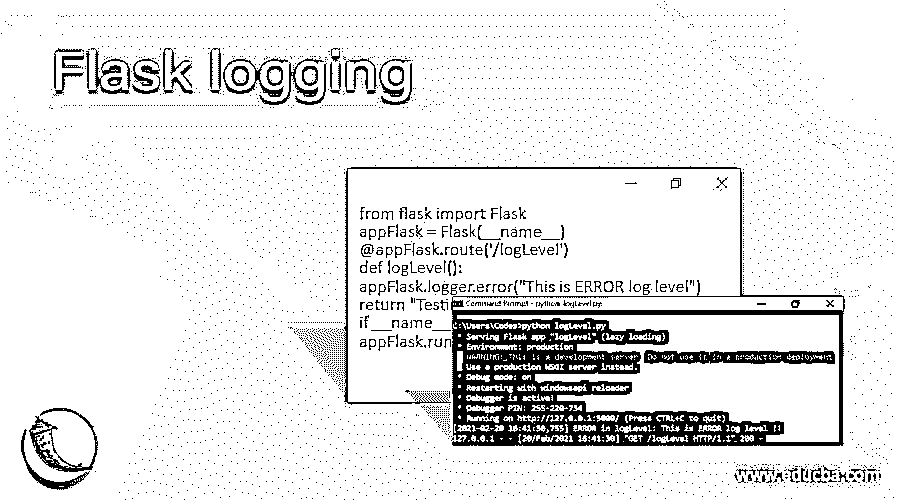
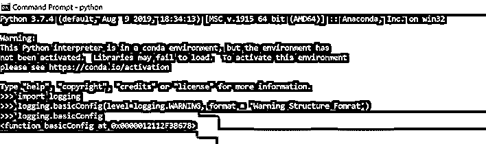
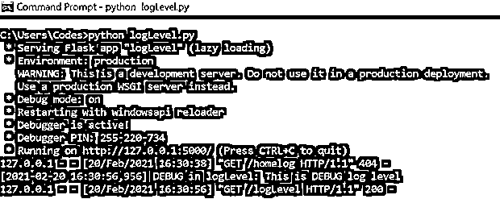
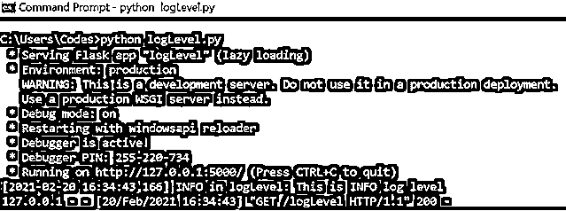
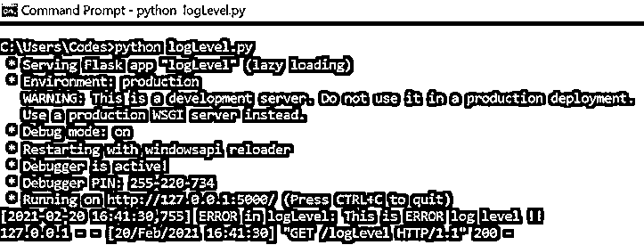
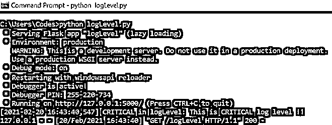

# 烧瓶测井

> 原文：<https://www.educba.com/flask-logging/>

## 烧瓶测井简介

Flask logging 被定义为一个模块，它使开发人员能够为 Flask 应用程序实现一个灵活的事件日志记录系统，并且包括实现所必需的所有类型的函数和类。Flask 中的日志记录使用相同的标准化 Python 日志记录框架。通过 Python 中的标准化库模块拥有日志记录框架的好处是，所有 Python 模块都可以在日志记录期间进行交互和参与。使用 app.logger 记录消息，使用与 app.name 相同的变量完成 Flask 对象的实例化。该模块为 Flask 应用程序的开发人员提供了大量功能和灵活性。

**语法**

<small>网页开发、编程语言、软件测试&其他</small>

日志记录是任何编码实践的基本部分，它允许开发人员在更深的层次上理解程序的流程。随着这种更深入的理解，出现了使代码运行更加透明的方法。有了下面的语法，在我们下一节开始学习日志工作之前，我们将对它的美学外观有一个大概的了解。

**实例化 Python 的默认记录器(basicConfig):**

`import logging
logging.basicConfig(filename='<filename>.log', level=logging.<log_level>, format = '<message_structure>')`

**将日志记录级别设置为调试:**

`<flask app name>.logger.debug("<Message that goes into the logger">)`

**将记录级别设置为信息:**

`<flask app name>.logger.info("<Message that goes into the logger">)`

**将记录级别设置为警告:**

`<flask app name>.logger.warning("<Message that goes into the logger">)`

**将记录级别设置为错误:**

`<flask app name>.logger.error("<Message that goes into the logger">)`

**将日志记录级别设置为严重:**

`<flask app name>.logger.critical("<Message that goes into the logger">)`

**删除默认处理程序:**

`<flask app name>.logger.removeHandler(default_handler)`

**向管理员邮寄错误:**

`import logging
from logging.handlers import SMTPHandler
handlerSMTP = SMTPHandler(
mailhost=<host IP address>,
fromaddr='<from mail address>',
toaddrs=['<list of to address separated by comma>'],
subject='<subject of the mail>'
)
handlerSMTP.setLevel(logging.ERROR)
<flask app name>.logger.addHandler(handlerSMTP)`

### Flask 中的日志记录是如何工作的？

为了理解 Flask 中的日志工作，我们需要理解作为 Flask 中日志框架的一部分的不同组件。不同的组件将登录 Flask 的过程绑定在一起，并使它成为一个完整的循环。这些组件是:

**1。Logger:** 这是任何日志记录系统的入口点，它为 Flask 应用程序提供了一个接口，用于为应用程序记录事件。被记录的事件被称为日志记录。每个级别的记录都有自己的严重性，它们是:

*   **调试:** 10
*   **信息:** 20
*   警告: 30
*   误差: 40
*   **危急:** 50

每个日志记录都包含与上述级别的严重性相匹配的记录。现在，记录器被配置为包含日志级别。任何严重程度高于所确定的日志级别的日志记录只记录在日志记录器中。现在，记录器将日志记录传递给处理程序。

**2。处理程序:**这个组件帮助将日志事件或记录定向到它们各自的目的地。通过使用不同的处理程序，事件被路由到不同的文件，这些文件甚至可能被放置在多个位置。如果需要，日志框架可能需要多个处理程序来满足应用程序的需要。

**3。格式化程序:**在处理程序处理完日志之后，格式化程序用于修改日志记录的美感和外观。该组件指定了日志记录的布局，并通过提及被存储的日志的格式来修改。

**4。Filters:** 最后，一旦决定了美观的外观，这个组件就可以帮助开发人员通过参数过滤日志记录。这些参数也可以是日志级别以外的任何参数。

有了以上 4 个组成部分，烧瓶测井的流程就很好理解了，但我们仍然对烧瓶测井工作的一些细节有所保留。后台的 Flask 应用程序使用 python 日志记录系统框架来跟踪应用程序运行时的事件。在本文中，我们将主要讨论如何使用 Python 的默认日志记录器“BasicConfig”。如果觉得不需要使用 filename，可以删除 filename 属性，日志将显示在控制台上，否则日志文件将与 filename 一起存储。日志扩展。最后一个钉子是由各种属性组成的格式，以便以一种标准化的方式存储日志的正确信息！

在下一节中，我们将看到在一个简单的 Flask 应用程序中使用日志记录！

### 例子

在本节中，我们将查看 Flask 应用程序中日志记录的所有用途，因为到目前为止，我们已经查看了 Flask 应用程序日志记录的语法和工作方式。这将是对我们上面所学理论的亲身体验。

#### 示例#1

实例化 Python 的默认记录器(basicConfig)

**语法**

`import logging
logging.basicConfig(level=logging.WARNING, format = 'Warning Structure Fomrat')`

**输出:**

#### 实施例 2

将日志记录级别设置为调试

**语法**

`from flask import Flask
appFlask = Flask(__name__)
@appFlask.route('/logLevel')
def logLevel():
appFlask.logger.debug("This is DEBUG log level")
return "Testing the debug log level"
if __name__ == "__main__":
appFlask.run(debug=True)`

**输出:**

#### 实施例 3

将日志记录级别设置为 INFO

**语法**

`from flask import Flask
appFlask = Flask(__name__)
@appFlask.route('/logLevel')
def logLevel():
appFlask.logger.info("This is INFO log level")
return "Testing the info log level"
if __name__ == "__main__":
appFlask.run(debug=True)`

**输出:**

#### 实施例 4

将日志记录级别设置为警告

**语法**

`from flask import Flask
appFlask = Flask(__name__)
@appFlask.route('/logLevel')
def logLevel():
appFlask.logger.warning("This is WARNING log level")
return "Testing the warning log level"
if __name__ == "__main__":
appFlask.run(debug=True)`

**输出:**

#### 实施例 5

将日志记录级别设置为错误

**语法**

`from flask import Flask
appFlask = Flask(__name__)
@appFlask.route('/logLevel')
def logLevel():
appFlask.logger.error("This is ERROR log level")
return "Testing the error log level"
if __name__ == "__main__":
appFlask.run(debug=True)`

**输出:**

#### 实施例 6

将日志记录级别设置为严重

**语法**

`from flask import Flask
appFlask = Flask(__name__)
@appFlask.route('/logLevel')
def logLevel():
appFlask.logger.critical("This is CRITICAL log level")
return "Testing the critical log level"
if __name__ == "__main__":
appFlask.run(debug=True)`

**输出:**

### 结论

在本文中，我们已经了解了 Flask 日志记录的工作方式，以及它如何在内部使用 Python 日志记录框架。除此之外，我们还对每个级别分别进行了深入研究，以便人们能够理解其中的差异，并根据他们的需求使用它。像往常一样，其他实验留给读者去执行和学习！

### 推荐文章

这是一个烧瓶测井指南。在这里，我们讨论 Flask 日志记录的工作方式，以及它如何在内部使用 Python 日志记录框架。您也可以看看以下文章，了解更多信息–

1.  [烧瓶 HTTPS](https://www.educba.com/flask-https/)
2.  [烧瓶会话](https://www.educba.com/flask-session/)
3.  [烧瓶 URL 参数](https://www.educba.com/flask-url-parameters/)
4.  [烧瓶环境变量](https://www.educba.com/flask-environment-variables/)

