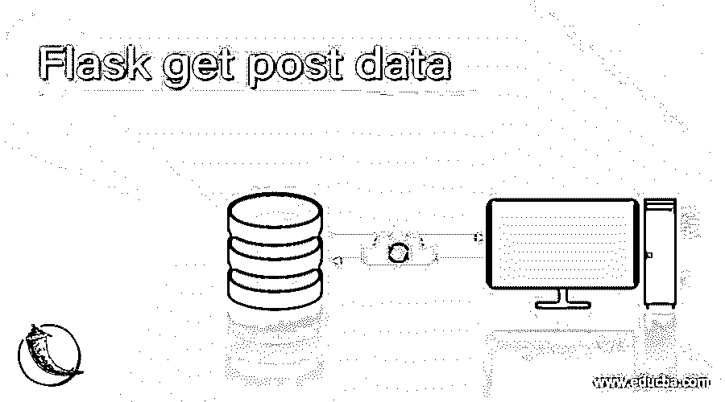
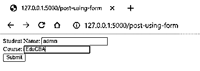
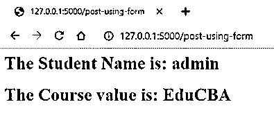
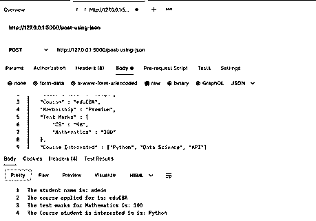

# Flask 获取后数据

> 原文：<https://www.educba.com/flask-get-post-data/>

## Flask get post 数据简介。

Flask 获取定义为 HTTP 请求类型的 POST 数据，HTTP 是万维网中数据传输方法的基础元素。HTTP 是超文本传输协议的缩写。在当今世界，所有的 web 框架都在数据通信中提供了几种 HTTP 方法，Flask 与 web 框架相比毫不逊色。容易混淆的两个常见方法是 GET 方法，这是用于以未加密形式向服务器发送数据的最常见方法，而 POST 请求是向服务器发送 HTML 表单数据，服务器不会缓存 POST 方法返回的数据。

**语法**

<small>网页开发、编程语言、软件测试&其他</small>

在我们查看 Flask GET 和 POST 中涉及的语法之前，我们需要了解有各种方法可以在 Flask 中处理任何传入的请求。在这一节中，我们将从语法的角度学习如何在 flask 中处理 GET 和 POST 数据，这样当我们从一般意义上了解每个 GET 和 POST 请求的分布以及如何处理“GET”和“POST”数据时，就可以更容易地用这里学到的语法将它们映射回来，从而对讨论的主题有一个完整的了解。

**初始化 POST HTTP 方法:**

`@< Flask object >.route('/< end point >,methods = ['POST'])`

**初始化获取 HTTP 方法:**

`@< Flask object >.route('/< end point >,methods = ['GET'])`

**检查请求方式是否为 POST:**

`from flask import request
if request.method == 'POST':`

**以请求方式检索数据:**

`from flask import request
variable = request.args.get('key')`

### 如何获取 Flask 中的 POST 数据？

在我们开始在 Flask 中获取 POST 数据之前，了解 web 框架开发中常见的错误术语的范围是非常重要的，这样人们就可以清楚地知道这样一个事实，即 POST 方法将遵循详细的解释，是人们根据业务需求正在寻找的正确的请求方法。

| 型 | **获取请求** | **发布请求** |
| **用例** | 在请求资源的情况下 | 在创建资源的情况下 |
| **参数** | 参数在 URL 中可见 | 参数在 URL 中不可见 |
| **缓存** | 在 GET 中缓存是可能的 | POST 中无法缓存 |
| **浏览器历史中的有效性** | 该请求保留在浏览器历史记录中 | 请求不会保留在浏览器历史记录中 |
| **书签** | 这些请求可以被加入书签 | 不能将请求加入书签 |
| **用途** | 不适合敏感数据 | 它可用于敏感数据 |
| **极限值** | 长度限制 | 长度不限 |

只是为了不冲淡 get 请求的简单介绍，让我们看看我们获取“GET”数据的方式。我们查看 GET 数据的原因是有一个共性，因此会产生混淆。这篇文章将有助于理解这种差异，因此首先是 GET 方法。数据通过 URL 查询字符串传递给 web 应用程序。这些论点后面都是一个问号(？)字符，每对都是键和值对组合，由等号(=)分隔。请求。参数可以访问 values.get()或 request.args [ ]。request.args [ ]的用法仅限于该键，如果该键丢失，将返回错误的请求错误。否则我们一般用 request.args.get()。

现在到了在 Flask 中获取 POST 数据的激动人心的部分。获取 POST 数据的第一种方法是使用表单数据。该表单数据是从作为 POST 请求发送给路由的表单中检索的。在这种情况下，URL 看不到数据，数据从后台的表单传递给应用程序。这个请求方法是在一个视图函数中提到的。如果方法是 GET，我们将显示表单并允许用户填充它。填写完成后，表单将作为 POST 请求进行处理，并采取必要的操作。

获取 POST 数据的另一种方式是通过 JSON 数据。JSON 数据是广泛使用的构建过程路线的方式。这里传递一个 JSON 对象，它被转换成 python 数据结构。一个对象被转换成 python 字典。而 JSON 中的 array 转换成 Python 中的 list。引号中的任何内容都被视为文本，不带引号的数字被视为数字。一旦完成这些转换，Flask 中就可以根据参数和键对数据进行必要的处理。

### 例子

下面举几个例子

#### 示例#1

将表单数据用于发布请求:

**语法**

`from flask import Flask, request
appFlask = Flask(__name__)
@appFlask.route('/post-using-form', methods=['GET', 'POST'])
def form_example():
# handle the POST request
if request.method == 'POST':
name = request.form.get('name')
course = request.form.get('Course')
return '''
<h1>The Student Name is: {}</h1>
<h1>The Course value is: {}</h1>'''.format(name, course)
# otherwise handle the GET request
return '''
<form method="POST">

<label>Student Name: <input type="text" name="name"></label>

<label>Course: <input type="text" name="Course"></label>

<input type="submit" value="Submit">
</form>'''
if __name__ == '__main__':
appFlask.run(debug = True)`

**输出:**

点击提交按钮后

#### 实施例 2

对 POST 请求使用 JSON 数据:

**语法**

`from flask import Flask,request
appFlask = Flask(__name__)
@appFlask.route('/post-using-json', methods=['POST'])
def json_example():
request_data = request.get_json()
name = request_data['Student Name'] course = request_data['Course'] python_version = request_data['Test Marks']['Mathematics'] example = request_data['Course Interested'][0] return '''
The student name is: {}
The course applied for is: {}
The test marks for Mathematics is: {}
The Course student is interested in is: {}'''.format(name, course, python_version, example)
if __name__ == '__main__':
appFlask.run(debug = True)`

**输出:**

端点的 JSON 对象通过 POSTMAN 发送。

### 结论

总之，在本文中，我们学习了在 Flask 中获取 POST 数据的技术以及处理它们的不同方法。POSTMAN 通常处理 JSON，因为在 web 浏览器上运行该方法的 URL 会导致 405 methods not allowed 错误。现在剩下的就看读者如何试验我们在这里学习的教程策略，并在现实生活中应用它们了。

### 推荐文章

这是一个关于 Flask 获取 post 数据的指南。这里我们讨论在 Flask 中获取 POST 数据的技术和处理它们的不同方法。您也可以看看以下文章，了解更多信息–

1.  [烧瓶缓存](https://www.educba.com/flask-cache/)
2.  [烧瓶版本](https://www.educba.com/flask-version/)
3.  [烧瓶 HTTPS](https://www.educba.com/flask-https/)
4.  [烧瓶数据库迁移](https://www.educba.com/flask-db-migrate/)

