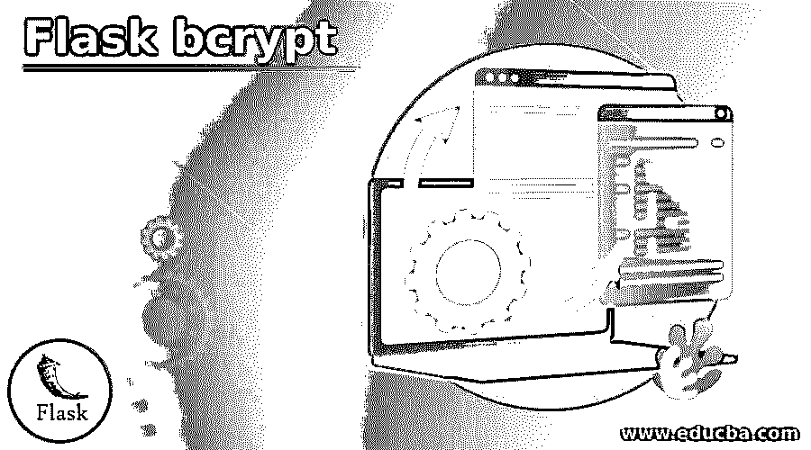
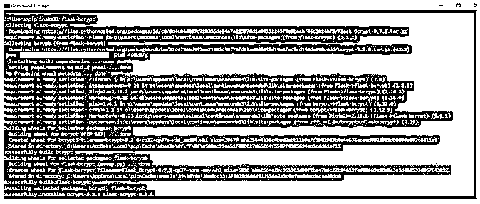
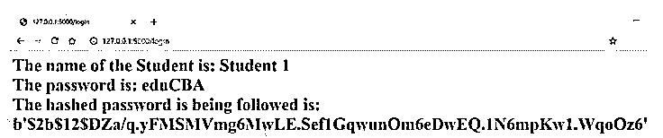
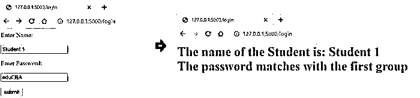
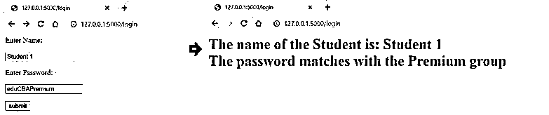

# Flask bcrypt

> 原文：<https://www.educba.com/flask-bcrypt/>

## 烧瓶 bcrypt 简介

Flask bcrypt 被定义为 Flask 扩展，它使用户能够使用与 bcrypt 散列相关的实用程序。bcrypt 是一个基于 Blowfish 密码的散列函数，它结合了 salt 来保护应用程序免受任何彩虹表攻击。我们知道，有太多的新术语。让我们来破译它！Salt 是随机数据的附加输入，有助于在存储时保护密码，而 rainbow table 是一个预计算表，支持缓存加密哈希函数，常用于破解密码哈希。bcrypt 是一个自适应函数，可以故意使其变慢，以便应用程序可以抵抗暴力攻击。

### Flask bcrypt 的语法

这里我们将看到 flask bcrypt 中广泛使用的一些命令的语法。这是因为当我们学习 bcrypt 时，对语法有一个肤浅的理解将会使我们更容易掌握整个上下文。

<small>网页开发、编程语言、软件测试&其他</small>

1.在 python 中安装 Flask bcrypt 模块。

`pip install flask-bcrypt`

2.用 python 实例化 bcrypt 对象。

`from flask import Flask
from flask.ext.bcrypt import Bcrypt
appBcrypt = Flask(__name__)
bcrypt = Bcrypt(appBcrypt)`

3.通过创建的 bcrypt 对象使用定义的方法散列密码。

**Python 2:**

`hashVar = <bcrypt object>.generate_password_hash('< password to hash >')`

**Python 3:**

`hashVar = <bcrypt object>.generate_password_hash('< password to hash >') .decode(‘utf-8’)`

4.通过创建的 bcrypt 对象检查散列密码。

`bcrypt.check_password_hash(hashVariable, '< password to hash >')`

### bcrypt 在 Flask 中是如何工作的？

*   为了理解 hashing，特别是 bcrypt，我们必须理解一些术语，这些术语可能是新的，但使用起来非常混乱，因此需要消除混乱。首先使用的可互换术语是身份验证和授权。在认证过程中，我们确保用户是他们所声称的那个人，而在授权过程中，我们确保用户被允许访问某个路由或资源。因此，我们将在使用 Bcrypt 的哈希中讨论的密码需要经过身份验证，一旦通过身份验证，用户将被授权继续执行接下来的任务。
*   这些密码对自己来说非常重要，因为一旦密码落入不法之徒手中，个人的财务或个人数据可能会面临泄露的风险，甚至会导致严重的安全漏洞。因此，存储的密码绝不能是纯文本。现在，如果我们需要存储密码，我们需要散列一个密码，然后将其存储到数据库中。这个散列过程也称为单向加密，其座右铭是永远不解密密码。现在，如果密码从未被解密，它是如何认证的。为此，我们散列用户发送的密码，然后匹配散列值，而不是对存储的散列密码执行解密。使 flask 能够执行这种散列操作的技术或模块之一出现在 flask bcrypt 中，现在我们将知道这个模块是如何工作的，现在我们已经清楚地了解了 bcrypt 工作的环境。
*   首先，我们需要在用于开发 flask 应用程序的环境中安装 flask-bcrypt 模块。安装模块时，我们需要使用 pip 命令。下一步，我们需要开始构建 flask 应用程序，首先需要导入安装的模块。一旦导入完成，我们需要实例化 bcrypt 的对象。这样，我们现在可以使用在整个代码中创建的对象。此时，我们已经创建了一个 bcrypt 对象，它将包含 flask 应用程序中散列实用程序所需的所有 API 调用。
*   存在各种散列方法。使用任何一种散列方法，我们都会尝试通过可用的 hashlib 生成一个密码散列，并保持散列后的密码不变。使用这个散列密码，当用户试图输入另一个密码时，我们将使用 check _ password _ hash API。这个 API 将接受 2 个值，一个是哈希值，另一个是用户的输入。现在，API 将尝试对用户输入的值进行散列，然后查看用户输入的散列值是否与存储的密码的散列值匹配，这样它将对用户进行身份验证。
*   如果有人试图查看散列密码，他们将看到的是一个可能没有任何意义的字节文字，而是包含散列值的信息以及关于密码如何被散列的信息。我们还讨论了 bcrypt 的一个实用工具，在这个工具中，我们可以增加散列密码所需的时间。通过这样做，我们可以延迟快速连续的暴力攻击，从而避免任何恶意攻击。现在我们知道了 bcrypt 在 flask 中的工作方式以及它们在什么环境中使用。

### 烧瓶 bcrypt 的例子

下面给出了烧瓶 bcrypt 的例子:

#### 示例#1

在 python 中安装 flask bcrypt 模块。

**语法:**

`pip install flask-bcrypt`

**输出:**

#### 实施例 2

通过创建的 bcrypt 对象使用定义的方法散列密码。

**语法:**

`from flask import Flask, request
from datetime import timedelta
from flask_bcrypt import Bcrypt
appBcrypt = Flask(__name__)
bcryptObj = Bcrypt(appBcrypt)
@appBcrypt.route("/login", methods = ['POST','GET'])
def login():
if request.method == 'POST':
studentName = request.form['studentName'] password = request.form['password'] hashPassword = bcryptObj.generate_password_hash(password)
return '''<h1> The name of the Student is: {}  
The password is: {}  
The hashed password is being followed is: {}'''.format(studentName, password, hashPassword)
return '''<form method = "post">

Enter Name:

<input type = "text" name = "studentName" />

Enter Password:

<input type = "text" name = "password" />

<input type = "submit" value = "submit" />

</form>'''
if __name__ == "__main__":
appBcrypt.run(debug=True)`

**输出:**

**<u>

</u>** 

#### 实施例 3

通过创建的 bcrypt 对象检查散列密码。

**语法:**

`from flask import Flask, request
from datetime import timedelta
from flask_bcrypt import Bcrypt
appBcrypt = Flask(__name__)
bcryptObj = Bcrypt(appBcrypt)
@appBcrypt.route("/login", methods = ['POST','GET'])
def login():
if request.method == 'POST':
studentName = request.form['studentName'] password = request.form['password'] hashPassword = bcryptObj.generate_password_hash(password)
if bcryptObj.check_password_hash(hashPassword, 'eduCBA'):
return '''<h1> The name of the Student is: {}  
The password matches with the first group'''.format(studentName)
elif bcryptObj.check_password_hash(hashPassword, 'eduCBAPremium'):
return '''<h1> The name of the Student is: {}  
The password matches with the Premium group'''.format(studentName)
else:
return ''' None of the group '''
return '''<form method = "post">

Enter Name:

<input type = "text" name = "studentName" />

Enter Password:

<input type = "text" name = "password" />

<input type = "submit" value = "submit" />

</form>'''
if __name__ == "__main__":
appBcrypt.run(debug=True)`

**输出:**

密码与第一组匹配:

密码与高级组匹配:

密码与以下任何组都不匹配:

### 结论

在本文中，我们已经了解了 bcrypt 是什么的全部细节，以及如何进行散列操作以及如何在不解密的情况下检查散列值。现在，读者可以利用他们的 flask 应用程序密码散列中的知识。

### 推荐文章

这是一个烧瓶 bcrypt 指南。这里我们讨论一下入门，bcrypt 在 flask 中是如何工作的？以及更好理解的例子。您也可以看看以下文章，了解更多信息–

1.  [什么是 ORM？](https://www.educba.com/what-is-orm/)
2.  [Python Rest 服务器](https://www.educba.com/python-rest-server/)
3.  [Python 系统模块](https://www.educba.com/python-sys-module/)
4.  [Python 对象到 JSON](https://www.educba.com/python-object-to-json/)

