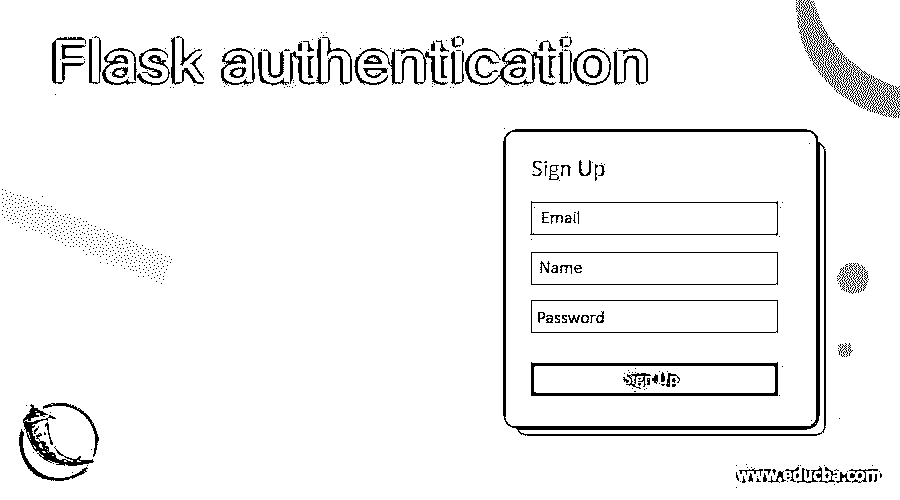
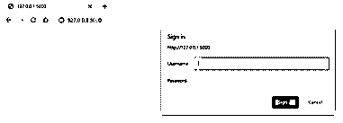
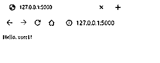
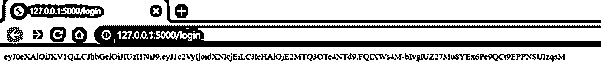
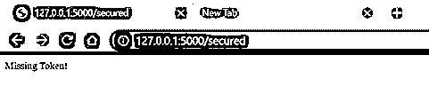

# 烧瓶鉴定

> 原文：<https://www.educba.com/flask-authentication/>

## 烧瓶认证简介

Flask 身份验证定义为通过简单的质询和响应机制来识别用户访问任何资源的资格的过程，其中首先用户请求访问资源，之后服务器要求提供将验证用户资格的信息，然后客户端将从用户处获取的信息以授权头的形式传递给服务器，并且编码为 base-64。身份验证可以被认为是客户端和服务器之间的一种协商行为，这样它就知道资源落入了正确的人手中。在 Flask 中有各种各样的认证方法，在本文中，我们将深入探讨这些方法！

**语法**

<small>网页开发、编程语言、软件测试&其他</small>

来自客户端的任何初始请求都是匿名请求，会被 Flask 服务器拒绝，并指示需要身份验证。发送包含支持的认证方案的 www-认证报头。在本节中，我们将从语法的角度学习身份验证，这样当我们学习各种身份验证方法时，就可以更容易地将它与这里学习的语法对应起来，从而对讨论的主题有一个完整的了解。

**安装 HTTPAuth 模块:**

`pip install Flask-HTTPAuth`

**安装长颈瓶 JWT 模块:**

`pip install jwt`

**使用密码哈希机制:**

`from passlib.apps import custom_app_context as hash_pass
pwdHashed = hash_pass.encrypt( < password variable > )`

### 如何在 Flask 中进行认证？

想象一下，构建一个 web 应用程序，并允许每个用户访问 web 应用程序中的每个 URL 端点。这就像向公众开放整个网站一样，从任何意义上来说都没有错，但是如果网站需要包含只有授权用户才能访问的会员相关的 URL 端点，我们将需要认证游戏计划。现在，在学习认证的时候，我们遇到了一个有趣的词，那就是授权。通常，人们会对身份验证和授权感到困惑。让我们用几个短句来理解其中的区别。尽管与 hear 惊人地相似，但这两个进程在功能上却有着惊人的不同。身份验证是为了确认用户是谁，而授权是授予访问特定资源的权限的过程。如果这仍然令人困惑，我们只需要记住我们在授权用户访问资源之前进行身份验证！

一般来说，身份验证有多种方式。例如，常见的流程有:

*   **使用密码:**用户名和密码是我们认证用户最常用的方式。输入正确的信息将允许您通过身份验证并最终获得访问资源的授权。
*   **使用 OTP 或一次性 pin:**这些通常被银行用作第二层身份验证，以双重确认用户是否确实是要验证的正确用户。
*   **使用身份验证应用:**一些企业使用移动系统上的应用来生成密码，该密码会定期刷新，以允许用户通过身份验证进入企业网络。

通过上述身份验证方式，Flask 支持适用于上述所有方式的各种身份验证方式。我们将在此讨论的方法应用最为广泛:

*   **使用密码散列:**这种方法是所有方法中最简单的。这里，我们将散列用户发送的密码，并对照散列密码进行验证。我们选择哈希密码的原因是哈希方法是单路由身份验证，在这种情况下，密码无法从哈希值中检索，因此可以保护该过程。但是这导致密码的硬编码，并且不可能用于动态多用户认证。
*   **使用 HTTP 基本认证:**这里 Flask-HTTPAuth 扩展非常方便，其中有一个名为 login_required 的装饰器，它与 verify_password 回调结合在一起，如果用户名和密码匹配，则提供 True。这种方法允许一次检查多个用户，但是仍然缺乏用户列表的动态更新。
*   **使用 HTTP 摘要认证:**另一种类似的认证方法是使用 Flask-HTTPAuth 扩展中的摘要认证。这被设计成比传统的摘要认证方案更安全。此外，在基本身份验证(提供非加密的 base64 编码)上，digest 对用户名、密码和 nonce 值应用散列函数。
*   **使用 JSON Web 令牌:**这种方法是这里讨论的方法中最安全的。首先，用户通过专门创建的返回令牌的路由登录。令牌一旦生成，就会与身份验证请求的其余部分一起发送。这允许用户在令牌有效期间保持登录。

### 例子

下面举几个例子

#### 示例#1

使用 HTTP 基本身份验证构建一个 flask 身份验证:

**语法**

`from flask import Flask
from flask_httpauth import HTTPBasicAuth
from werkzeug.security import generate_password_hash, check_password_hash
appFlask = Flask(__name__)
basicAuth = HTTPBasicAuth()
users = {
"user1": generate_password_hash("pass1"),
"user2": generate_password_hash("pass2")
}
@basicAuth.verify_password
def verify_password(username, password):
if username in users and \
check_password_hash(users.get(username), password):
return username
@appFlask.route('/')
@basicAuth.login_required
def index():
return "Hello, %s!" % basicAuth.current_user()
if __name__ == '__main__':
appFlask.run()`

**输出:**

输入错误的用户名或密码会使弹出框反复打开。

#### 实施例 2

使用 JSON Web 令牌构建 flask 身份验证:

**语法**

`from flask import Flask, jsonify, request, make_response
import jwt
import datetime
from functools import wraps
appFlask = Flask(__name__)
appFlask.config['SECRET_KEY'] = 'eduCBA'
def token_required(f):
@wraps(f)
def token_dec(*args, **kwargs):
token = request.args.get('token')
if not token:
return "Missing Token!"
try:
data = jwt.decode(token, appFlask.config['SECRET_KEY'])
except:
return "Invalid Token"
return f(*args, **kwargs)
return token_dec
@appFlask.route('/insecured')
def insecured():
return "This resource is public. Anyone can access this"
@appFlask.route('/secured')
@token_required
def secured():
return "You are authenticated to see the resource"
@appFlask.route('/login')
def login():
userAuth = request.authorization
if userAuth and userAuth.password == 'secret':
token = jwt.encode({'user' : userAuth.username, 'exp' : datetime.datetime.utcnow() + datetime.timedelta(seconds=180)}, appFlask.config['SECRET_KEY'])
return token.decode('UTF-8')
return "Login Required"
if __name__ == '__main__':
appFlask.run(debug=True)`

**输出:**

复制上面的令牌，然后在地址栏中使用该令牌，如下所示

http://127.0.0.1/secured？token=

不使用令牌

使用错误的令牌:

使用正确的令牌:

3 分钟后使用相同的有效令牌:

### 结论

总之，在本文中，我们了解了验证 Flask 应用程序的不同方法，以及一些广泛使用的 Flask 验证方法的实际例子。就像我们每次在每篇文章中所说的，实验是发明之母，所以要不断实验，不断学习！

### 推荐文章

这是一个烧瓶认证指南。在这里，我们讨论了验证 Flask 应用程序的不同方法，以及一些广泛使用的 Flask 验证方法的实际例子。您也可以阅读以下文章，了解更多信息——

1.  [烧瓶 HTTPS](https://www.educba.com/flask-https/)
2.  [烧瓶数据库迁移](https://www.educba.com/flask-db-migrate/)
3.  [烧瓶环境变量](https://www.educba.com/flask-environment-variables/)
4.  [烧瓶会话](https://www.educba.com/flask-session/)

