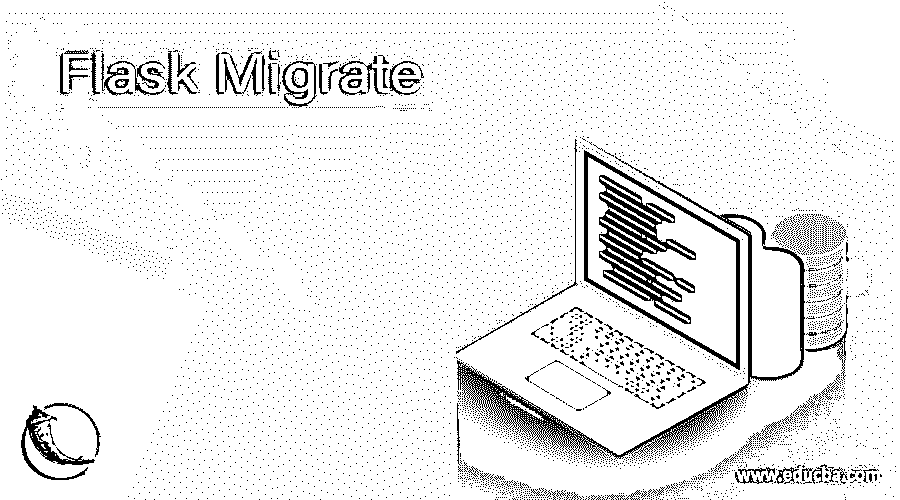
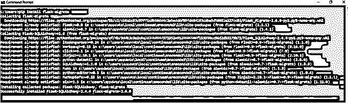
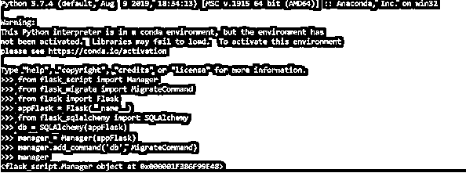

# 烧瓶迁移

> 原文：<https://www.educba.com/flask-migrate/>

## 烧瓶迁移的定义

Flask migrate 被定义为 Flask 应用程序中使用的扩展，用于使用 Alembic 处理 SQLAlchemy 的数据库迁移。该模块使开发人员能够快速设置和启动数据库模式迁移。我们需要数据库迁移的原因可以解释如下。假设我们构建了一个数据库，然后要求通过添加一个额外的列来修改它。添加后，我们觉得现在的模式不太适合完整的应用程序架构，希望回到原来的模式。在正常情况下，很难做到这一点，但有了 flask migrate，任务就顺利多了！在本文中，我们将研究如何在 Flask 中执行迁移。

**语法:**

<small>网页开发、编程语言、软件测试&其他</small>

数据库迁移是管理变化的艺术，这些变化是增量的、可逆的，并由关系数据库模式中的版本控制。在定义中，我们看到，当我们觉得有必要更新到一个新版本或者甚至恢复到旧版本时，我们执行任何迁移。在这一节中，我们将从语法的角度学习 flask 中的迁移，这样当我们学习如何执行迁移时，就可以更容易地用这里学到的语法将它映射回来，从而对讨论的主题有一个完整的了解。

安装 flask migrate 并配置它:

`pip install flask-migrate`

在烧瓶中安装 SQLAlchemy

`pip install flask-sqlalchemy`

在配置参数中配置数据库 URI:

`< Flaskapp variable >.config["SQLALCHEMY_DATABASE_URI"] = "< Link of the SQL Database>"`

正在初始化迁移命令:

`migrate = Migrate(<Flask application variable>, <SQLAlchemy variable>)`

创建迁移存储库:

`flask db init`

初始迁移的创建:

`flask db migrate`

### 如何在烧瓶中进行迁移？

在我们考虑在 Flask 中执行迁移之前，我们需要确保该模块安装在 python 环境中。为此，我们需要运行命令 **pip install flask-migrate** ，这将确保模块安装在 python 代码运行的环境中。还需要确保安装了 SQL alchemy 模块，以便在 Flask 中顺利运行迁移。一旦一切都设置好了，我们就为在 Flask 中执行迁移的下一步做好了准备。

Flask 应用程序有时觉得有必要在 Alembic 配置中动态使用或插入它们自己的设置。为了维护这个实用程序，我们使用装饰器实用程序，它使用配置回调。发布装饰实用程序并回调函数。该函数可以修改配置对象，或者用函数中的新变量完全替换它。使用 decorator 允许使用多个配置回调，并且回调的调用顺序是不确定的。一旦配置部分排序完毕，就该绑定数据库了。SQL alchemy 模块的安装提供了允许 Flask-migrate 跟踪到多个数据库的迁移的特性。这可以通过 SQL alchemy 的绑定特性来实现。在命令中包含–multi db 参数可以创建多个数据库迁移存储库。

现在，一旦配置和参数的包含都处理好了，我们就该使用模块 Flask migrate 公开的类了。这是为了填充 python 代码中的所有设置，以确保我们继续执行 3 个迁移命令。在学习使用它们在 Flask 中执行迁移之前，让我们先了解一下各个类。公开的类是 Migrate 和 MigrateCommand。Migrate 类本身涵盖了该扩展的所有功能和实用程序，而 MigrateCommand 则在需要通过使用 Flask 脚本扩展来公开数据库迁移命令时使用。现在要执行下一步的迁移，我们需要初始化对象，这是通过命令来完成的: **Migrate( < Flask 应用程序变量>，< SQLAlchemy DB 变量>)。**Migrate 类使用的两个参数是应用程序实例和 SQL alchemy 数据库实例。还采用了与传递给 Alembic 的 EnvironmentContext.configure()方法相同的附加关键字。最后，作为标准实践，Flask-migrate 可以使用 init_app 方法初始化。向用户公开的另一个类是 MigrateCommand，一旦 Migrate 的初始化完成，我们需要从 flask_script 包中声明一个**管理器**的实例，方法是向它传递应用程序实例。既然 manager 对象已经实例化，我们需要向该对象添加一个命令，该命令将是 MigrateCommnad。流程如下:

`from flask_script import Manager
from flask_migrate import MigrateCommand
appFlask = Flask(__name__)
manager = Manager(appFlask)
manager.add_command('< SQLAlchemy variable >', MigrateCommand)`

设置完成后，我们将继续执行 3 个迁移命令，即 init、migrate 和 upgrade，以执行数据库迁移。数据库迁移的细节将在另一篇文章中详细介绍。

### 例子

让我们讨论烧瓶迁移的例子。

#### 示例#1

Python 环境中 Flask migrate 模块的安装:

**语法:**

`pip install flask-migrate`

**输出:**

#### 示例# **2**

正在初始化迁移实例:

**语法:**

`from flask_migrate import Migrate
from flask import Flask
appFlask = Flask(__name__)
from flask_sqlalchemy import SQLAlchemy
db = SQLAlchemy(appFlask)
migrate = Migrate(appFlask, db)
migrate`

**输出:**

**T2】**

 **#### 实施例 3

将 MigrateCommand 添加到管理器的命令列表中:

**语法:**

`from flask_script import Manager
from flask_migrate import MigrateCommand
from flask import Flask
appFlask = Flask(__name__)
from flask_sqlalchemy import SQLAlchemy
db = SQLAlchemy(appFlask)
manager = Manager(appFlask)
manager.add_command('db', MigrateCommand)
manager`

**输出:**

### 结论

总之，在本文中，我们已经了解了 Flask 中的迁移配置和应用。我们还可以使用这种方法来包含现有项目的迁移，这样开发人员就不需要删除所有内容，然后从头开始。在将迁移包含到现有项目中的任务中，唯一需要记住的是需要在源代码的模型中进行一些更改。像其他任何时候一样，休息对你来说是实验。

### 推荐文章

这是一个烧瓶迁移指南。这里我们讨论定义，语法，如何在 Flask 中执行迁移？和示例。您也可以看看以下文章，了解更多信息–

1.  [Python 框架](https://www.educba.com/python-frameworks/)
2.  [Python OverflowError](https://www.educba.com/python-overflowerror/)
3.  [Python 过滤函数](https://www.educba.com/python-filter-function/)
4.  [Python 中的字符串数组](https://www.educba.com/string-array-in-python/)

**