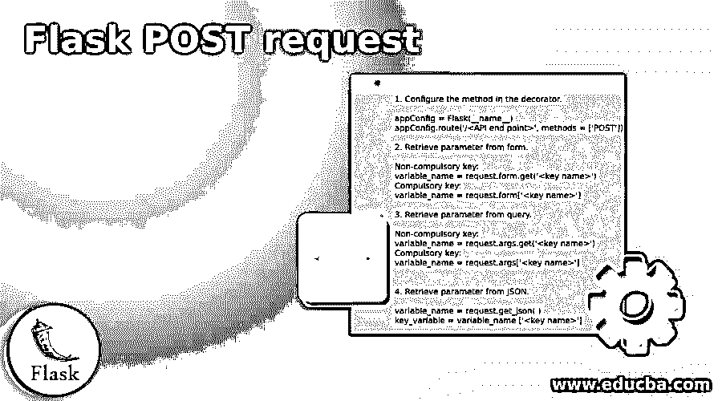
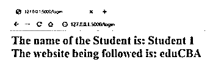
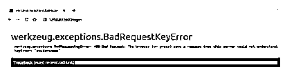
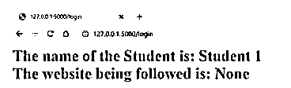
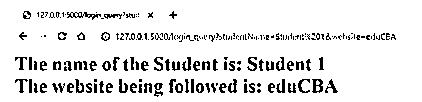
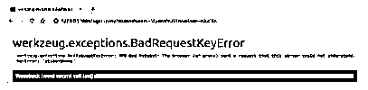
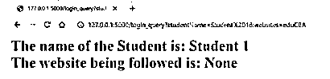

# 烧瓶 POST 请求

> 原文：<https://www.educba.com/flask-post-request/>

## 烧瓶 POST 请求简介

Flask POST 请求被定义为一种 HTTP 协议方法，使用户能够向服务器发送 HTML 表单数据。HTTP 协议是数据通信的基础，基本上被定义为协作、分布式、超媒体信息系统的应用层。我们称 HTTP 为超文本的原因是因为在万维网中，超文本文档是到其他资源的超链接，用户可以很容易地访问这些资源。POST 请求是 HTTP 方法之一，它使用户能够为任何资源的更新或创建发送数据。HTTP 请求的请求体包含使用 POST 方法发送到服务器的数据。

### Flask POST 请求的语法

下面给出了 Flask POST 请求的语法:

<small>网页开发、编程语言、软件测试&其他</small>

1.在装饰器中配置方法。

`appConfig = Flask(__name__)
appConfig.route('/<API end point>', methods = ['POST'])`

2.从表单中检索参数。

`Non-compulsory key:
variable_name = request.form.get('<key name>')
Compulsory key:
variable_name = request.form['<key name>']`

3.从查询中检索参数。

`Non-compulsory key:
variable_name = request.args.get('<key name>')
Compulsory key:
variable_name = request.args['<key name>']`

4.从 JSON 中检索参数。

`variable_name = request.get_json( )
key_variable = variable_name ['<key name>']`

### POST 请求如何在 Flask 中工作？

*   到目前为止，我们已经知道 POST 是 HTTP 协议方法之一，它使用户能够向服务器发送表单数据。当通过 POST 方法接收数据时，服务器不会对其进行缓存。在本描述中，我们遇到了许多新术语，然后看看我们如何将它们放在各自的位置，并着眼于更大的画面。
*   HTTP 请求中的表单就像一个接口，允许用户从用户输入中编译一组键和值对，并提供一种方法来构造键和值对，以表示表单字段及其值。现在，POST 是一个允许将这组键和值对发送到服务器的方法，它是由指定如何发送表单数据的方法属性设置的。HTTP 模板中的 action 属性将表单数据提交到属性中指定的位置。接下来，当我们进入为端点定义的函数时，我们会遇到请求上下文。现在是时候了解请求上下文的工作方式了，这样我们就可以完成请求后工作的整个过程。
*   请求上下文是关于 HTTP 请求的信息，它在请求级别跟踪数据。不是传递请求对象本身，而是访问请求代理。任何 flask 应用程序在处理请求时都会创建一个请求对象。创建的这个对象依赖于 WSGI 服务器接收到的环境。一个工作者一次只能处理一个请求。当发出请求时，flask 应用程序在过程中自动推送请求上下文。函数，错误处理程序能够在请求期间访问代理。现在我们知道请求上下文在 POST 请求中扮演什么角色。

**举例:**

**代码:**

`from flask import Flask, redirect, url_for, render_template, request, session
from datetime import timedelta
appFlask = Flask(__name__)
appFlask.secret_key = "27eduCBA09"
@appFlask.route("/login", methods = ['POST','GET'])
def login():
if request.method == 'POST':
studentName = request.form['studentName'] website = request.form.get('website')
return 'Submitted!'
return '''<form method = "post">

Enter Name:

<input type = "text" name = "studentName" />

Enter Website:

<input type = "text" name = "website" />

<input type = "submit" value = "submit" />

</form>'''
if __name__ == "__main__":
appFlask.run(debug=True)`

*   首先，我们导入运行 flask 应用程序所需的所有模块。接下来，我们创建 flask 应用程序对象，它将包含 Flask 应用程序的所有细节或特征。现在是时候在装饰器中分配端点了。当 URL 被发布时，相应的装饰器被搜索，相应的函数被激活。我们将这两种方法都放在装饰器中的原因是，在某些情况下，端点本身就是表单被提交的地方。如果只提到 POST 方法，会导致提到某个方法不被允许的情况。简而言之，端点充当 POST 和 GET 方法，因此需要提到这两者。
*   现在，代码将搜索任何 HTTP 请求，在开始时，因为它没有获得任何 POST 请求，所以它将返回上次返回的内容(在 if 循环之外)。现在，一旦用户输入数据并点击“提交”按钮，if 循环就被激活，并导致执行其中的命令。请求上下文有助于获取参数。

### 烧瓶 POST 请求的示例

以下是烧瓶 POST 请求的示例:

#### 示例#1

从表单中检索参数。

**语法:**

`Compulsory key:
studentName = request.form['studentName'] Non-compulsory key:
website = request.form.get('website')`

**输出:**

当我们提供两个密钥时:

错误使用强制键时:

错误使用非强制键时:

#### 实施例 2

从查询中检索参数。

**语法:**

`Compulsory key:
studentName = request.form['studentName'] Non-compulsory key:
website = request.form.get('website')`

**输出:**

当我们提供两个密钥时:

当强制键使用错误时:(仔细注意 studentName 拼写为 studentNames)

当非强制键被错误使用时:(仔细注意网站被拼错为网站)

### 结论

在本文中，我们已经了解了什么是 POST 请求的细节，以及强制键和非强制键之间的区别。处理强制键时需要小心使用，否则可能会导致 API 中断。JSON 留给读者去尝试和试验，就像 form 和 query 一样。

### 推荐文章

这是 Flask POST 请求的指南。在这里我们讨论介绍，POST 请求如何在 flask 中工作？和示例。您也可以看看以下文章，了解更多信息–

1.  [Python 框架](https://www.educba.com/python-frameworks/)
2.  [Python OverflowError](https://www.educba.com/python-overflowerror/)
3.  [Python 过滤函数](https://www.educba.com/python-filter-function/)
4.  [Python 中的字符串数组](https://www.educba.com/string-array-in-python/)

