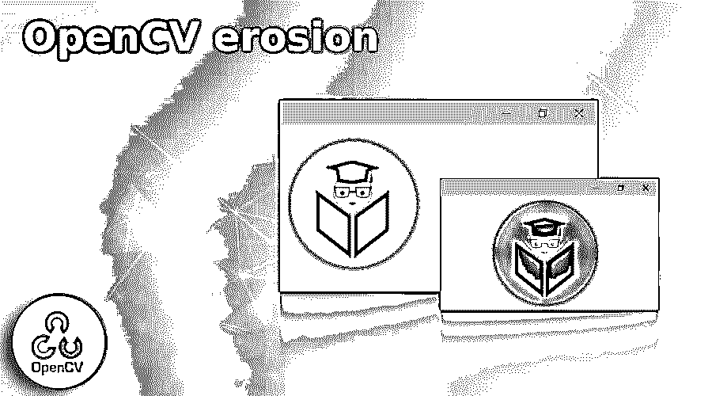
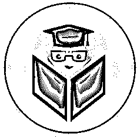

# OpenCV 侵蚀

> 原文：<https://www.educba.com/opencv-erosion/>

## OpenCV 侵蚀简介

OpenCV 侵蚀()是 OpenCV 公共域库中的一个命令，它可以帮助用户对想要修改的图像进行形态学处理。该过程用于对所提供的图像的几何结构进行修改。在此过程中，系统会找到图像中存在的对象的确切形状或结构完整性以及大小。该操作主要是针对以二进制格式呈现的图像来定义的，但是它们的扩展使用甚至可以在灰度图像上进行。

**OpenCV 糜烂()的语法**

<small>网页开发、编程语言、软件测试&其他</small>

为了利用 OpenCV erosion()函数，可以使用下面的语法:

`cv2 . erode ( src , dst , kernel )`

**参数:**

OpenCV 侵蚀函数接受以下参数:

| **参数** | **参数说明** |
| **src** | 该参数用于表示用户输入的图像或源图像。它是属于 Mat 类的对象。 |
| **夏令时** | 该参数用于表示功能执行后系统产生的最终输出图像，或者目标图像。它是属于 Mat 类的对象。 |
| **内核** | 该参数是具有用于表示内核值的整数值的变量。 |
| **返回值** | 这个方法负责返回一个输出图像，它将从指定的文件中加载。 |

### 侵蚀功能执行的操作是什么，它是如何工作的？

在侵蚀过程中，物体所使用的总面积减少了。此外，相对于膨胀函数，腐蚀函数具有更大的优势，因为它具有去除图像中存在的白噪声的能力，同时导致图像尺寸的缩小。福特，用户，为了获得更有效的结果，他们可以首先使用 OpenCV 腐蚀功能执行腐蚀功能，然后使用膨胀功能来移除图像并增加图像中存在的对象所占据的总面积。该功能有时也用于连接图像中出现的特定对象的某些部分。

*   通常，第一个过程是相对于用户提供的图像形成内核。通常，关于所形成的核的矩阵具有奇数值顺序(例如，1、3、5、7、9 等。).
*   对于所提供的图像，选择像素大小。对于所有像素都被视为在核天气顺序值之下的图像，该值为 1；对于这样的图像，要选择的像素是 1。
*   该函数还负责增加图像中存在的整体白色区域，或者相对于所提供的图像中存在的前景中的对象的证据大小。

### OpenCV 侵蚀示例

以下给出的示例可用于说明如何在编码初始化中使用 OpenCV 侵蚀命令:

**代码:**

`# command used to import the OpenCV library to utilize OpenCV erosion function
import cv2
# command used to import the numpy library to utilize np_array commands
import numpy as np1 * * * * * *
# command used for reading an image from the disk that has been instructed by the user
img1 = cv2.imread(r'C:\Users\PRIYANKA BANERJEE\Edu CBA logo.jpg', 1)
# declaring the kernel value * * * * * *
kernel1 = np1.ones((50,50), np1.uint8)
# using the OpenCV erode command to morphologically process the images that user wants to modify * * * * * *
img1_erosion1 = cv2.erode(img1, kernel1, iterations=1) * * * * * *
# convoluting along with kernels * * * * * *
img1_dilation1 = cv2.dilate(img1, kernel1, iterations=1) * * * * * *
# displaying the original image being processed by the user
print ("The original image being processed by the user :"; /n)
cv2.imshow('Input', img1) * * * * * *
# displaying the final image being processed by the user
print ("The final image being processed by the user : "; /n)
cv2.imshow('Erosion', img1_erosion1) * * * * * *
cv2.waitKey(0)
cv2.destroyAllWindows()`

**输出:**

**用户处理原始图像:**

**用户正在处理的最终图像:**

### 使用 OpenCV 侵蚀命令时，输出有何不同？

*   OpenCV erode()执行的输出非常类似于 OpenCV dilate 函数。可以注意到的主要变化是，计算的像素值是最小值，而不是最大值，最大值是在使用 OpenCV 扩张函数时计算的。
*   相对于最小像素突出范围的计算值，处理后的图像被替换到锚定终端之下。此外，可以看到处理后的合成图像随着对比度或色调的增加而具有相对较暗的区域或阴影，并且合成图像将相对不太亮，并且白色物体将看起来被洗掉。

### 结论

OpenCV 腐蚀函数被广泛用于从正在处理的图像中去除噪声。该命令还用于识别正在处理的图像中存在的强度碰撞或空洞，并隔离图像中存在的单个成分，同时组装设计者正在处理的图像中存在的不同雏形。

### 推荐文章

这是一个 OpenCV 侵蚀指南。在这里，我们讨论侵蚀作用及其工作原理。示例&输出有何不同。您也可以看看以下文章，了解更多信息–

1.  [OpenCV 行](https://www.educba.com/opencv-line/)
2.  [OpenCV 正文](https://www.educba.com/opencv-text/)
3.  [OpenCV 筛选](https://www.educba.com/opencv-sift/)
4.  [OpenCV 直方图](https://www.educba.com/opencv-histogram/)

