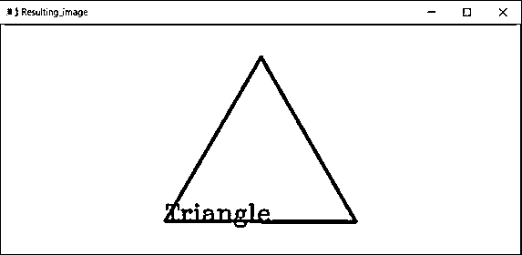
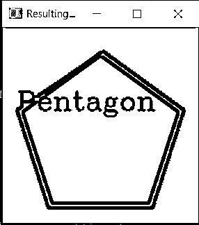

# OpenCV ApproxPolyDP

> 原文：<https://www.educba.com/opencv-approxpolydp/>

## OpenCV ApproxPolyDP 简介

将一个轮廓形状逼近另一个由较少顶点组成的形状，使形状轮廓之间的距离等于或小于指定精度的过程称为轮廓形状的逼近。OpenCV 中的内置函数用于将多边形曲线的形状近似到指定的精度，称为 approxPolyDP()函数，approxPolyDP()函数返回形状与输入曲线相同的近似轮廓，轮廓形状的近似被广泛用于机器人领域，以对模式和场景分析进行分类。

**OpenCV 中定义 approxPolyDP()函数的语法如下:**

<small>网页开发、编程语言、软件测试&其他</small>

approxPolyDP(输入曲线，ε，闭合)

其中，输入曲线表示其轮廓必须以指定精度近似的输入面，

ε表示输入多边形的形状轮廓的近似值和原始输入多边形之间的最大距离

closed 是一个布尔值，如果近似曲线是闭合的，则该值为 true 如果近似曲线不是闭合的，则该值为 false。

### OpenCV 中 approxPolyDP()函数的使用

*   将给定多边形的轮廓形状与原始多边形的形状近似到指定精度的过程称为轮廓形状的近似。
*   我们利用 OpenCV 中一个名为 approxPolyDP()的函数来执行轮廓形状的近似。
*   使用 imread()函数读取轮廓形状必须近似的多边形的图像。
*   然后，输入图像被转换成灰度图像。
*   然后对灰度图像应用阈值函数以将其转换成二值图像。
*   然后使用 findContours()函数确定图像中的轮廓。
*   然后，对于图像中确定的每个轮廓，应用 approxPolyDP()函数来确定图像中存在的多边形的形状。
*   然后使用 drawContours()函数在图像上绘制轮廓的确定形状，然后显示为程序的输出。

### OpenCV ApproxPolyDP 示例

下面举几个例子

#### 示例#1

python 中的 OpenCV 程序，通过使用 approxPolyDP()函数来确定给定图像中多边形的形状。命名检测到的形状，然后将结果图像作为输出显示在屏幕上:

**代码:**

`#importing the module cv2
import cv2
#reading the image whose shape is to be detected using imread() function
imageread = cv2.imread('C:/Users/admin/Desktimg/triangle.png')
#converting the input image to grayscale image using cvtColor() function
imagegray = cv2.cvtColor(imageread, cv2.COLOR_BGR2GRAY)
#using threshold() function to convert the grayscale image to binary image
_, imagethreshold = cv2.threshold(imagegray, 245, 255, cv2.THRESH_BINARY_INV)
#finding the contours in the given image using findContours() function
imagecontours, _ = cv2.findContours(imagethreshold, cv2.RETR_TREE, cv2.CHAIN_APPROX_SIMPLE)
#for each of the contours detected, the shape of the contours is approximated using approxPolyDP() function and the contours are drawn in the image using drawContours() function
for count in imagecontours:
epsilon = 0.01 * cv2.arcLength(count, True)
approximations = cv2.approxPolyDP(count, epsilon, True)
cv2.drawContours(imageread, [approximations], 0, (0), 3)
#the name of the detected shapes are written on the image
i, j = approximations[0][0] if len(approximations) == 3:
cv2.putText(imageread, "Triangle", (i, j), cv2.FONT_HERSHEY_COMPLEX, 1, 0, 2)
elif len(approximations) == 4:
cv2.putText(imageread, "Rectangle", (i, j), cv2.FONT_HERSHEY_COMPLEX, 1, 0, 2)
elif len(approximations) == 5:
cv2.putText(imageread, "Pentagon", (i, j), cv2.FONT_HERSHEY_COMPLEX, 1, 0, 2)
elif 6 < len(approximations) < 15:
cv2.putText(imageread, "Ellipse", (i, j), cv2.FONT_HERSHEY_COMPLEX, 1, 0, 2)
else:
cv2.putText(imageread, "Circle", (i, j), cv2.FONT_HERSHEY_COMPLEX, 1, 0, 2)
#displaying the resulting image as the output on the screen
cv2.imshow("Resulting_image", imageread)
cv2.waitKey(0)`

给定程序的输出显示在下面的快照中:

在上面的程序中，导入了所需的模块 cv2。然后，我们使用 imread()函数读取要检测其形状的图像。然后，我们使用 cvtColor()函数将输入图像转换为灰度图像。然后，我们使用 threshold()函数将灰度图像转换为二值图像。然后我们使用 findContours()函数在给定的图像中寻找轮廓。然后，对于检测到的每个轮廓，使用 approxPolyDP()函数近似轮廓的形状，并使用 drawContours()函数在图像中绘制轮廓。然后，我们将检测到的形状的名称写在图像上。然后，生成的图像作为输出显示在屏幕上。

#### 实施例 2

python 中的 OpenCV 程序，通过使用 approxPolyDP()函数来确定给定图像中多边形的形状。命名检测到的形状，然后将结果图像作为输出显示在屏幕上:

**代码:**

`#importing the module cv2
import cv2
#reading the image whose shape is to be detected using imread() function
imageread = cv2.imread('C:/Users/admin/Desktimg/pentagon.png')
#converting the input image to grayscale image using cvtColor() function
imagegray = cv2.cvtColor(imageread, cv2.COLOR_BGR2GRAY)
#using threshold() function to convert the grayscale image to binary image
_, imagethreshold = cv2.threshold(imagegray, 245, 255, cv2.THRESH_BINARY_INV)
#finding the contours in the given image using findContours() function
imagecontours, _ = cv2.findContours(imagethreshold, cv2.RETR_TREE, cv2.CHAIN_APPROX_SIMPLE)
#for each of the contours detected, the shape of the contours is approximated using approxPolyDP() function and the contours are drawn in the image using drawContours() function
for count in imagecontours:
epsilon = 0.01 * cv2.arcLength(count, True)
approximations = cv2.approxPolyDP(count, epsilon, True)
cv2.drawContours(imageread, [approximations], 0, (0), 3)
#the name of the detected shapes are written on the image
i, j = approximations[0][0] if len(approximations) == 3:
cv2.putText(imageread, "Triangle", (i, j), cv2.FONT_HERSHEY_COMPLEX, 1, 0, 2)
elif len(approximations) == 4:
cv2.putText(imageread, "Rectangle", (i, j), cv2.FONT_HERSHEY_COMPLEX, 1, 0, 2)
elif len(approximations) == 5:
cv2.putText(imageread, "Pentagon", (i, j), cv2.FONT_HERSHEY_COMPLEX, 1, 0, 2)
elif 6 < len(approximations) < 15:
cv2.putText(imageread, "Ellipse", (i, j), cv2.FONT_HERSHEY_COMPLEX, 1, 0, 2)
else:
cv2.putText(imageread, "Circle", (i, j), cv2.FONT_HERSHEY_COMPLEX, 1, 0, 2)
#displaying the resulting image as the output on the screen
cv2.imshow("Resulting_image", imageread)
cv2.waitKey(0)`

给定程序的输出显示在下面的快照中:

在上面的程序中，导入了所需的模块 cv2。然后，我们使用 imread()函数读取要检测其形状的图像。然后，我们使用 cvtColor()函数将输入图像转换为灰度图像。然后，我们使用 threshold()函数将灰度图像转换为二值图像。然后我们使用 findContours()函数在给定的图像中寻找轮廓。然后，对于检测到的每个轮廓，使用 approxPolyDP()函数近似轮廓的形状，并使用 drawContours()函数在图像中绘制轮廓。然后，我们将检测到的形状的名称写在图像上。然后，生成的图像作为输出显示在屏幕上。

### 推荐文章

这是一个 OpenCV ApproxPolyDP 的指南。在这里，我们讨论 approxPolyDP()函数的概念，并给出相应的编程示例及其输出来演示它们。您也可以看看以下文章，了解更多信息–

1.  [OpenCV HSV](https://www.educba.com/opencv-hsv/)
2.  [OpenCV kmeans](https://www.educba.com/opencv-kmeans/)
3.  [OpenCV 霍夫变换](https://www.educba.com/opencv-hough-transform/)
4.  [打开 CV resize()](https://www.educba.com/open-cv-resize/)

