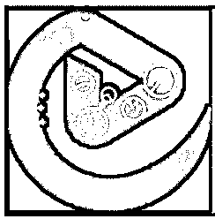
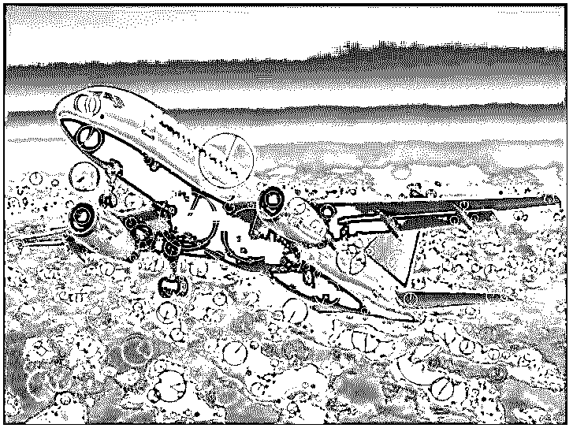
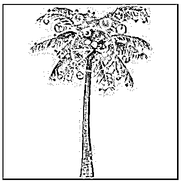

# OpenCV SIFT

> 原文：<https://www.educba.com/opencv-sift/>

## OpenCV SIFT 简介

为了执行特征检测和匹配， 我们使用 OpenCV 中称为 sift 函数或比例不变特征变换函数的函数，使用该函数从图像的视觉内容中提取矢量表示，以对其执行数学运算，sift 函数受专利保护，我们不允许免费将 sift 函数用于任何商业目的，并且必须安装 opencv-contrib 模块，以便能够在我们的程序和关键点中使用 sift 函数 并且通过使用 sift 函数提供关键点描述符，其中关键点描述符用于描述关键点。

**S** **yntax 在 OpenCV 中定义 SIFT 函数:**

<small>网页开发、编程语言、软件测试&其他</small>

`Sift_object = cv.SIFT_create()
keypoint = sift.detect(gray,None)`

在哪里，

*   SIFT_create()是一个用于创建 SIFT 对象的函数。
*   sift.detect()函数用于检测图像中的关键点。

### OpenCV 中 SIFT 函数的使用

*   为了执行特征检测和匹配，我们使用 OpenCV 中称为 sift 函数或尺度不变特征变换函数的函数。
*   OpenCV 中的尺度不变特征变换函数或 sift 函数用于从图像的视觉内容中提取矢量表示，以对其执行数学运算。
*   OpenCV 中的尺度不变特征变换函数或 sift 函数受专利保护，我们不得免费将 sift 函数用于任何商业目的。
*   必须安装 opencv-contrib 模块，以便能够在我们的程序中使用 sift 函数或尺度不变特征变换函数。
*   通过使用 sift 函数或尺度不变特征变换函数来提供关键点和关键点描述符，其中关键点描述符用于在给定尺度和旋转以及图像梯度下描述关键点。

### OpenCV SIFT 示例

以下是 OpenCV SIFT 的示例:

#### 示例#1

python 中的 OpenCV 程序演示了 sift 函数或尺度不变特征变换函数，使用该函数，我们将确定给定图像中的关键点和关键点的方向，并将结果图像作为输出显示在屏幕上。

**代码:**

`#importing the module cv2
import cv2
#reading the image using imread() function from cv2 module and converting it into gray image
readimage = cv2.imread('C:/Users/admin/Desktop/logo.png')
grayimage = cv2.cvtColor(readimage, cv2.COLOR_BGR2GRAY)
#creating a sift object and using detectandcompute() function to detect the keypoints and descriptor from the image
siftobject = cv2.xfeatures2d.SIFT_create()
keypoint, descriptor = siftobject.detectAndCompute(grayimage, None)
#drawing the keypoints and orientation of the keypoints in the image and then displaying the image as the output on the screen
keypointimage = cv2.drawKeypoints(readimage, keypoint, None, color=(0, 255, 0), flags=cv2.DRAW_MATCHES_FLAGS_DRAW_RICH_KEYPOINTS)
cv2.imshow('SIFT', keypointimage)
cv2.waitKey()`

**输出:**

在上面的程序中，我们正在导入模块 cv2。然后，我们使用 imread()函数从 cv2 模块读取图像，并将其转换为灰度图像。然后我们创建一个 sift 对象，然后使用 detectandcompute()函数从图像中检测关键点和描述符。然后，我们在图像中绘制关键点和关键点的方向，然后在屏幕上显示图像作为输出。输出显示在上面的快照中。

#### 实施例 2

python 中的 OpenCV 程序演示了 sift 函数或尺度不变特征变换函数，使用该函数，我们将确定给定图像中的关键点和关键点的方向，并将结果图像作为输出显示在屏幕上。

**代码:**

`#importing the module cv2
import cv2
#reading the image using imread() function from cv2 module and converting it into gray image
readimage = cv2.imread('C:/Users/admin/Desktop/plane.jpg')
grayimage = cv2.cvtColor(readimage, cv2.COLOR_BGR2GRAY)
#creating a sift object and using detectandcompute() function to detect the keypoints and descriptor from the image
siftobject = cv2.xfeatures2d.SIFT_create()
keypoint, descriptor = siftobject.detectAndCompute(grayimage, None)
#drawing the keypoints and orientation of the keypoints in the image and then displaying the image as the output on the screen
keypointimage = cv2.drawKeypoints(readimage, keypoint, None, color=(0, 255, 0), flags=cv2.DRAW_MATCHES_FLAGS_DRAW_RICH_KEYPOINTS)
cv2.imshow('SIFT', keypointimage)
cv2.waitKey()`

**输出:**

在上面的程序中，我们正在导入模块 cv2。然后，我们使用 imread()函数从 cv2 模块读取图像，并将其转换为灰度图像。然后我们创建一个 sift 对象，然后使用 detectandcompute()函数从图像中检测关键点和描述符。然后，我们在图像中绘制关键点和关键点的方向，然后在屏幕上显示图像作为输出。输出显示在上面的快照中。

#### 实施例 3

python 中的 OpenCV 程序演示了 sift 函数或尺度不变特征变换函数，使用该函数，我们将确定给定图像中的关键点和关键点的方向，并将结果图像作为输出显示在屏幕上。

**代码:**

`#importing the module cv2
import cv2
#reading the image using imread() function from cv2 module and converting it into gray image
readimage = cv2.imread('C:/Users/admin/Desktop/tree.jpg')
grayimage = cv2.cvtColor(readimage, cv2.COLOR_BGR2GRAY)
#creating a sift object and using detectandcompute() function to detect the keypoints and descriptor from the image
siftobject = cv2.xfeatures2d.SIFT_create()
keypoint, descriptor = siftobject.detectAndCompute(grayimage, None)
#drawing the keypoints and orientation of the keypoints in the image and then displaying the image as the output on the screen
keypointimage = cv2.drawKeypoints(readimage, keypoint, None, color=(0, 255, 0), flags=cv2.DRAW_MATCHES_FLAGS_DRAW_RICH_KEYPOINTS)
cv2.imshow('SIFT', keypointimage)
cv2.waitKey()`

**输出:**

在上面的程序中，我们正在导入模块 cv2。然后，我们使用 imread()函数从 cv2 模块读取图像，并将其转换为灰度图像。然后我们创建一个 sift 对象，然后使用 detectandcompute()函数从图像中检测关键点和描述符。然后，我们在图像中绘制关键点和关键点的方向，然后在屏幕上显示图像作为输出。输出显示在上面的快照中。

### 推荐文章

这是一个 OpenCV SIFT 的指南。这里我们分别讨论 OpenCV 中 SIFT 函数的介绍、工作原理和实例。您也可以看看以下文章，了解更多信息–

1.  [Python mkdir](https://www.educba.com/python-mkdir/)
2.  [Python 断言错误](https://www.educba.com/python-assertionerror/)
3.  [Python 中的自定义异常](https://www.educba.com/custom-exception-in-python/)
4.  [Python 过滤函数](https://www.educba.com/python-filter-function/)

