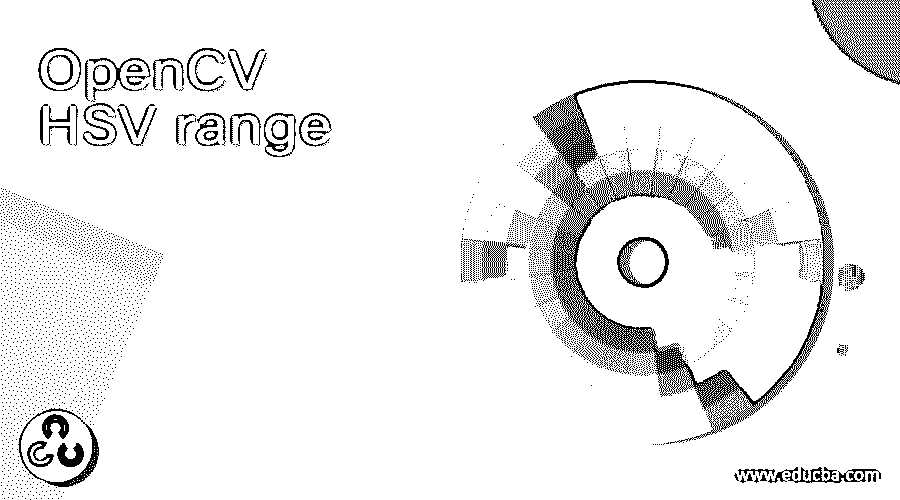

# OpenCV HSV 范围

> 原文：<https://www.educba.com/opencv-hsv-range/>

## OpenCV HSV 系列简介

给定对象的 HSV 或色调、饱和度和值是与 OpenCV 中的对象相关联的颜色空间，其中色调表示颜色，饱和度表示灰度，而值表示亮度，并且它用于解决与计算机视觉相关的问题，因为当与 RGB 或红色、蓝色和绿色空间相比时，它具有更好的性能，并且 HSV 中的色调范围是[0，179]，HSV 中的饱和度范围是[0，255]，HSV 中的值范围是[0，255]，并且为了执行对象检测，找到 HSV 的范围

**OpenCV 中定义 HSV 范围的语法如下:**

<small>网页开发、编程语言、软件测试&其他</small>

`hsvcolorspace = cv.cvtColor(image, cv.COLOR_BGR2HSV)
lower_hsvcolorspace = np.array([Hue range, Saturation range, Value range])
upper_hsvcolorspace = np.array([Hue range, Saturation range, Value range])`

其中 hsvcolorspace 是给定图像从 RGB 格式到 HSV 格式的转换，

lower_hsvcolorspace 是某种颜色范围的下限阈值，

upper_hsvcolorspace 是某种颜色范围的上限阈值，

色调范围是 HSV 中的色调范围[0，179]，

饱和范围是 HSV 中的饱和范围，为[0，255]和

取值范围是 HSV 中的取值范围[0，255]。

### OpenCV 中 HSV 范围的工作

*   给定对象的 HSV 或色调、饱和度和值是 OpenCV 中与该对象相关联的颜色空间。
*   HSV 中的色调表示颜色，HSV 中的饱和度表示灰色，HSV 中的值表示亮度。
*   每当我们要解决与物体检测相关的问题时，就有必要使用 HSV 并找到 HSV 的范围。
*   HSV 中的色调、饱和度和值有它们自己的取值范围。
*   HSV 中的色调范围是[0，179]，HSV 中的饱和度范围是[0，255]，HSV 中的值范围是[0，255]。
*   HSV 中每种颜色的范围也有上限和下限。
*   与 RGB 或红色、蓝色和绿色空间相比，HSV 或给定对象的色调、饱和度和值提供了更好的性能，因此它广泛用于计算机视觉领域。

### OpenCV HSV 系列示例

下面举几个例子

#### 示例#1

python 中的 OpenCV 程序，通过将给定图像转换为 HSV 图像并指定黑色范围的下阈值和上阈值，然后将生成的图像作为输出显示在屏幕上，来屏蔽给定图像中的黑色

**代码:**

`#importing the module cv2 and numpy
import cv2
import numpy as np
#reading the image which is to be converted to HSV color space
imagergb = cv2.imread('C:/Users/admin/Desktop/log.jpg')
#converting the image to HSV color space using cvtColor function
imagehsv = cv2.cvtColor(imagergb, cv2.COLOR_BGR2HSV)
#defining the lower threshold and upper threshold for a range of black color in HSV
lower_black = np.array([0, 0, 0])
upper_black = np.array([350,55,100])
#masking the HSV image to get only black colors
imagemask = cv2.inRange(imagehsv, lower_black, upper_black)
#displaying the resulting HSV image with only black colors masked
cv2.imwrite("C:/Users/admin/Desktop/logo1.png", imagemask)`

**输出:**

在上面的程序中，我们正在导入模块 cv2 和 numpy。然后，我们使用 imread()函数读取要转换到 HSV 颜色空间的图像。然后，我们使用 cvtColor 函数将图像转换到 HSV 颜色空间。然后，我们为 HSV 中的黑色范围定义下阈值和上阈值。然后我们屏蔽 HSV 图像，只得到黑色。然后我们在屏幕上显示合成的 HSV 图像，并以黑色作为输出。输出显示在上面的快照中。

#### 实施例 2

python 中的 OpenCV 程序，通过将给定图像转换为 HSV 图像并指定黑色范围的下阈值和上阈值，然后将生成的图像作为输出显示在屏幕上，来屏蔽给定图像中的黑色:

**代码:**

`#importing the module cv2 and numpy
import cv2
import numpy as np
#reading the image which is to be converted to HSV color space
imagergb = cv2.imread('C:/Users/admin/Desktop/educba.jpg')
#converting the image to HSV color space using cvtColor function
imagehsv = cv2.cvtColor(imagergb, cv2.COLOR_BGR2HSV)
#defining the lower threshold and upper threshold for a range of black color in HSV
lower_black = np.array([0, 0, 0])
upper_black = np.array([350,55,100])
#masking the HSV image to get only black colors
imagemask = cv2.inRange(imagehsv, lower_black, upper_black)
#displaying the resulting HSV image with only black colors masked
cv2.imwrite("C:/Users/admin/Desktop/educba1.jpg", imagemask)`

**输出:**

在上面的程序中，我们正在导入模块 cv2 和 numpy。然后，我们使用 imread()函数读取要转换到 HSV 颜色空间的图像。然后，我们使用 cvtColor 函数将图像转换到 HSV 颜色空间。然后，我们为 HSV 中的黑色范围定义下阈值和上阈值。然后我们屏蔽 HSV 图像，只得到黑色。然后我们在屏幕上显示合成的 HSV 图像，并以黑色作为输出。输出显示在上面的快照中。

#### 实施例 3

python 中的 OpenCV 程序，通过将给定图像转换为 HSV 图像并指定黑色范围的下阈值和上阈值，然后将生成的图像作为输出显示在屏幕上，来屏蔽给定图像中的黑色

**代码:**

`#importing the module cv2 and numpy
import cv2
import numpy as np
#reading the image which is to be converted to HSV color space
imagergb = cv2.imread('C:/Users/admin/Desktop/educbaw.jpg')
#converting the image to HSV color space using cvtColor function
imagehsv = cv2.cvtColor(imagergb, cv2.COLOR_BGR2HSV)
#defining the lower threshold and upper threshold for a range of black color in HSV
lower_black = np.array([0, 0, 0])
upper_black = np.array([350,55,100])
#masking the HSV image to get only black colors
imagemask = cv2.inRange(imagehsv, lower_black, upper_black)
#displaying the resulting HSV image with only black colors masked
cv2.imwrite("C:/Users/admin/Desktop/educbaw1.jpg", imagemask)`

**输出:**

在上面的程序中，我们正在导入模块 cv2 和 numpy。然后，我们使用 imread()函数读取要转换到 HSV 颜色空间的图像。然后，我们使用 cvtColor 函数将图像转换到 HSV 颜色空间。然后，我们为 HSV 中的黑色范围定义下阈值和上阈值。然后我们屏蔽 HSV 图像，只得到黑色。然后我们在屏幕上显示合成的 HSV 图像，并以黑色作为输出。输出显示在上面的快照中。

### 推荐文章

这是 OpenCV HSV 系列的指南。在这里，我们通过 HSV 范围的定义、语法和工作来讨论 HSV 范围的概念，并使用相应的编程示例及其输出来演示它们。您也可以看看以下文章，了解更多信息–

1.  [NumPy vstack](https://www.educba.com/numpy-vstack/)
2.  [NumPy fft](https://www.educba.com/numpy-fft/)
3.  [JavaScript 数组切片](https://www.educba.com/javascript-array-slice/)
4.  [C++读取文件](https://www.educba.com/c-plus-plus-read-file/)

