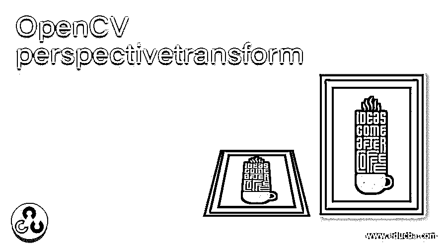
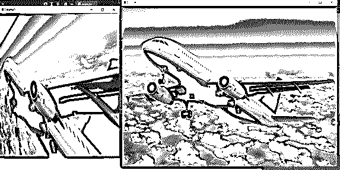

# OpenCV 透视变换

> 原文：<https://www.educba.com/opencv-perspectivetransform/>

## OpenCV perspectivetransform 简介

为了改变给定图像或视频的视角，或者为了按照 OpenCV 中的要求对准给定图像或视频，我们利用 OpenCV 中称为 PerspectiveTransform()的函数，并且通过利用 perspective transform()函数， 有可能从图像或视频中获得关于所需信息的更多洞察，并且图像上的点(其透视将根据需要被变换)被给予 PerspectiveTranform()函数，并且图像的相应部分使用被称为 warpPerspective()函数的另一个函数被变换为原始图像的大小。

**OpenCV 中定义 PerspectiveTransform()函数和 warpPerspective()函数的语法如下:**

<small>网页开发、编程语言、软件测试&其他</small>

`cv2.PerspectiveTransform(source_coordinates, destination_coordinates)`

其中 source_coordinates 是源图像上要改变视角的点，以及

destination_coordinates 是目标图像中与源图像上的点相对应的点

`cv2.warpPerspective(source_image, destination_image, destination_imagesize)`

其中源图像是其视角将被变换的原始图像，

destination_image 是其视角根据 destination_imagesize 和

destination_imagesize 是目标图像的大小。

### OpenCV 中 PerspectiveTransform()函数的工作原理:

让我们看看下面提到的这个函数的工作原理:

*   有时，我们有所需的图像或视频，但必要的信息却无法正常显示。在这种情况下，我们可能需要改变图像或视频的对齐方式，或者改变图像或视频的视角，以便从图像或视频中获得所需的信息。
*   然后我们利用 OpenCV 中一个名为 PerspectiveTransform()的函数。
*   PerspectiveTransform()函数将需要转换的源图像上的坐标点和与源图像上的点相对应的目标图像上的坐标点作为输入参数。
*   PerspectiveTransform()函数将转换后的透视矩阵作为输出返回。
*   然后，将原始源图像和 PerspectiveTransform()函数生成的矩阵以及所需输出图像的大小传递给 warpPerspective()函数，以获得转换后的图像。
*   warpPerspective()函数返回源图像按所需大小对齐或变换后的图像。

### OpenCV perspectivetransform 示例

下面举几个例子:

#### 示例#1

python 中的 OpenCV 程序演示 PerspectiveTrasnform()函数，我们将使用该函数转换给定图像的透视以获得更多的洞察力，并使用 warpPerspective()函数将其显示为符合所需大小的输出图像:

**代码:**

`#importing the module cv2 and numpy
import cv2
import numpy as np
while True:
#reading the image which is to be transformed
imagergb = cv2.imread('C:/Users/admin/Desktop/plane.jpg')
#specifying the points in the source image which is to be transformed to the corresponding points in the destination image
srcpts = np.float32([[0, 100], [700, 260], [0, 700], [700, 400]])
destpts = np.float32([[0, 200], [600, 0], [0, 700], [1000, 700]])
#applying PerspectiveTransform() function to transform the perspective of the given source image to the corresponding points in the destination image
resmatrix = cv2.getPerspectiveTransform(srcpts, destpts)
#applying warpPerspective() function to display the transformed image
resultimage = cv2.warpPerspective(imagergb, resmatrix, (500, 600))
#displaying the original image and the transformed image as the output on the screen
cv2.imshow('frame', imagergb)
cv2.imshow('frame1', resultimage)
if cv2.waitKey(24) == 27:
break`

上面程序的输出显示在下面的快照中:

在上面的程序中，我们正在导入 cv2 和 numpy 模块。然后，我们使用 imread()函数读取要转换视角的图像。然后，我们使用 PerspectiveTransform()函数指定源图像中要转换为目标图像中相应点的点。然后，我们将 PerspectiveTransform()函数的结果矩阵以及原始图像和输出图像的预期大小传递给 warpPerspective()函数，以获得转换后的图像作为屏幕上的输出。输出显示在上面的快照中。

#### 实施例 2

python 中的 OpenCV 程序演示 PerspectiveTrasnform()函数，我们将使用该函数转换给定图像的透视以获得更多的洞察力，并使用 warpPerspective()函数将其显示为符合所需大小的输出图像:

**代码:**

`#importing the module cv2 and numpy
import cv2
import numpy as np
while True:
#reading the image which is to be transformed
imagergb = cv2.imread('C:/Users/admin/Desktop/educba.jpg')
#specifying the points in the source image which is to be transformed to the corresponding points in the destination image
srcpts = np.float32([[0, 100], [700, 260], [0, 700], [700, 400]])
destpts = np.float32([[0, 200], [600, 0], [0, 700], [1000, 700]])
#applying PerspectiveTransform() function to transform the perspective of the given source image to the corresponding points in the destination image
resmatrix = cv2.getPerspectiveTransform(srcpts, destpts)
#applying warpPerspective() function to display the transformed image
resultimage = cv2.warpPerspective(imagergb, resmatrix, (500, 600))
#displaying the original image and the transformed image as the output on the screen
cv2.imshow('frame', imagergb)
cv2.imshow('frame1', resultimage)
if cv2.waitKey(24) == 27:
break`

上面程序的输出显示在下面的快照中:

在上面的程序中，我们正在导入 cv2 和 numpy 模块。然后，我们使用 imread()函数读取要转换视角的图像。然后，我们使用 PerspectiveTransform()函数指定源图像中要转换为目标图像中相应点的点。然后，我们将 PerspectiveTransform()函数的结果矩阵以及原始图像和输出图像的预期大小传递给 warpPerspective()函数，以获得转换后的图像作为屏幕上的输出。输出显示在上面的快照中。

### 结论

在本文中，我们已经通过 PerspectiveTransform()函数的定义、语法和工作方式了解了 PerspectiveTransform()函数的概念，并使用相应的编程示例及其输出来演示它们。

### 推荐文章

这是 OpenCV perspectivetransform 的指南。这里我们通过 PerspectiveTransform()函数的定义、语法和工作原理来讨论 PerspectiveTransform()函数的概念。您也可以看看以下文章，了解更多信息–

1.  [OpenCV kmeans](https://www.educba.com/opencv-kmeans/)
2.  [打开 CV resize()](https://www.educba.com/open-cv-resize/)
3.  [珠光打开](https://www.educba.com/perl-open/)
4.  [开源软件](https://www.educba.com/open-source-software/)

