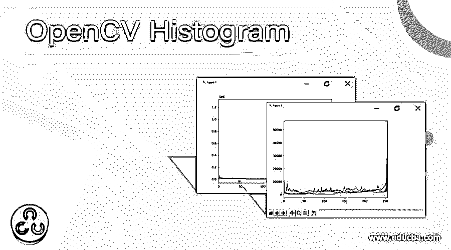
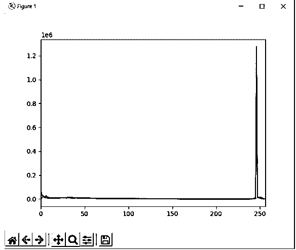
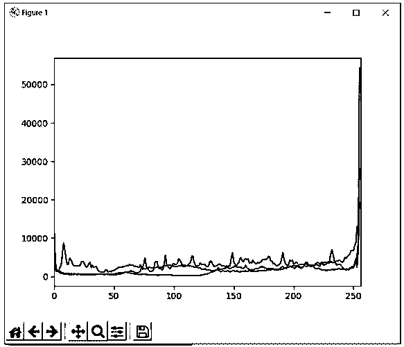

# OpenCV 直方图

> 原文：<https://www.educba.com/opencv-histogram/>

## OpenCV 直方图简介

图像的直方图可以被认为是使我们理解图像中强度分布的图形或曲线，其中 x 轴是像素值，y 轴是图像中相应的像素数量，通过绘制图像的直方图，我们可以理解图像中的亮度、对比度、强度分布等。直方图的特性在所有用于图像处理的工具中都是可用的，我们在 OpenCV 中有称为 calcHist()函数的内置函数来绘制图像的直方图，它返回一个 256*1 数组作为输出。

**OpenCV 中定义 calcHist()函数的语法如下:**

<small>网页开发、编程语言、软件测试&其他</small>

`calcHist(sourceimage, channels, mask, histSize, ranges )`

其中源图像是要计算其直方图的图像，其值在方括号中指定，
通道是计算直方图的索引。对于灰度图像，通道的值为[0]。对于蓝色、绿色和红色，通道的值分别为[0]、[1]、[2]，该值在方括号中指定，
mask 指定不需要找到其直方图的图像区域。屏蔽 id 的值无如果我们不希望屏蔽图像的任何区域，
histSize 表示方括号中指定的箱数。给定图像的直方图可分为 16 个子部分，子部分中所有像素的总和称为 BIN，表示为 histSize，
range 指定强度值范围。

### OpenCV 中 calcHist()函数的使用

*   图像的直方图可以被认为是使我们理解图像中强度分布的图形或曲线，其 x 轴是像素值，y 轴是图像中相应的像素数量。
*   可以使用 OpenCV 中的 calcHist()函数计算图像的直方图。
*   calcHist()函数有五个参数，即源图像。频道、遮罩、histSize 和范围。
*   参数源图像是要计算其直方图的图像，其值在方括号中指定。
*   参数通道是计算直方图的索引。对于灰度图像，通道的值为[0]。蓝色、绿色和红色的通道值分别为[0]、[1]、[2]，该值在方括号中指定。
*   参数 mask 指定不需要找到直方图的图像区域。如果我们不想屏蔽图像的任何区域，则屏蔽 id 的值为 None。
*   参数 histSize 表示方括号中指定的容器计数。给定图像的直方图可以分成 16 个子部分，子部分中所有像素的总和称为 BIN，表示为 histSize。
*   参数范围指定强度值范围，其值通常为[0，256]。
*   calcHist()函数返回一个 256*1 的数组，其中每个值都是一个像素值，对应于给定图像中的像素值。

#### 示例#1

python 中的 OpenCV 程序演示 calcHist()函数，使用该函数我们计算给定图像的直方图，并绘制给定图像的直方图，以在屏幕上显示为输出:

**代码:**

`#importing the modules numpy, cv2 and matplotlib
import numpy as np
import cv2 as cv
from matplotlib import pyplot as plt
#reading the image whose histogram is to be calculated
imgread = cv.imread('C:/Users/admin/Desktop/car.jpg')
#specifying the colors which are iterated to be passed as values of colors to the calcHist() function to calculate the histogram of an image and plot the histogram of an image
color = ('b','g','r')
for k,color in enumerate(color):
histogram = cv.calcHist([imgread],[k],None,[256],[0,256])
plt.plot(histogram,color = color)
plt.xlim([0,256])
plt.show()`

给定程序的输出显示在下面的快照中:

在上面的程序中，我们导入了模块 cv2、numpy 和 matplotlib。然后我们读取图像，使用 imread()函数计算其直方图。然后，我们指定迭代的颜色，作为颜色值传递给 calcHist()函数，以计算图像的直方图，并绘制图像的直方图，作为屏幕上的输出。输出显示在上面的快照中。

#### 实施例 2

python 中的 OpenCV 程序演示 calcHist()函数，使用该函数我们计算给定图像的直方图，并绘制给定图像的直方图，以在屏幕上显示为输出:

**代码:**

`#importing the modules numpy, cv2 and matplotlib
import numpy as np
import cv2 as cv
from matplotlib import pyplot as plt
#reading the image whose histogram is to be calculated
imgread = cv.imread('C:/Users/admin/Desktop/plane.jpg')
#specifying the colors which are iterated to be passed as values of colors to the calcHist() function to calculate the histogram of an image and plot the histogram of an image
color = ('b','g','r')
for k,color in enumerate(color):
histogram = cv.calcHist([imgread],[k],None,[256],[0,256])
plt.plot(histogram,color = color)
plt.xlim([0,256])
plt.show()`

给定程序的输出显示在下面的快照中:

在上面的程序中，我们导入了模块 cv2、numpy 和 matplotlib。然后我们读取图像，使用 imread()函数计算其直方图。然后，我们指定迭代的颜色，作为颜色值传递给 calcHist()函数，以计算图像的直方图，并绘制图像的直方图，作为屏幕上的输出。输出显示在上面的快照中。

### 结论

在本文中，我们通过 OpenCV 中 calcHist()函数的定义、语法和工作原理了解了 OpenCV 中 calcHist()函数的概念，并通过相应的编程示例及其输出来演示。

### 推荐文章

这是一个 OpenCV 直方图的指南。在这里，我们讨论 OpenCV 中 calcHist()函数的介绍、语法和工作原理，并举例说明，以便更好地理解。您也可以看看以下文章，了解更多信息–

1.  [数字直方图](https://www.educba.com/numpy-histogram/)
2.  [R 中的直方图](https://www.educba.com/histogram-in-r/)
3.  [表格中的直方图](https://www.educba.com/histogram-in-tableau/)
4.  [直方图示例](https://www.educba.com/histogram-examples/)

