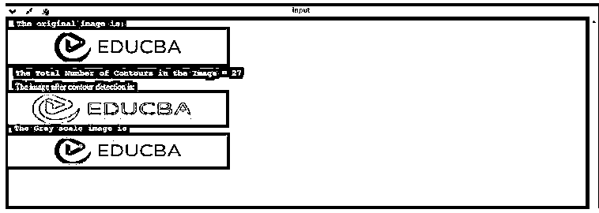

# opencv findcontours 找到轮廓

> 原文：<https://www.educba.com/opencv-findcontours/>

## OpenCV findContours 简介

以下文章提供了 OpenCV findContours 的概要。OpenCV find contour()是 Python 编码语言中存在的功能，它定义了呈现的线条，这些线条使编码器提供的图像边界上的所有点都具有相同的像素亮度。在分析所提供的图像的形状、检测所提供的图像中必须检测的物体的大小和尺寸以及检测特定物体方面，这些恰好是非常有用的。

它在二进制图片和图像上基本上工作良好，尽管在第一次应用 Sobel 边缘和阈值技术时应该实现。每个单独的轮廓代表具有坐标 x 和 y 的单独的 numpy 数组，其代表用户已经输入的对象的边界点。

<small>网页开发、编程语言、软件测试&其他</small>

**OpenCV find contour()**的语法

以下是应用 OpenCV findContour 方法时使用的语法:

`void cv :: findContours (InputOutputArray image,
OutputArrayOfArrays contours,
OutputArray hierarchy,
int mode,
int method,
Point offset = Point()
)`

### OpenCV findContour()的参数:

该方法基本上有 3 个参数可用。第一个参数实质上指的是用户提供的图像源，第二个参数指的是轮廓提取的模式，第三个参数指的是轮廓提取方法，在该方法的应用上，用于近似具有轮廓和层次的修改图像。

以下是用于 Open CV findContour()方法的参数:

| **图像** | 使用的是通过大约八位的单通道生成的源图像。任何非零类别的像素被指定为 1，零类别的像素被指定为 0，从而将图像转换为二进制形式。各种参数(如 adaptiveThreshold、inRange、Canny、Threshold 等。)以便使用用户的彩色或灰度图像来创建二进制图像。在模式等于 RETR _ 泛光填充或 RETR_CCOMP 的情况下，则由用户输入作为源图像的图像是标签为 CV_32SC1 的基于 3 位整数的图像。 |
| **等高线** | 轮廓检测——每个单独的轮廓都以多个矢量点的形式存储。 |
| **层级** | 它是一个可选参数，以输出向量的形式出现。它包含与用户输入的图像类型相关的重要信息。该参数由与图像中轮廓总数一样多的数字元素组成。让我们用它的积分微分来证明它。对于具有第 i 个轮廓的图像，以下将是轮廓[i]，并且该轮廓的相关层级将是层级[i][0] - >层级[i][1] - >层级[I][2]-【T4]和层级[I][3]；在轮廓中呈现一个从零开始的索引系统，其中每个先前的和更好的轮廓在层次级别上都是先前的(技术上是指第一个出生来运行父轮廓的孩子)。在没有嵌套轮廓、父轮廓、下一个轮廓上的上一个轮廓的情况下，对于轮廓 I，其相对于其层次结构的对应元素将是负值(层次结构[i])。 |
| **模式** | 专门为轮廓检索激活的模式。 |
| **方法** | 专为描绘图像轮廓的近似方法而激活的模式。 |
| **偏移** | 这是一个可选参数，通过它可以移动每个轮廓点。当轮廓已经被提取为图像 ROI 时，这是非常有用的，然后应该在整个图像的背景下进行进一步的分析。 |

### OpenCV findContour()是如何工作的？

*   当让计算机检测输入图像的边缘时，它会找到那些在色彩强度上有明显差异的点，然后简单地打开这些像素。当系统被指示执行轮廓绘制时，会注意到明显的差异。
*   轮廓基本上是线段和点的抽象集合，这些线段和点对应于已经通过系统处理的图像中存在的物体的反射形状。由于这一点；我们有能力在程序中操纵轮廓，通过这些程序来访问它们。
*   这可以通过多种方式来完成，例如对图像中轮廓的数量进行计数，然后使用该计数来对对象形状进行分类，用于分割图像或从正在处理的图像中裁剪对象，以及许多类似的功能。

### 例子

以下是 OpenCV findContour 的示例:

**代码:**

`import numpy as np1
import cv2
img_1 = cv2.imread('EduCBA.png')
print (“The Gray scale image is ” /n)
imgray_1 = cv2.cvtColor(img_1, cv2.COLOR_BGR2GRAY)
ret, thresh = cv2.threshold(imgray_1, 127, 255, 0)
contours, hierarchy = cv2.findContours(thresh, cv2.RETR_TREE, cv2.CHAIN_APPROX_NONE)
print("The Total Number of Contours in the Image = ")
//command len used to calculate the number of contours in the image
print (str(len(contours)))
print(contours[0])
cv2.drawContours(img_1, contours, -1,(0,2550,0),3)
cv2.drawContours(imgray_1, contours, -1,(0,255,0),3)
print (“The original image is: “ /n)
cv2.imshow('Image', img_1)
cv2.imshow('Image GRAY', imgray_1)
cv2.waitKey(0)
cv2.destroyAllWindows()`

**输出:**

输出屏幕显示了编译上述代码的屏幕截图。

**

** 

### 结论–OpenCV find contours

OpenCV find contour 方法非常有用，因为它提供了一个预定义的函数，无需实现整个代码即可调用，并且可以使用各种参数进行修改。在分析所提供的图像的形状、检测所提供的图像中必须检测的物体的大小和尺寸以及检测特定物体方面，这是非常有用的。这样做是为了对对象形状进行分类，以便从正在处理的图像中分割图像或裁剪对象，以及许多类似的功能。

### 推荐文章

这是一个 OpenCV findContours 的指南。这里我们讨论引言；OpenCV findContour()是如何工作的？还有例子。您也可以看看以下文章，了解更多信息–

1.  [Python json.dumps](https://www.educba.com/python-json-dumps/)
2.  [Python 多行字符串](https://www.educba.com/python-multiline-string/)
3.  [Python 缓冲器](https://www.educba.com/python-bufferedreader/)
4.  [Python 异步](https://www.educba.com/python-async/)

