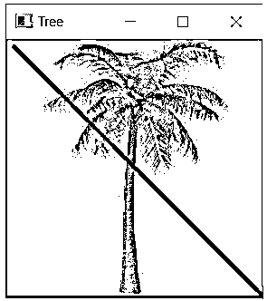
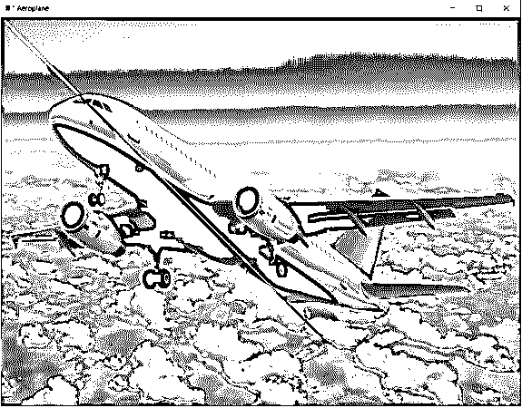

# OpenCV 行

> 原文：<https://www.educba.com/opencv-line/>

## OpenCV 系列简介

不同的几何形状，如直线、圆等。在我们试图解决计算机视觉问题的情况下，需要在图像上绘制线条，为了在给定的图像上绘制线条，我们利用 OpenCV 中称为 line()函数的函数，使用该函数，可以在给定的图像上绘制从给定的起点开始并在给定的终点结束的所需粗细和所需颜色的线条，并通过使用 line()函数将按照规范在其上绘制了线条的图像作为输出返回。

**OpenCV 中定义 line()函数的语法如下:**

<small>网页开发、编程语言、软件测试&其他</small>

`line(image, starting_point, ending_point, color, thickness)`

其中 image 是必须画线的图像，

*   starting_point 是直线应该开始的 x 坐标和 y 坐标，
*   ending_point 是线条应该结束的 x 坐标和 y 坐标，
*   颜色表示要在给定图像上绘制的线条的颜色
*   粗细是要在给定图像上绘制的线条的粗细。

### OpenCV 中 line()函数的工作原理

OpenCV 中 line()函数的工作原理如下:

*   不同的几何形状，如直线、圆等。当我们试图解决计算机视觉问题时，需要在图像上绘制。
*   为了能够在给定的图像上画线，我们使用了 OpenCV 中的 line()函数。
*   line()函数接受五个参数，即图像、起点、终点、颜色和厚度。
*   参数图像是必须在其上画线的图像。
*   参数 starting_point 是 x 坐标和 y 坐标，线应该从这两个坐标开始。
*   参数 ending_point 是直线应该结束的 x 坐标和 y 坐标。
*   参数 color 表示要在给定图像上绘制的线条的颜色。
*   参数 thickness 是要在给定图像上绘制的线条的粗细。
*   OpenCV 中的 line()函数返回按照规范绘制了一条线的图像作为输出。

#### 示例#1

python 中的 OpenCV 程序演示 line()函数，使用 imread()函数读取图像，然后使用 line()函数在给定图像上从指定起点、终点绘制一条具有指定颜色和粗细的线，然后将图像显示为屏幕上的输出:

`#importing the module cv2
import cv2
#reading the image from a given path on which a line is to be drawn
imageread = cv2.imread('C:/Users/admin/Desktop/tree.jpg')
#using line() function to draw a line on the given image
imageline = cv2.line(imageread, (5, 5), (500, 500), (255, 0, 0), 2)
#displaying the image on which the line is drawn as the output on the screen
cv2.imshow('Tree',imageline)
cv2.waitKey(0)
cv2.destroyAllWindows()`

给定程序的输出显示在下面的快照中:

在上面的程序中，我们正在导入模块 cv2。然后，我们使用 imread()函数读取要在其上画线的图像。然后，我们使用 line()函数，通过指定图像名称、起点、终点、颜色和厚度作为参数，在给定的图像上绘制一条线，然后在屏幕上显示为输出。

#### 实施例 2

python 中的 OpenCV 程序演示 line()函数，使用 imread()函数读取图像，然后使用 line()函数在给定图像上从指定起点、终点绘制一条具有指定颜色和粗细的线，然后将图像显示为屏幕上的输出:

`#importing the module cv2
import cv2
#reading the image from a given path on which a line is to be drawn
imageread = cv2.imread('C:/Users/admin/Desktop/plane.jpg')
#using line() function to draw a line on the given image
imageline = cv2.line(imageread, (5, 5), (3000, 3000), (0, 255, 0), 2)
#displaying the image on which the line is drawn as the output on the screen
cv2.imshow('Aeroplane',imageline)
cv2.waitKey(0)
cv2.destroyAllWindows()`

给定程序的输出显示在下面的快照中:

在上面的程序中，我们正在导入模块 cv2。然后，我们使用 imread()函数读取要在其上画线的图像。然后，我们使用 line()函数，通过指定图像名称、起点、终点、颜色和厚度作为参数，在给定的图像上绘制一条线，然后在屏幕上显示为输出。

#### 实施例 3

python 中的 OpenCV 程序演示 line()函数，使用 imread()函数读取图像，然后使用 line()函数在给定图像上从指定起点、终点绘制一条具有指定颜色和粗细的线，然后将图像显示为屏幕上的输出:

`#importing the module cv2
import cv2
#reading the image from a given path on which a line is to be drawn
imageread = cv2.imread('C:/Users/admin/Desktop/educba.jpg')
#using line() function to draw a line on the given image
imageline = cv2.line(imageread, (5, 5), (10000, 5000), (0, 255, 0), 2)
#displaying the image on which the line is drawn as the output on the screen
cv2.imshow('EDUCBA',imageline)
cv2.waitKey(0)
cv2.destroyAllWindows()`

给定程序的输出显示在下面的快照中:

在上面的程序中，我们正在导入模块 cv2。然后，我们使用 imread()函数读取要在其上画线的图像。然后，我们使用 line()函数，通过指定图像名称、起点、终点、颜色和厚度作为参数，在给定的图像上绘制一条线，然后在屏幕上显示为输出。

### 结论

在本文中，我们通过 OpenCV 中 line()函数的定义、语法和工作原理了解了 OpenCV 中 line()函数的概念，并通过相应的编程示例及其输出来演示。

### 推荐文章

这是一个 OpenCV 线的指南。这里我们讨论 OpenCV 中 line()函数的介绍、语法和工作原理，并给出例子。您也可以看看以下文章，了解更多信息–

1.  [OpenCV kmeans](https://www.educba.com/opencv-kmeans/)
2.  [机器学习库](https://www.educba.com/machine-learning-libraries/)
3.  [机器学习编程语言](https://www.educba.com/machine-learning-programming-languages/)
4.  [詹金斯管道](https://www.educba.com/jenkins-pipeline/)

