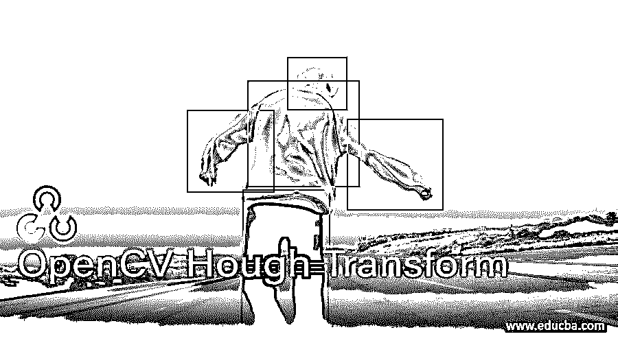
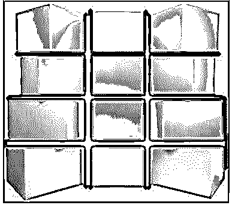
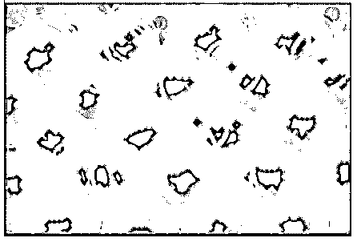

# OpenCV 霍夫变换

> 原文：<https://www.educba.com/opencv-hough-transform/>

## OpenCV 霍夫变换简介

以下文章提供了 OpenCV Hough 变换的概要。一种用于检测直线、圆等简单形状的特征提取方法。在图像中被称为 hough 变换，并且这种简单的形状可以由诸如斜率和截距的参数来表示，这两个参数表示直线，中心坐标和半径是表示圆的三个参数，并且在 hough 变换中，我们利用 HoughLines()函数和 HoughLinesP()函数来检测图像中的直线，并且我们利用 HoughCircles()函数来检测图像中的圆，并且所有这些函数都返回在图像中检测到直线和圆的图像。

### OpenCV 霍夫变换的语法

OpenCV 中定义 HoughLines()函数和 HoughLinesP()函数的语法:

<small>网页开发、编程语言、软件测试&其他</small>

`HoughLines(edges, lines, rho, theta, threshold)`

`HoughLinesP(edges, lines, rho, theta, threshold)`

在哪里，

*   边缘表示使用边缘检测器找到的边缘。
*   线条表示存储线条起点坐标和线条终点坐标的向量。
*   rho 表示分辨率参数 p，单位为像素。
*   θ以弧度表示分辨率参数θ。
*   阈值表示检测直线所需的最小相交点数量。

HoughLinesP()函数中的 p 代表概率霍夫变换。

**OpenCV 中定义 HoughCircles()函数的语法:**

`HoughCircles(input_image, method, inverse_ratio, min_distance, parameter1_and_parameter2, min_radius, max_radius)`

在哪里，

*   input_image 是要在其中检测圆的源图像。
*   方法表示用于检测圆的方法。
*   inverse_ratio 表示累加器分辨率和图像分辨率的反比。
*   min_distance 表示检测到的圆心之间的最小距离。
*   parameter1 _ 和 parameter2 表示特定于该方法的两个参数。
*   min_radius 表示要检测的圆的最小半径值。
*   max_radius 表示要检测的圆的最大半径值。

### Hough 变换在 OpenCV 中的应用

*   简单的形状，如直线、圆等。可以使用称为霍夫变换的特征提取方法来检测。
*   可以使用 HoughLines()函数和 HoughLinesP()函数检测给定图像中的线条。
*   给定图像中线的检测首先初始化累加器。
*   然后使用任何边缘检测器方法检测边缘。
*   然后对形成边缘的像素进行投票。
*   给定图像中的圆可以使用 HoughCircles()函数来检测。
*   检测给定图像中的圆的工作方式是首先使用任何边缘检测器方法在给定图像中找到边缘。
*   然后为最大半径值和最小半径值设置阈值。
*   然后，三维累加器阵列收集图像中存在圆形的证据。
*   HoughLines()函数和 HoughLinesP()函数返回在图像中检测到线条的图像。
*   HoughCircles()函数返回在图像中检测到圆的图像。

### OpenCV 霍夫变换示例

以下是 OpenCV 霍夫变换的示例:

#### 示例#1

python 中的 OpenCV 程序，使用 houghLinesP()函数对给定图像执行 Hough 变换以确定图像中存在的线条，并将结果图像作为输出显示在屏幕上。

**代码:**

`#importing the required modules
import cv2
import numpy as np
#reading the image in which the lines must be detected using imread() function
Imageread = cv2.imread('C:/Users/admin/Desktimg/boxes.jpg', cv2.IMREAD_COLOR)
#converting the input image to grayscale image using cvtColor() function
imagegray = cv2.cvtColor(imageread, cv2.COLOR_BGR2GRAY)
#finding the edges in the image using canny detector
resultedges = cv2.Canny(imagegray, 50, 200)
#using HoughLinesP() function to detect points on the lines present in the image
line_points = cv2.HoughLinesP(resultedges, 1, np.pi/180, 70, minLineLength=10, maxLineGap=250)
#using for loop to draw the lines by joining the intersecting points
for eachline in line_points:
x1, y1, x2, y2 = eachline[0] cv2.line(imageread, (x1, y1), (x2, y2), (255, 0, 0), 3)
#displaying the resulting image as the output on the screen
cv2.imshow("Resulting_image", imageread)
cv2.waitKey(0)`

**输出:**

在上面的程序中，导入了必要的模块。然后我们使用 imread()函数读取需要检测线条的图像。然后，我们使用 cvtColor()函数将输入图像转换为灰度图像。然后我们使用 canny 检测器在图像中找到边缘。然后，我们使用 HoughLinesP()函数来检测图像中存在的直线上的点。然后，我们使用 for 循环通过连接交点来绘制直线。然后，我们将结果图像作为输出显示在屏幕上。

#### 实施例 2

python 中的 OpenCV 程序，使用 houghCircles()函数对给定图像执行 Hough 变换以确定图像中存在的圆，并将结果图像作为输出显示在屏幕上。

**代码:**

`#importing the required modules
import cv2
import numpy as np
#reading the image in which the circles must be detected using imread() function
Imageread = cv2.imread('C:/Users/admin/Desktimg/oranges.jpg', cv2.IMREAD_COLOR)
#converting the input image to grayscale image using cvtColor() function
imagegray = cv2.cvtColor(imageread, cv2.COLOR_BGR2GRAY)
#using medianBlur() function on the input image to remove the noise from the image
imageblur = cv2.medianBlur(imagegray, 5)
#using HoughCircles() function to detect circles present in the image
circles = cv2.HoughCircles(imageblur, cv2.HOUGH_GRADIENT, 1, imageread.shape[0]/64, param1=100, param2=10, minRadius=20, maxRadius=30)
#drawing the detected circles on the input image
if circles is not None:
circles = np.uint16(np.around(circles))
for i in circles[0, :]:
cv2.circle(imageread, (i[0], i[1]), i[2], (0, 255, 0), 2)
cv2.circle(imageread, (i[0], i[1]), 2, (0, 0, 255), 3)
#displaying the resulting image as the output on the screen
cv2.imshow("Resulting_image", imageread)
cv2.waitKey(0)`

**输出:**

在上面的程序中，导入了必要的模块。然后使用 imread()函数读取需要检测圆的图像。然后，我们使用 cvtColor()函数将输入图像转换为灰度图像。然后我们对输入图像使用 medianBlur()函数来去除图像中的噪声。然后，我们使用 HoughCircles()函数来检测图像中的圆。然后，我们使用 for loop 在输入图像上绘制检测到的圆。然后，我们将结果图像作为输出显示在屏幕上。

### 结论

在本文中，我们看到了 hough 变换的概念，使用 HoughLines()函数和 HoughLinesP()函数检测给定图像中的直线，使用 HoughCircles()函数检测给定图像中的圆，并给出了相应的编程示例及其输出来演示它们。

### 推荐文章

这是一个 OpenCV 霍夫变换的指南。这里我们分别讨论 hough 变换在 OpenCV 中的介绍、工作原理和实例。您也可以看看以下文章，了解更多信息–

1.  [OpenCV kmeans](https://www.educba.com/opencv-kmeans/)
2.  [Python 断言错误](https://www.educba.com/python-assertionerror/)
3.  [Python 数组长度](https://www.educba.com/python-array-length/)
4.  [Python 索引错误](https://www.educba.com/python-indexerror/)

