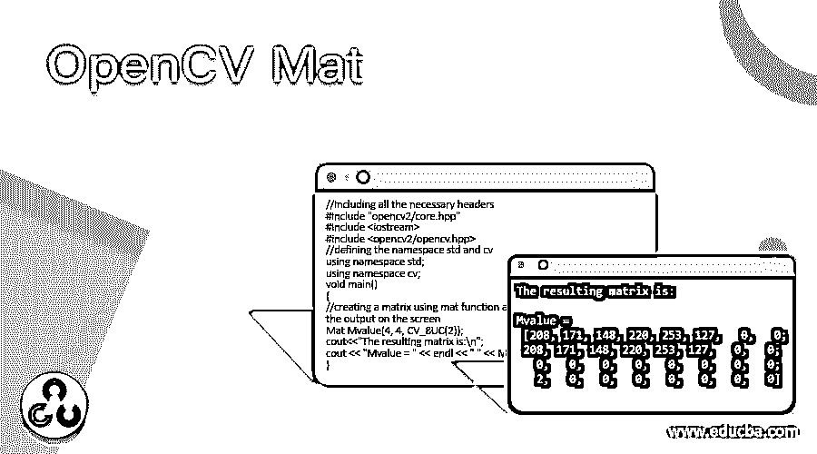
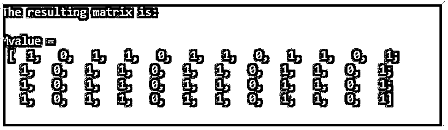
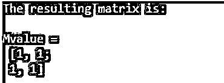
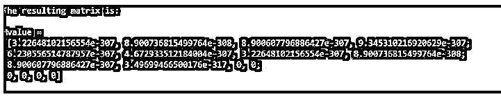

# OpenCV Mat

> 原文：<https://www.educba.com/opencv-mat/>

## OpenCV Mat 简介

使用照相机、扫描仪等捕获的图像。捕捉图像中每个点的数值，这些数值只不过是这些点的像素值，为了以矩阵形式存储和处理图像并管理与图像相关的内存，我们使用了 OpenCV 中名为 Mat 的类，通过使用 OpenCV 中的 Mat 类，内存管理自动发生，为 Mat 类对象分配的内存可以重复使用，该类在 OpenCV C++库中的包 opencv2/core.hpp 中可用。

**S** **yntax 在 OpenCV 中定义 Mat()函数:**

<small>网页开发、编程语言、软件测试&其他</small>

`cv2::Mat::Mat(int rows, int columns, int type, const Scalar &s)`

在哪里，

*   rows 是矩阵的行数。
*   columns 是矩阵的列。
*   type 是用于在矩阵中存储柠檬的数据类型。
*   标量&s 指定要存储在矩阵中的值。

### OpenCV 中 Mat()函数的使用

*   Mat 是 OpenCV 中的一个类，由两个数据部分组成，即矩阵头和指向矩阵的指针。
*   诸如矩阵的大小、用于存储矩阵的方法、矩阵必须存储的地址等信息。可在矩阵标题中找到。
*   Mat 函数有四个参数，即行、列、数据类型和标量。
*   传递给 Mat 函数的 rows 参数表示矩阵中的行。
*   传递给 Mat 函数的 columns 参数表示矩阵中的列。
*   传递给 Mat 函数的数据类型参数表示存储在矩阵中的元素的类型。
*   指定矩阵中元素的数据类型所遵循的惯例是 CV _[每项的位数][有符号或无符号][类型前缀]C[通道号]。
*   标量参数指定要存储在矩阵中的数据。

### OpenCV Mat 示例

以下是 OpenCV Mat 的示例:

#### 示例#1

OpenCV 程序在 C++中使用 Mat 函数创建一个矩阵，并将该矩阵作为输出显示在屏幕上。

**代码:**

`//including all the necessary headers
#include "opencv2/core.hpp"
#include <iostream>
#include <opencv2/opencv.hpp>
//defining the namespace std and cv
using namespace std;
using namespace cv;
void main()
{
//creating a matrix using mat function and displaying the matrix as the output on the screen
Mat Mvalue(4, 4, CV_8UC3, Scalar(1, 0, 1));
cout<<"The resulting matrix is:\n";
cout << "Mvalue = " << endl << " " << Mvalue << endl << endl;
}`

**输出:**

在上面的程序中，我们包含了必要的头。然后我们定义名称空间 std 和 cv。然后定义 main 方法，在该方法中，我们使用 Mat 函数创建一个矩阵，并将该矩阵作为结果显示在屏幕上。

#### 实施例 2

OpenCV 程序在 C++中使用 Mat 函数创建一个矩阵，并将该矩阵作为输出显示在屏幕上。

**代码:**

`//including all the necessary headers
#include "opencv2/core.hpp"
#include <iostream>
#include <opencv2/opencv.hpp>
//defining the namespace std and cv
using namespace std;
using namespace cv;
void main()
{
//creating a matrix using mat function and displaying the matrix as the output on the screen
Mat Mvalue(4, 4, CV_8UC(2));
cout<<"The resulting matrix is:\n";
cout << "Mvalue = " << endl << " " << Mvalue << endl << endl;
}`

**输出:**

在上面的程序中，我们包含了必要的头。然后我们定义名称空间 std 和 cv。然后定义 main 方法，在该方法中，我们使用 Mat 函数创建一个矩阵，并将该矩阵作为结果显示在屏幕上。

#### 实施例 3

OpenCV 程序在 C++中使用 Mat 函数创建一个矩阵，并将该矩阵作为输出显示在屏幕上。

**代码:**

`//including all the necessary headers
#include "opencv2/core.hpp"
#include <iostream>
#include <opencv2/opencv.hpp>
//defining the namespace std and cv
using namespace std;
using namespace cv;
void main()
{
//creating a matrix using mat function and displaying the matrix as the output on the screen
Mat Mvalue(2, 2, CV_32F, Scalar(1,1,1));
cout<<"The resulting matrix is:\n";
cout << "Mvalue = " << endl << " " << Mvalue << endl << endl;
}`

**输出:**

在上面的程序中，我们包含了必要的头。然后我们定义名称空间 std 和 cv。然后定义 main 方法，在该方法中，我们使用 Mat 函数创建一个矩阵，并将该矩阵作为结果显示在屏幕上。

#### 实施例 4

OpenCV 程序在 C++中使用 Mat 函数创建一个矩阵，并将该矩阵作为输出显示在屏幕上。

**代码:**

`//including all the necessary headers
#include "opencv2/core.hpp"
#include <iostream>
#include <opencv2/opencv.hpp>
//defining the namespace std and cv
using namespace std;
using namespace cv;
void main()
{
//creating a matrix using mat function and displaying the matrix as the output on the screen
Mat Mvalue(4, 4, CV_64F);
cout<<”The resulting matrix is:\n";
cout << "Mvalue = " << endl << " " << Mvalue << endl << endl;
}`

**输出:**

在上面的程序中，我们包含了必要的头。然后我们定义名称空间 std 和 cv。然后定义 main 方法，在该方法中，我们使用 Mat 函数创建一个矩阵，并将该矩阵作为结果显示在屏幕上。

### 推荐文章

这是一个 OpenCV Mat 的指南。这里我们分别讨论 OpenCV 中 Mat()函数的介绍、工作原理和实例。您也可以看看以下文章，了解更多信息–

1.  [OpenCV kmeans](https://www.educba.com/opencv-kmeans/)
2.  [Python deepcopy](https://www.educba.com/python-deepcopy/)
3.  [Python 断言错误](https://www.educba.com/python-assertionerror/)
4.  [Python 命令行参数](https://www.educba.com/python-command-line-arguments/)

