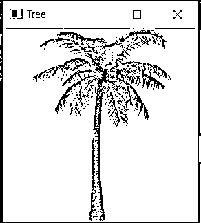

# OpenCV imshow

> 原文：<https://www.educba.com/opencv-imshow/>

## OpenCV imshow 简介

当我们试图解决与计算机视觉相关的问题时，经常需要在窗口中显示程序产生的图像，在这种情况下，为了能够在窗口中显示给定的图像， 我们使用一个名为 imshow()函数的函数，通过指定窗口的名称，可以在窗口中显示图像，并且可以使用 waitkey()函数指定持续时间，如果 0 作为参数传递给 waitkey()函数，则窗口的显示将继续，直到按下任何键，并且可以使用 destroyAllWindows()函数销毁窗口。 在这个主题中，我们将学习 OpenCV imshow。

**OpenCV 中定义 imshow()函数的语法**

<small>网页开发、编程语言、软件测试&其他</small>

`imshow(window_name, image)`

其中 window_name 是必须在其中显示给定图像的窗口的名称

image 是要在窗口中显示的图像。

### OpenCV 中 imshow()函数的使用

*   当我们试图解决与计算机视觉相关的问题时，经常需要在窗口中显示程序生成的图像。
*   为了能够通过创建窗口来显示图像，我们使用了 OpenCV 中一个名为 imshow()的函数。
*   imshow()函数有两个参数，即 window_name 和 image。
*   参数 window_name 是必须在其中显示给定图像的窗口的名称。
*   参数图像是要在窗口中显示的图像。
*   使用 imshow()函数创建的用于显示图像的窗口将一直显示，直到使用 waitkey()函数按下键盘上的任何键。
*   使用 imshow()函数创建的显示图像的窗口可以使用 destroyAllWindows()函数销毁。
*   imshow()函数在窗口中显示给定的图像，但不返回任何内容。

### OpenCV imshow 示例

这里我们讨论下面提到的例子

#### 示例#1

python 中的 OpenCV 程序演示了 imshow()函数，使用 imread()函数读取图像，然后使用 imshow()函数显示相同的图像，方法是创建一个窗口并指定该窗口的名称，然后将其显示为屏幕上的输出:

`#importing the module cv2
import cv2
#reading the image from a given path on which is to be displayed in the window
imageread = cv2.imread('C:/Users/admin/Desktop/educba.jpg')
#creating a window by using namedWindow() function
cv2.namedWindow('imageread', cv2.WINDOW_NORMAL)
#displaying the image in the window by specifying a name for it and the display continues until any key is pressed on the keyboard
cv2.imshow('EDUCBA',imageread)
cv2.waitKey(0)
cv2.destroyAllWindows()`

给定程序的输出显示在下面的快照中:

在上面的程序中，我们正在导入模块 cv2。然后，我们使用 imread()函数读取要在窗口中显示的图像。然后我们使用了 namedwindow()函数，我们命名了必须显示图像的窗口。然后我们使用 imshow()函数将窗口中的图像显示为屏幕上的输出。

#### 实施例 2

python 中的 OpenCV 程序演示了 imshow()函数，使用 imread()函数读取图像，然后使用 imshow()函数显示相同的图像，方法是创建一个窗口并指定该窗口的名称，然后将其显示为屏幕上的输出:

`#importing the module cv2
import cv2
#reading the image from a given path on which is to be displayed in the window
imageread = cv2.imread('C:/Users/admin/Desktop/plane.jpg')
#creating a window by using namedWindow() function
cv2.namedWindow('imageread', cv2.WINDOW_NORMAL)
#displaying the image in the window by specifying a name for it and the display continues until any key is pressed on the keyboard
cv2.imshow('Aeroplane',imageread)
cv2.waitKey(0)
cv2.destroyAllWindows()`

给定程序的输出显示在下面的快照中:

在上面的程序中，我们正在导入模块 cv2。然后，我们使用 imread()函数读取要在窗口中显示的图像。然后我们使用了 namedwindow()函数，我们命名了必须显示图像的窗口。然后我们使用 imshow()函数将窗口中的图像显示为屏幕上的输出。

#### 实施例 3

python 中的 OpenCV 程序演示了 imshow()函数，使用 imread()函数读取图像，然后使用 imshow()函数显示相同的图像，方法是创建一个窗口并指定该窗口的名称，然后将其显示为屏幕上的输出:

`#importing the module cv2
import cv2
#reading the image from a given path on which is to be displayed in the window
imageread = cv2.imread('C:/Users/admin/Desktop/logo.png')
#creating a window by using namedWindow() function
cv2.namedWindow('imageread', cv2.WINDOW_NORMAL)
#displaying the image in the window by specifying a name for it and the display continues until any key is pressed on the keyboard
cv2.imshow('EDUCBA_logo',imageread)
cv2.waitKey(0)
cv2.destroyAllWindows()`

给定程序的输出显示在下面的快照中:

在上面的程序中，我们正在导入模块 cv2。然后，我们使用 imread()函数读取要在窗口中显示的图像。然后我们使用了 namedwindow()函数，我们命名了必须显示图像的窗口。然后我们使用 imshow()函数将窗口中的图像显示为屏幕上的输出。

#### 实施例 4

用 python 编写 OpenCV 程序来演示 imshow()函数，使用 imread()函数读取图像，然后通过创建一个窗口并指定该窗口的名称来使用 imshow()函数显示相同的图像，并将其显示为屏幕上的输出:

`#importing the module cv2
import cv2
#reading the image from a given path on which is to be displayed in the window
imageread = cv2.imread('C:/Users/admin/Desktop/tree.jpg')
#creating a window by using namedWindow() function
cv2.namedWindow('imageread', cv2.WINDOW_NORMAL)
#displaying the image in the window by specifying a name for it and the display continues until any key is pressed on the keyboard
cv2.imshow(‘Tree',imageread)
cv2.waitKey(0)
cv2.destroyAllWindows()`

给定程序的输出显示在下面的快照中:

在上面的程序中，我们正在导入模块 cv2。然后，我们使用 imread()函数读取要在窗口中显示的图像。然后我们使用了 namedwindow()函数，我们命名了必须显示图像的窗口。然后我们使用 imshow()函数将窗口中的图像显示为屏幕上的输出。

### 结论

在本文中，我们通过 OpenCV 中 imshow()函数的定义、语法和工作原理，了解了 OpenCV 中 imshow()函数的概念，并给出了相应的编程示例和输出。

### 推荐文章

这是一个 OpenCV imshow 的指南。这里我们通过 imshow()函数的定义、语法和工作原理来讨论 OpenCV 中 imshow()函数的概念。您也可以看看以下文章，了解更多信息–

1.  [打开 CV resize()](https://www.educba.com/open-cv-resize/)
2.  [OpenCV kmeans](https://www.educba.com/opencv-kmeans/)
3.  [Python 索引错误](https://www.educba.com/python-indexerror/)
4.  [Python mkdir](https://www.educba.com/python-mkdir/)

