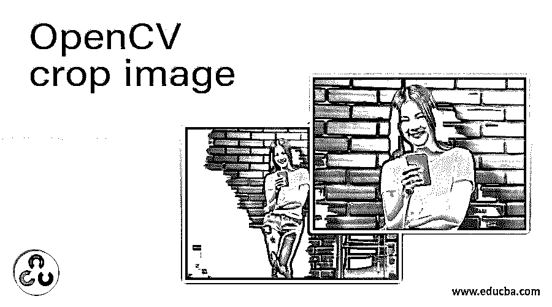
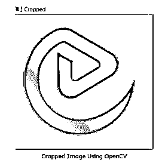

# OpenCV 裁剪图像

> 原文：<https://www.educba.com/opencv-crop-image/>

## OpenCV 裁剪图像简介

以下文章提供了 OpenCV 裁剪图像的概要。这是 OpenCV Python 语言库中的一个内置函数。Python 图像库中有多个函数，如裁剪图像()或俗称的 PIL。该库负责通过 Python 解释器向输出平台添加并在编辑和格式化图像时读取格式化特征。它有几个内置功能，旨在对用户提供的进行手动分析。它的目的是识别和裁剪单个图像，以便保存编码器提供的每个图像文件，将它们作为单独的对象保存在不同的文件夹中。

### OpenCV 裁剪图像的语法()

以下是有助于使用 OpenCV 裁剪图像功能的语法:

<small>网页开发、编程语言、软件测试&其他</small>

`image[start_x:end_x, start_y:end_y]`

(使用打开的 CV 库)

`Image.crop(left, top, right, bottom)`

(使用 PIL 图书馆)

**参数:**

以下是在使用 OpenCV 裁剪图像功能时使用的参数，这些参数使源图像的裁剪能够准确执行:

| **参数** | **参数说明** |
| 源图像 | 该参数表示必须处理并进一步裁剪的原始图像。 |
| 开始 x:结束 x | 该参数表示需要裁剪图像的图像上端的开始和结束坐标。 |
| 开始时间:结束时间 | 该参数表示需要裁剪图像的图像下端的起点和终点坐标。 |
| 顶端 | 参数 left 表示图像中需要裁剪的顶部坐标。(即(a，b) =(左，上)。 |
| 左边的 | 参数 left 表示图像中需要裁剪的左侧坐标。(即(a，b) =(左，上)。 |
| 底部 | 参数 left 表示图像中需要裁剪的底部坐标。(即(c，d) =(右，下)。 |
| 对吧 | 参数 left 表示图像中需要裁剪的右坐标。(即(c，d) =(右，下)。 |
| 返回值 | 在原始图像上执行该功能后，它输出经过正确坐标处理的图像，用于裁剪图像。 |

### OpenCV crop image 是如何工作的？

*   通过相对于 x & y 坐标传递起始索引和结束索引的过程，已经由用户提供的图像实际上被切片以形成各种数组集合。
*   该图像具有以像素形式表示的坐标，以找到最终输出，从而给出裁剪后的图像。

### OpenCV 裁剪图像示例

下面是提到的例子:

以下示例演示了 OpenCV 裁剪图像功能的使用:

#### 示例#1

**代码:**

`# importing the class library cv2 in order perform the usage of crop image()
import cv2
# defining the variable which read the image path for the image to be
Processed
img_1 = Image.open(r’C:\Users\data\Desktop\educba logo1.png’;
# defining the coordinated for the four corners represented y,x,h and w which are used to crop the source image appropriately
y1=0
x1=0
h1=3000
w1=5100
cropimage_1 = image[x1:w1, y1:h1] # Displaying the output image which has been cropped as per the provided coordinates
cv2.imshow("Cropped", crop_image)
cv2.waitKey(0)`

**输出:**

上面的图像使用 OpenCV 裁剪图像功能进行了捆绑，其最终输出为:

**原始图像:**

**裁剪后的图像:**

#### 实施例 2

一个用 Python 编码语言编写的程序，旨在解释 OpenCV crop image()的内置方法。

**代码:**

`# importing the class library PIL in order perform the usage of crop the
image from PIL import Image
# defining the variable which read the image path for the image to be
Processed
img_1 = Image.open(r’C:\Users\data\Desktop\edu cba logo2.png’;
# defining the coordinated for the four corners left, top, right and bottom which are used to crop the source image appropriately
left_1 = 0
top_1 = 500
right_1 = 5100
bottom_1 = 2920
imgres_1 = img.crop((left_1, top_1, right_1, bottom_1))
# Displaying the output image which has been cropped as per the provided coordinates
imgres_1.show()`

**输出:**

上面的图像使用 OpenCV 裁剪图像功能进行了捆绑，其最终输出为:

**原始图像:**

**裁剪后的图像:**

### 结论

这是 Python 库中一个非常重要的内置函数。作为一个内置的功能，它降低了通常用于剪切图像的代码的速度。此功能在涉及图像处理的图像检测作业中更为适用。其中一个主要参数是为每个单独的图像应用裁剪所需要的，源图像由特定的轮廓提供。OpenCV 图像裁剪功能有助于减少所提供的 Numpy 数组的总尺寸，该数组表示由编码器提供的图像中存在的像素。

### 推荐文章

这是一个 OpenCV 裁剪图像指南。这里我们讨论一下入门，OpenCV crop image 是如何工作的？和示例。您也可以看看以下文章，了解更多信息–

1.  [OpenCV kmeans](https://www.educba.com/opencv-kmeans/)
2.  [Python 断言错误](https://www.educba.com/python-assertionerror/)
3.  [Python 过滤函数](https://www.educba.com/python-filter-function/)
4.  [Python 读取 Excel 文件](https://www.educba.com/python-read-excel-file/)

