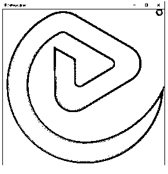

# OpenCV imread

> 原文：<https://www.educba.com/opencv-imread/>

## OpenCV imread 简介

以下文章提供了 OpenCV imread 的概要。OpenCV 是一种使用户能够处理图像并支持用户解决与计算机视觉相关的问题的技术或库。它提供了许多功能，包括 imread。imread 函数有助于从指定的文件夹中加载图像。为了处理图像，必须首先读取该图像。这个函数的工作是返回一个空矩阵，如果它发现一个丢失的文件或任何不正确的权限，无效的格式或不支持的文件格式。这将表明待处理的图像存在问题。

**语法:**

<small>网页开发、编程语言、软件测试&其他</small>

`cv2.imread(path, flag)`

**参数:**

*   路径:这将是一个字符串，它将让编译器知道图像在哪里。
*   **flag:** 它将指定读取图像的方式。默认情况下，它的颜色值是 cv2。IMREAD_COLOR。

该函数的返回值将是一个图像，该图像将从之前指定的路径和文件中加载。

### imread 函数是如何工作的？

imread 函数是 OpenCV 库的一个函数。OpenCV 用于深度学习算法。它将读取图像进行进一步处理，这将有助于分类和分析。为了使用这些图像，第一步将是读取图像。这是通过使用该函数来执行的。

该功能的工作方式如下:

*   **imread:** 这将从指定的路径读取图像并加载。
*   **imread_multi:** 有时可能需要加载多个图像。imread_multi 函数有助于加载多个图像。这些图像可以是 TIFF 格式或 ATK 格式。使用此功能也可以读取 TIFF 的 sub 格式图像。
*   **imsave:** 该选项有助于根据需要保存和写入图像。

图像也可以以不同的格式读取。函数调用中的第二个参数按照您希望的方式处理图像。有三种处理图像的方法。

其中一种方法是上面提到的，你可以加载彩色格式的图像。

*   **Cv2.imread_color:** 该格式的图像将以彩色格式加载。如果图像中有透明度，那么它将被忽略，默认标志将被设置。
*   **cv2 . im read _ gray:**为了处理和分析图像，通常将图像转换为灰度图像，以便对其进行分类和应用算法。该函数以灰度模式创建图像。
*   **Cv2.imread_unchanged:** 这种模式有助于使用 alpha 通道加载图像。

这三种模式有助于同时读取和处理图像。您可以使用一种简单的方法来传递三个用整数表示的标志，而不是使用这些冗长的函数名。当您想要彩色图像时，我们可以将参数传递为 1，当它是灰度图像时，可以将参数传递为 0，当它应该不变时，可以将参数传递为-1。

现在让我们看一个例子，并尝试理解其功能。

#### 示例:

Python 程序理解 imread 函数。

**代码:**

`# import library cv2
import cv2
#Store path where the image is in a variable
p = r'C:\Users\aanch\eduCBA.JPG'
# Use cv2.imread() method in OpenCV to read and load the image
imgr = cv2.imread(p)
# Display the image that is loaded
cv2.imshow('image', imgr)
cv2.waitKey()
cv2.destroyAllWindows()`

**输出:**

让我们浏览一下代码，理解它在这里做什么。

我们首先导入了 cv2 库。如果您没有插入 cv2 库，您可以使用 pip install 命令安装它，以安装 opencv-python 库，其中包含所需的方法。然后我们取一个变量“p ”,在这里我们将读取一个特定路径上的图像。我们在这里指定路径，并将其存储在变量 p 中。然后，我们在这个库中使用 imread()函数，它帮助我们读取这个路径上的图像。我们没有传递任何第二个参数，因此图像将被加载，没有任何改变。读取图像后，我们必须显示它，以检查它是否被正确读取。为了显示图像，我们使用同一个库中的 imshow()函数。我们传递“imgr”参数，然后输入 waitKey()方法，让包含图像的窗口保持不变，然后销毁此窗口，防止它在后台运行。将显示带有图像的新窗口。如果您观察上面的输出，您将看到将要显示的图像。

这里的另一个变体是以灰度显示图像。您可以使用第二个参数中的 im read _ gray()方法将图像更改为灰度。下面的代码将有助于黑白图像。

**代码:**

`import cv2
# Use cv2.imread() method in OpenCV to read and pass GRAYSCALE to load it in grayscale
p_gray = cv2.imread('eduCBA.JPG', cv2.IMREAD_GRAYSCALE)
# Display the image that is loaded
cv2.imshow('image_gray', p_gray)
cv2.waitKey()
cv2.destroyAllWindows()`

您将看到的上述代码中唯一的变化是，我们使用了带有第二个参数 cv2 的 imread 函数。IMREAD _ gray 帮助我们将传递给 im read 函数的图像转换为灰度。

**输出:**

你可以看到图像不是灰度的。

### 结论–OpenCV imread

OpenCV 是一个帮助我们处理深度学习图像的库。为了分析和获得具体的结果，我们需要先阅读图像，然后你才能进一步处理它。imread()函数用于读取图像，并且可以加载图像。该功能有助于我们按原样读取图像或将其转换为灰度，甚至同时读取多幅图像。

### 推荐文章

这是一个 OpenCV imread 的指南。这里我们讨论一下 imread 函数的简介和工作原理？为了更好的理解。您也可以看看以下文章，了解更多信息–

1.  [OpenCV kmeans](https://www.educba.com/opencv-kmeans/)
2.  [Python 断言错误](https://www.educba.com/python-assertionerror/)
3.  [Python 数组长度](https://www.educba.com/python-array-length/)
4.  [Python 索引错误](https://www.educba.com/python-indexerror/)

