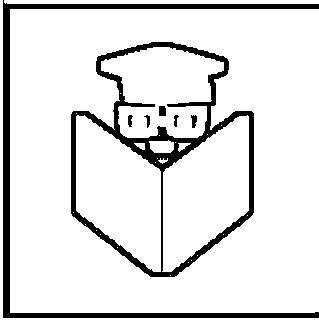
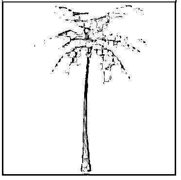
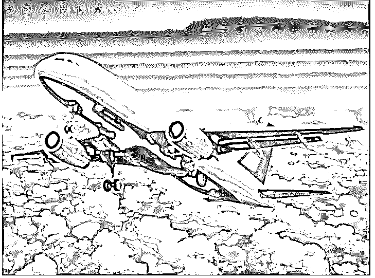

# OpenCV 扩张

> 原文：<https://www.educba.com/opencv-dilate/>

## OpenCV 扩张简介

下面的文章提供了 OpenCV 扩张的概要。可以根据图像的形状来处理图像的一组操作被称为形态学操作，并且对给定图像执行形态学操作在给定图像上形成结构元素，该结构元素从图像中去除噪声或者消除任何缺陷以使图像非常清晰， 使用给定图像中白色物体的尺寸增加或者给定图像中黑色物体的尺寸减小，给定输入图像中特定形状的膨胀被称为膨胀。

**S**

<small>网页开发、编程语言、软件测试&其他</small>

`dilate(source_image, kernel)`

在哪里，

*   source_image 是要使用 dilate()函数放大的图像。
*   kernel 表示核矩阵。

### OpenCV 中 expand()函数的使用

*   在 OpenCV 中，与在给定输入图像中具有特定形状的定位点的内核执行卷积的过程被称为 expand()函数。
*   dilate()函数首先通过在输入图像上重叠内核来计算最小像素值。
*   然后图像被中心的内核锚点替换。
*   这导致图像中的白色区域变得更大，图像大小也随之增加。
*   函数的作用是:返回给定图像中白色阴影增加的图像。

### OpenCV 扩张示例

以下是 OpenCV dilate 的示例:

#### 示例#1

用 python 编写的 OpenCV 程序演示了 dilate()函数读取给定的图像，增加图像中白色区域的大小，并将结果图像作为输出显示在屏幕上。

**代码:**

`#importing all the required modules
import numpy as np
import cv2 as cv
#reading the image that is to be dilated using imread() function
imageread = cv.imread('C:/Users/admin/Desktop/logo2.png')
#defining the matrix for kernel to apply dilate() function on the image to dilate the image
kernelmatrix = np.ones((5, 5), np.uint8)
#applying dilate() function on the image to dilate the image and display it as the output on the screen
resultimage = cv.dilate(imageread, kernelmatrix)
cv.imshow('Dilated_image', resultimage)
cv.waitKey(0)
cv.destroyAllWindows()`

**输出:**

在上面的程序中，我们正在导入所需的模块。然后，我们使用 imread()函数读取要放大的图像。然后我们利用 dilate()函数来放大图像。然后，我们将放大的图像作为输出显示在屏幕上。

#### 实施例 2

用 python 编写的 OpenCV 程序演示了 dilate()函数读取给定的图像，增加图像中白色区域的大小，并将结果图像作为输出显示在屏幕上。

**代码:**

`#importing all the required modules
import numpy as np
import cv2 as cv
#reading the image that is to be dilated using imread() function
imageread = cv.imread('C:/Users/admin/Desktop/logo1.jpg')
#defining the matrix for kernel to apply dilate() function on the image to dilate the image
kernelmatrix = np.ones((5, 5), np.uint8)
#applying dilate() function on the image to dilate the image and display it as the output on the screen
resultimage = cv.dilate(imageread, kernelmatrix)
cv.imshow('Dilated_image', resultimage)
cv.waitKey(0)
cv.destroyAllWindows()`

**输出:**

在上面的程序中，我们正在导入所需的模块。然后，我们使用 imread()函数读取要放大的图像。然后我们利用 dilate()函数来放大图像。然后，我们将放大的图像作为输出显示在屏幕上。

#### 实施例 3

用 python 编写的 OpenCV 程序演示了 dilate()函数读取给定的图像，增加图像中白色区域的大小，并将结果图像作为输出显示在屏幕上。

**代码:**

`#importing all the required modules
import numpy as np
import cv2 as cv
#reading the image that is to be dilated using imread() function
imageread = cv.imread('C:/Users/admin/Desktop/educba1.jpg')
#defining the matrix for kernel to apply dilate() function on the image to dilate the image
kernelmatrix = np.ones((5, 5), np.uint8)
#applying dilate() function on the image to dilate the image and display it as the output on the screen
resultimage = cv.dilate(imageread, kernelmatrix)
cv.imshow('Dilated_image', resultimage)
cv.waitKey(0)
cv.destroyAllWindows()`

**输出:**

在上面的程序中，我们正在导入所需的模块。然后，我们使用 imread()函数读取要放大的图像。然后我们利用 dilate()函数来放大图像。然后，我们将放大的图像作为输出显示在屏幕上。

#### 实施例 4

用 python 编写的 OpenCV 程序演示了 dilate()函数读取给定的图像，增加图像中白色区域的大小，并将结果图像作为输出显示在屏幕上。

**代码:**

`#importing all the required modules
import numpy as np
import cv2 as cv
#reading the image that is to be dilated using imread() function
imageread = cv.imread('C:/Users/admin/Desktop/lo.jpg')
#defining the matrix for kernel to apply dilate() function on the image to dilate the image
kernelmatrix = np.ones((5, 5), np.uint8)
#applying dilate() function on the image to dilate the image and display it as the output on the screen
resultimage = cv.dilate(imageread, kernelmatrix)
cv.imshow('Dilated_image', resultimage)
cv.waitKey(0)
cv.destroyAllWindows()`

**输出:**

在上面的程序中，我们正在导入所需的模块。然后，我们使用 imread()函数读取要放大的图像。然后我们利用 dilate()函数来放大图像。然后，我们将放大的图像作为输出显示在屏幕上。

### 推荐文章

这是一个 OpenCV 扩张指南。在这里我们分别讨论 OpenCV 中的 dilate()函数的介绍、工作原理和实例。您也可以看看以下文章，了解更多信息–

1.  [OpenCV kmeans](https://www.educba.com/opencv-kmeans/)
2.  [Python 断言错误](https://www.educba.com/python-assertionerror/)
3.  [Python 数组长度](https://www.educba.com/python-array-length/)
4.  [Python 索引错误](https://www.educba.com/python-indexerror/)

