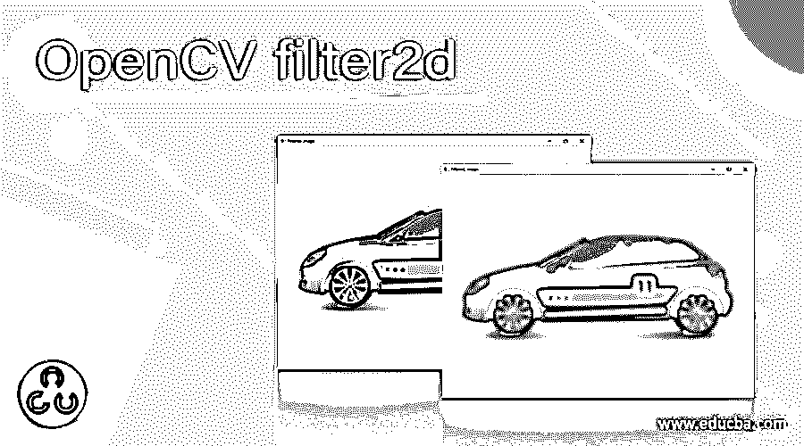
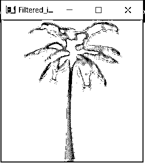
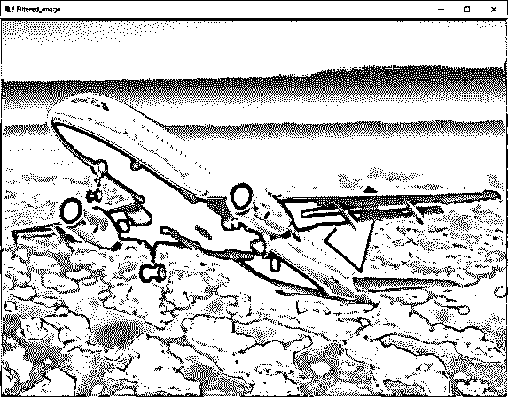
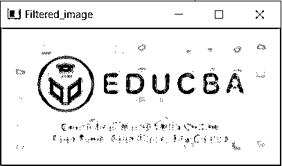
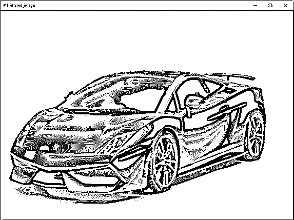

# OpenCV filter2d

> 原文：<https://www.educba.com/opencv-filter2d/>

## OpenCV filter2d 简介

当在图像处理中处理图像时，经常出现修改或增强图像的需要，在这种情况下，我们利用滤波器，利用这些滤波器可以改善或去除图像的某些特征，并且有各种类型的滤波器，如低通滤波器、高通滤波器等。OpenCV 提供了一个名为 filter2d()的过滤功能，使用该功能可以将图像与内核进行卷积，从而导致图像模糊、图像锐化、图像边缘检测等。filter2d()函数返回模糊或去除噪声后的图像。

**OpenCV 中定义 filter2d()函数的语法如下:**

<small>网页开发、编程语言、软件测试&其他</small>

`filter2d(source_image, depth, kernel)`

其中 source_image 是必须对其执行过滤操作的图像，

深度是指定输出图像中深度的整数变量，

核是表示卷积核的矩阵。

### OpenCV 中 filter2d()函数的工作原理

*   在 OpenCV 中，改善图像中的某些特征或从图像中删除某些特征的技术称为过滤。
*   过滤图像的过程能够模糊图像、锐化图像、检测图像中的边缘等。
*   OpenCV 提供了一个名为 filter2d()的函数来执行图像的过滤。
*   filter2d()函数将内核与图像进行卷积。
*   卷积是将由相同维数的数字组成的两个数组相乘，以产生由相同维数的数字组成的第三个数组。
*   核是用于图像模糊、图像锐化、图像边缘检测等的小矩阵。在图像处理方面。
*   filter2d()函数的工作原理是将内核放在所有像素上，然后找到所有像素的平均值，使其成为中心像素值，并对图像中的所有像素重复该过程。
*   filter2d()函数在增强图像中的某些特征或从图像中移除某些特征之后返回图像。

### OpenCV filter2d 示例

下面举几个例子

#### 示例#1

python 中的 OpenCV 程序演示了 filter2d()函数，用于模糊给定的图像，并将模糊的图像作为输出显示在屏幕上:

**代码:**

`#importing all the required modules
import numpy as np
import cv2 as cv
#reading the image that is to be blurred using imread() function
imageread = cv.imread('C:/Users/admin/Desktop/tree.jpg')
#defining the matrix for kernel to apply filter2d() function on the image to blur the image
kernelmatrix = np.ones((5,5),np.float32)/25
#applying filter2d() function on the image to blur the image and display it as the output on the screen
resultimage = cv.filter2D(imageread,-1,kernelmatrix)
cv.imshow('Filtered_image',resultimage)
cv.waitKey(0)
cv.destroyAllWindows()`

给定程序的输出显示在下面的快照中:

在上面的程序中，我们正在导入所需的模块。然后，我们使用 imread()函数读取要模糊的图像。然后，我们为内核定义矩阵，以对图像应用 filter2d()函数来模糊图像。然后，我们对图像应用 filter2d()函数来模糊图像，并将其作为输出显示在屏幕上。输出显示在上面的快照中。

#### 实施例 2

python 中的 OpenCV 程序演示了 filter2d()函数，用于模糊给定的图像，并将模糊的图像作为输出显示在屏幕上:

**代码:**

`#importing all the required modules
import numpy as np
import cv2 as cv
#reading the image that is to be blurred using imread() function
imageread = cv.imread('C:/Users/admin/Desktop/plane.jpg')
#defining the matrix for kernel to apply filter2d() function on the image to blur the image
kernelmatrix = np.ones((5,5),np.float32)/25
#applying filter2d() function on the image to blur the image and display it as the output on the screen
resultimage = cv.filter2D(imageread,-1,kernelmatrix)
cv.imshow('Filtered_image',resultimage)
cv.waitKey(0)
cv.destroyAllWindows()`

给定程序的输出显示在下面的快照中:

在上面的程序中，我们正在导入所需的模块。然后，我们使用 imread()函数读取要模糊的图像。然后，我们为内核定义矩阵，以对图像应用 filter2d()函数来模糊图像。然后，我们对图像应用 filter2d()函数来模糊图像，并将其作为输出显示在屏幕上。输出显示在上面的快照中。

#### 实施例 3

python 中的 OpenCV 程序演示了 filter2d()函数，用于模糊给定的图像，并将模糊的图像作为输出显示在屏幕上:

**代码:**

`#importing all the required modules
import numpy as np
import cv2 as cv
#reading the image that is to be blurred using imread() function
imageread = cv.imread('C:/Users/admin/Desktop/educba.jpg')
#defining the matrix for kernel to apply filter2d() function on the image to blur the image
kernelmatrix = np.ones((5,5),np.float32)/25
#applying filter2d() function on the image to blur the image and display it as the output on the screen
resultimage = cv.filter2D(imageread,-1,kernelmatrix)
cv.imshow('Filtered_image',resultimage)
cv.waitKey(0)
cv.destroyAllWindows()`

给定程序的输出显示在下面的快照中:

在上面的程序中，我们正在导入所需的模块。然后，我们使用 imread()函数读取要模糊的图像。然后，我们为内核定义矩阵，以对图像应用 filter2d()函数来模糊图像。然后，我们对图像应用 filter2d()函数来模糊图像，并将其作为输出显示在屏幕上。输出显示在上面的快照中。

#### 实施例 4

python 中的 OpenCV 程序演示了 filter2d()函数，用于模糊给定的图像，并将模糊的图像作为输出显示在屏幕上:

**代码:**

`#importing all the required modules
import numpy as np
import cv2 as cv
#reading the image that is to be blurred using imread() function
imageread = cv.imread('C:/Users/admin/Desktop/car.jpg')
#defining the matrix for kernel to apply filter2d() function on the image to blur the image
kernelmatrix = np.ones((5,5),np.float32)/25
#applying filter2d() function on the image to blur the image and display it as the output on the screen
resultimage = cv.filter2D(imageread,-1,kernelmatrix)
cv.imshow('Filtered_image',resultimage)
cv.waitKey(0)
cv.destroyAllWindows()`

给定程序的输出显示在下面的快照中:

在上面的程序中，我们正在导入所需的模块。然后，我们使用 imread()函数读取要模糊的图像。然后，我们为内核定义矩阵，以对图像应用 filter2d()函数来模糊图像。然后，我们对图像应用 filter2d()函数来模糊图像，并将其作为输出显示在屏幕上。输出显示在上面的快照中。

### 推荐文章

这是一个 OpenCV filter2d 的指南。在这里，我们讨论 OpenCV 中使用 filter2d()函数进行过滤的概念，并给出相应的编程示例以及演示它们的输出。您也可以看看以下文章，了解更多信息–

1.  [OpenCV kmeans](https://www.educba.com/opencv-kmeans/)
2.  [打开 CV resize()](https://www.educba.com/open-cv-resize/)
3.  [C 语言中的编程错误](https://www.educba.com/programming-errors-in-c/)
4.  [后端编程语言](https://www.educba.com/back-end-programming-languages/)

